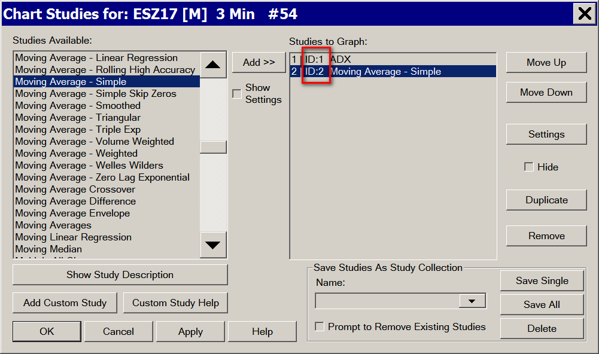

# ACSIL Programming Concepts

* [Introduction](#introduction)
* [Unique Study Instance Identifiers](#uniquestudyinstanceidentifiers)
* [Global Variables](#globalvariables)
* [System Studies](#systemsandalerts)
* [Working with SCString, Text Strings and Setting ACSIL Structure Member Name Strings](#workingwithtextstrings)
  + [SCString Methods](#scstringmemberfunctions)
  + [SCString Examples](#scstringexamples)
* [Dynamic Graph Names](#dynamicgraphnames)
* [Using or Referencing Study/Indicator Data in an ACSIL Function](#usingstudydata)
* [Referencing Data from a Sheet within a Spreadsheet](#referencingdatafromspreadsheet)
* [Direct Programmatic Interaction with Spreadsheet Sheets](#directprogrammaticinteractionwithspreadsheetsheets)
* [Making Function Calls to External DLLs](#dllcalling)
* [Passing ACSIL Interface Members Structure To Secondary Function](#passingacsilmembers)
* [Dynamic Memory Allocations Within Study Instance](#dynamicmemoryallocations)
  + [Alternative Method: Getting and Setting Persistent Data](#gettingandsettingpersistentdata)
  + [Allocating Memory for Classes](#allocatingmemoryforclasses)
* [Study and Related Functions for Requesting Remote Data for Price Levels](#pricelevelssample)
* [One Time Calculations That Do Not Run During Study Updating](#onetimecalculations)
* [One Time Processing per Bar in the Chart](#onetimeprocessingperbar)
* [Accessing Milliseconds](#accessingmilliseconds)
* [Custom Subgraph Coloring](#customsubgraphcoloring)
* [Limiting Study Access to Particular Chartbook and Symbol](#limitingstudyaccess)
* [Finding Chart Bar Data Array Index for Start of Day](#findingstartofdayindex)
* [Custom Free Form Drawing into Chart Window Using GDI](#customfreeformdrawing)
* [Scale Related ACSIL Variables](#acsilscalevariables)
* [Accessing Volume at Price Data Per Bar](#accessingvolumepricedataperbar)
* [Not Performing Calculation/Processing during Historical Data Downloading or Full Recalculation](#notperformingcalcduringdatadownloadorfullrecalc)
* [Not Allowing Changes to Study Subgraph Settings](#notallowingstudysubgraphsettingschanges)
* [Converting Date-Time in One Time Zone to The User Set Time Zone](#convertingbetweentimezones)
* [Skipping Bars/Columns with a Subgraph Draw Style](#skippingwithasubgraphdrawstyle)
* [Detecting New Bars Added to Chart](#detectingnewbarsaddedtochart)
* [Performing Action When Certain Time is Encountered in Most Recent Chart Bar](#actionwhencertaintimeisencounteredinmostrecentbar)
* [Accessing Current Symbol Data for Other Symbols](#accessingcurrentsymboldataforothersymbols)
* [ACSIL Chart Drawings and Hiding a Study](#acsilchartdrawingsandhidingastudy)
* [Getting Index of Start of Trading Day in Intraday Chart](#gettingindexofstartoftradingday)
* [Accessing Data from Another Chart at Second to Last Index](#accessingdatafromanotherchartatsecondtolastindex)
* [Displaying Custom Values in the Market Data Columns on the Chart / Trade DOM](#displayingcustomvaluesinmarketdatacolumnsonthecharttradedom)
* [Determining New Bars When Chart is Updated](#determiningnewbarswhenchartisupdated)
* [Use of Dialog Windows in Advanced Custom Studies](#useofdialogwindowsinadvancedcustomstudies)
* [Filling an Area Between Two Price Levels](#fillinganareabetweentwopricelevels)
* [Debug Logging](#debuglogging)
* [Uniquely Identifying an Instance of a Study](#uniquelyidentifyinganinstanceofastudy)
* [Determining if Last Chart Bar is Closed](#determiningiflastchartbarisclosed)
* [Drawing Study in Two Different Chart Regions](#drawingstudyintwodifferentchartregions)
* [Combining Intraday Chart File Records into Original Summary Trade](#combiningintradaychartfilerecordsintooriginalsummarytrade)
* [Programmatically Accessing Historical and Current Market Depth Data](#programmaticallyaccessinghistoricalandcurrentmarketdepthdata)
* [Study Initialization/Unitialization](#studyinitializationunitialization)
* [Floating Point Value Error](#floatingpointvalueerror)
* [ACSIL File Functions](#acsilfilefunctions)
* [Keyboard Interaction with ACSIL Studies](#keyboardinteractionwithacsilstudies)
* [ACSIL Persistent Variables](#acsilpersistentvariables)

---

## Introduction

[Link](#introduction) - [Top](#top)

This page documents various programming concepts for [ACSIL](AdvancedCustomStudyInterfaceAndLanguage.md) (Advanced Custom Study Interface and Language).

## Unique Study Instance Identifiers

[Link](#uniquestudyinstanceidentifiers) - [Top](#top)

Each study has a unique instance identifier. Refer to the image below. Many [ACSIL Functions](ACSIL_Members_Functions.md) require this identifier.

This identifier can be accessed through ACSIL with the [sc.StudyGraphInstanceID](ACSIL_Members_Variables_And_Arrays.md#scstudygraphinstanceid) variable. This identifier is for the instance of the study that is accessing this value directly.

[](../images/studyuniqueidentifier.png)

The proper way to obtain this unique study instance identifier for a particular study, from another study is through the [sc.Input[].SetStudyID()](index0fb1.html?page=doc/ACSIL_Members_scInputs.html#scInputSetStudyID) and [sc.Input[].GetStudyID()](index0fb1.html?page=doc/ACSIL_Members_scInputs.html#scInputGetStudyID) Input functions or other Input functions which create a study Input and allow getting of a study identifier. **sc.Input[].SetStudyID()** creates a study Input with a list of studies on a chart and allow selecting one of them.

Also refer to [sc.Input[].SetChartStudyValues()](index0fb1.html?page=doc/ACSIL_Members_scInputs.html#scInputSetChartStudyValues), [sc.Input[].GetChartNumber()](index0fb1.html?page=doc/ACSIL_Members_scInputs.html#scInputGetChartNumber) and [sc.Input[].GetStudyID()](index0fb1.html?page=doc/ACSIL_Members_scInputs.html#scInputGetStudyID) Input functions.

## Global Variables

[Link](#globalvariables) - [Top](#top)

In C++ it is possible to define global variables which are accessible from any of the study functions in your source code cpp file.

Global variables should not be confused with [ACSIL Persistent Variables](#acsilpersistentvariables) which can be used to get and set persistent variables for an individual study or other studies or studies on other charts.

There are generally 2 reasons why global variables would be used. 1. To share data between multiple study functions. 2. To maintain data between calls to your study function.

It is essential to understand, that when a DLL is released like when it is built, or when using **Analysis >> Build Custom Studies DLL >> Build >> Release All DLLs and Deny Load**, then what you will find is that the global variables get reset.

Global variables need to be at the top of your source code file and outside of your study function. Refer to the code example below.

Keep in mind that when a variable is global, there is only a single instance of it per DLL file. Therefore, multiple instances of a particular study or multiple study functions, are going to be sharing the very same instance of a global variable in the DLL it is defined within.

If you require basic variable types which are specific to each individual study instance, then you can store persistent data by using [ACSIL Persistent Variables](#acsilpersistentvariables).

If you require nonbasic variable types which are specific to each individual study instance and remain persistent between calls to a study function, then refer to [Dynamic Memory Allocations Within Study Instance](#dynamicmemoryallocations).

### Code Example

```cpp

#include "SierraChart.h"
SCDLLName("StudiesFileName")

//This is a global integer variable
int g_GlobalIntegerVariable;

SCSFExport scsf_StudyFunction(SCStudyInterfaceRef sc)
{
    if (sc.SetDefaults)
    {
     
    }
}
        
```

## System Studies

[Link](#systemsandalerts) - [Top](#top)

You are able to create, using the **Advanced Custom Study Interface and Language**, a System study. A System study is one in which gives you graphical, text and/or audible indication of buy and sell signals. This differs from an [Automated Trading](ACSILTrading.md) study which can also submit simulated or live orders.

The custom study interface is the same whether you create an indicator type Study or a System study. In the case of a **Study** you will put your formula results into a [sc.Subgraph[].Data](index40e9.html?page=doc/ACSIL_Members_scSubgraph.html#scSubgraphData) array or arrays that are graphed on the chart.

In the case of a **System**  study you will fill the **sc.Subgraph[].Data** arrays with values indicating where you want to buy or sell at and use these together with the appropriate [sc.Subgraph[].DrawStyle](index40e9.html?page=doc/ACSIL_Members_scSubgraph.html#scSubgraphDrawStyle) to indicate buy and sell conditions. For example, in the case of a System, you could set the **sc.Subgraph[].Data** array element for the bar you want to give a buy signal at, to the price at which you will buy. And set the  **sc.Subgraph[].DrawStyle** to **DRAWSTYLE\_ARROW\_UP**. If your study is displayed in Chart Region 1 ( **sc.GraphRegion = 0;**), then the Up Arrow will be shown at the price level you set the corresponding **sc.Subgraph[].Data** array element to.

If you require an audible or text indication of a buy or sell condition, then specify an Alert Condition Formula with your custom system study. For more information, refer to [Alerts and Scanning](StudyChartAlertsAndScanning.md). Or, you can add an alert message and play a sound directly from the study function using [sc.SetAlert](ACSIL_Members_Functions.md#scsetalert).

An example study function that acts as a System can be found in **Systems.cpp** inside the **/ACS\_Source** folder inside of the folder that Sierra Chart is installed to.

## Working with SCString, Text Strings and Setting ACSIL Structure Member Name Strings

[Link](#workingwithtextstrings) - [Top](#top)

Some members of the Advanced Custom Study Interface (**sc** structure passed to your study function) use strings (a series of text characters). In most cases these are implemented as an **SCString** type. For functions that receive a text string, these may just require a const character pointer (\*) only or they may use an SCString type for the text string parameter.

To set or modify these SCStrings or names which use an SCString, to build your own formatted string, to compare strings, or to directly access the contents of an **SCString** when you need to access the const character pointer (\*), refer to the information below.

There is no need to have an understanding of the internal implementation details of the SCString class.

### SCString Methods

[Link](#scstringmemberfunctions) - [Top](#top)

#### SCString::Clear()

**Type**: Function

void Clear();

The **Clear()** function clears the data of an SCString object.

#### SCString::Format()

**Type**: Function

SCString& **Format**(const char\* **String**, ...);

The **Format()** function overwrites the contents of the SCString object according to the given parameters. This function works the same as the C++ Standard Library **printf()** function.

#### SCString::AppendFormat()

**Type**: Function

SCString& **AppendFormat**(const char\* **String**, ...);

The **AppendFormat()** function appends the given parameters to the end of the SCString object. This function works the same as the C++ Standard Library **printf()** function.

#### SCString::Compare()

**Type**: Function

int **Compare**(const char\* **StringToCompare**, int **NumChars** = 0) const;

The **Compare** function makes a comparison between the SCString object and **StringToCompare** and returns 0 if they are the same. An optional NumChars can be supplied which will compare only the first NumChars between the strings, otherwise the entire string is compared.

#### SCString::CompareNoCase()

**Type**: Function

int **CompareNoCase**(const char\* **StringToCompare**, int **NumChars** = 0) const;

int **CompareNoCase**(const SCString& **StringToCompare**, int **NumChars** = 0) const;

The **CompareNoCase()** function works the same as the **Compare()** function, except that character case is ignored in the comparison.

#### SCString::IsModified()

**Type**: Function

int IsModified() const;

The **IsModified()** function returns 1 if the SCString object has been modified or 0 if it has not been modified.

#### SCString::IsEmpty()

**Type**: Function

int **IsEmpty**() const;

The **IsEmpty()** function returns a value of 1 if the SCString object is an empty string, otherwise it returns a value of 0.

#### SCString::GetChars()

**Type**: Function

const char\* **GetChars**() const;

The **GetChars()** function returns the string contained in the SCString object.

#### SCString::GetLength()

**Type**: Function

int **GetLength**() const;

The **GetLength()** function returns the number of characters that make up the SCString object.

#### SCString::IndexOf()

**Type**: Function

int **IndexOf**(char **Delimiter**, int **StartIndex** = 0) const;

The **IndexOf()** function returns the position of the first occurrence of the **Delimeter** character within the SCString object. The optional **StartIndex** defines the starting location of the search in terms of position within the SCString object starting at 0.

#### SCString::GetSubString()

**Type**: Function

SCString **GetSubString**(int **SubstringLength**, int **StartIndex** = 0) const;

The **GetSubString()** function returns the substring of the SCString object that starts at the **StartIndex** and is **SubStringLength** number of characters long.

#### SCString::ParseLines()

**Type**: Function

void **ParseLines**(std::vector<SCString> &**Lines**);

The **ParseLines** function parses the SCSTring object looking for \n (newline) characters and placing each string prefacing the \n into the **Lines** vector.

#### SCString::ParseLineItemsAsFloats()

**Type**: Function

void **ParseLineItemsAsFloats**(std::vector<float> &**FloatValues**);

The **ParseLineItemsAsFloats()** function parses the SCString object looking for \n (newline) characters and placing each floating point value prefacing the \n into the **FloatValues** vector.

#### SCString::Tokenize()

**Type**: Function

int **Tokenize**(const char\* **Delim**, std::vector<char\*>& **Tokens**);

The **Tokenize()** function parses the SCString object looking for the **Delim** character and placing each string prefacing the **Delim** into the **Tokens** vector.

#### SCString::Append()

**Type**: Function

SCString& **Append**(const SCString& **Rhs**);

The **Append()** function appends the contents of the **Rhs** string to the end of the SCString object.

#### SCString::Left()

**Type**: Function

SCString **Left**(int **Count**) const;

The **Left()** function returns the substring from the SCString object that is the number of characters defined by **Count** starting from the left side (beginning) of the SCString object when **Count** is positive.

If **Count** is negative, then the substring starts at the left side (beginning) of the SCString object, but has **Count** number of characters removed from the right side (end) of the SCString object. If **Count** is negative and would result in the return of no data, then a NULL string is returned.

#### SCString::Right()

**Type**: Function

SCString **Right**(int **Count**) const;

The **Right()** function returns the substring from the SCString object that is the number of characters defined by **Count** starting from the right side (end) of the SCString object when **Count** is positive. If **Count** is negative, then the substring starts at the right side (end) of the SCString object, but has **Count** number of characters removed from the left side (beginning) of the SCString object. If **Count** is negative and would result in the return of no data, then a NULL string is returned.

#### SCString::operator ==

**Type**: Operator

**==**

The **==** operator performs a comparison between the SCString object on the left-hand side and another SCString object or a Character String on the right-hand side. Returns True if the strings are the same, otherwise returns False.

#### SCString::operator !=

**Type**: Operator

**!=**

The **!=** operator performs a comparison between the SCString object on the left-hand side and another SCString object or a Character String on the right-hand side. Returns True if the strings are not the same, otherwise returns False.

#### SCString::operator <

**Type**: Operator

**<**

The **<** operator performs a comparison between the SCString object on the left-hand side and another SCString object or a Character String on the right-hand side. Returns True if the first character that does not match is a lower value in the left-hand side than in the right-hand side, otherwise returns False.

#### SCString::operator =

**Type**: Operator

**=**

The **=** operator replaces the contents of the SCString on the left-hand side with the SCSTring or Character string on the right-hand side. This also sets the SCString as having been modified (m\_IsModified is set to a value of 1).

#### SCString::operator +=

**Type**: Operator

**+=**

The **+=** operator appends the contents of the right-hand side to the SCString on the left-hand side.

### SCString Examples

[Link](#scstringexamples) - [Top](#top)

#### Setting a SCString Name To A Constant String

##### Code Example

```cpp

sc.GraphName = "My Study Graph";
                
```

#### Creating Strings that Consist of Numbers and Text

[Link](#formattedtextstring) - [Top](#top)

You are able to build text strings that contain numbers and other strings by using the **Format()** and **AppendFormat()** member functions of the **SCString** class.

The **Format()** function assigns the formatted string to the **SCString** object, overwriting any existing string contents. The **AppendFormat()** function adds the formatted string to the end of any existing string contents currently in the **SCString** object.

The parameters of the **Format()** and **AppendFormat()** functions work exactly like the C++ standard library **printf()** function. For reference on the **printf()** function, refer to the [the printf reference](http://www.cplusplus.com/reference/cstdio/printf/).

##### Date Text String Example

This creates a text string with a date without any spaces.

```cpp

SCString DateText;
int  Year, Month, Day;
sc.BaseDateTimeIn[sc.Index].GetDateYMD(Year,Month,Day);
DateText.Format("%d%02d%02d", Year,Month,Day);
                
```

##### Formatting Value to Chart Value Format

This creates a text string with the last trade price formatted according to the chart Value Format. This does not use **SCString::Format()**.

```cpp

SCString FormattedValue;
sc.FormatGraphValue(sc.BaseData[SC_CLOSE][sc.Index], sc.ValueFormat);
                
```

##### sc.GraphName String Code Example

sc.GraphName will be set to the string created by the Format function.

```cpp

int ExampleNumber = 5;

sc.GraphName.Format("Example %d", ExampleNumber); 
                
*No example provided by SierraChart*cpp

SCString TestString;
float Value = 4.5;
TestString.Format("%s %.2f", "Value is:", Value);
                
```

##### SCString within SCString Code Example

You will notice in the example below that we use the **GetChars()** function on the **SCString**  to be able to access the internal C++ character pointer which is necessary when using this class with the SCString **Format()** and **AppendFormat()** functions.

If we do not do this, it can lead to what is known as a CPU exception that you will see displayed in the Sierra Chart Message Log and additionally you will not get a properly formatted string.

```cpp

SCString BarLabelText;            
BarLabelText.Format("HL %s (%s)", ReversalPrice.GetChars(), LengthStr.GetChars()); 
                
```

##### Building a Character String for the sc.AddMessageToLog() or sc.AddAlertLine() Functions

If you want to add messages to the log using the **[sc.AddMessageToLog()](ACSIL_Members_Functions.md#scaddmessagetolog)** or **[sc.AddAlertLine()](ACSIL_Members_Functions.md#scaddalertline)** functions, and have the messages contain variables, use a **SCString** and the **Format()** function.

```cpp

int MyInt = 50;

float MyFloat = 2.5f;
SCString Buffer;
Buffer.Format("My integer is %d. My float is: %f", MyInt, MyFloat);

sc.AddMessageToLog(Buffer,0); 
                
```

#### Using a Formated String With The Text Tool

If you want to use the [sc.UseTool](ACSILDrawingTools.md) function to display text that contains variables as text, use the **Format()** and **AppendFormat()** member functions.

The **Format()** function assigns the formatted string to the **SCString** object, overwriting any existing string contents, and the **AppendFormat()** function adds the formatted string to the end of any existing string contents currently in the **SCString** object.

The parameters of the **Format()** and **AppendFormat()** functions work exactly like the C++ standard library **printf()** function. For reference on the **printf()** function, refer to [this page](http://www.cplusplus.com/reference/cstdio/printf/).

##### Code Example

```cpp

s_UseTool Tool;
Tool.Text.Format("High Value: %.3f",sc.BaseDataIn[SC_HIGH][123]);
                
```

#### How To Compare Strings

[Link](#howtocomparestrings) - [Top](#top)

You can compare a SCString to another string using the **SCString CompareNoCase(const char\* **String**, int **NumChars**)** or **SCString CompareNoCase(SCString **String**, int **NumChars**)** functions.

These functions compare **String** to the string in the **SCString** these functions are called from, using a case-insensitive comparison up to the first **NumChars** characters of the two strings.

If **NumChars** is left out, then the function compares all the characters of the two strings.

The function returns 0 if both strings are equal up to the given length, an integer < 0 if **String** is lexically less than the string in **SCString**, and an integer > 0 if **String** is lexically greater than the string in **SCString**.

##### Code Example

```cpp

int Result;
Result = sc.Symbol.CompareNoCase("ABC");

SCString SymbolToCompare("ABC");
Result = sc.Symbol.CompareNoCase(SymbolToCompare); 
                
```

### Directly Accessing a SCString

[Link](#directlyaccessingscstring) - [Top](#top)

You can use the **GetChars** function to directly access a SCString. This function returns a pointer to a C++ **char** type.

##### Code Example

```cpp

const char* p_Symbol;
p_Symbol = sc.Symbol.GetChars(); 
                
```

##### Assigning to C++ string Code Example

```cpp

std::string SymbolCopy;
SymbolCopy = sc.Symbol.GetChars(); 
                
```

#### SCString += operator (Text String Concatenation)

[Link](#scstringplusequaloperator) - [Top](#top)

You can use the SCString += operator to concatenate multiple text strings into a larger text string. Refer to the code example below.

##### Code Example

```cpp

SCString ExampleText;
Text = "Dog";
Text += "and Lion"; 
                
```

#### SCString::GetLength()

[Link](#scstringgetlength) - [Top](#top)

To get the length of a text string contained within a SCString object, call **GetLength** function on it. Refer to the example below.

##### Code Example

```cpp

SCString TextString;
TextString = "Hello";
int Length = TextString.GetLength(); // will be set to 5
                
```

#### SCString::GetSubString()

[Link](#scstringgetsubstring) - [Top](#top)

To get a text string within an existing SCString, use the **GetSubString(int SubstringLength, int StartIndex)**  function.

This function returns the string of the length specified by the **SubstringLength** parameter starting at the **StartIndex** parameter. If SubstringLength is longer than the number of characters available beginning with StartIndex, then it is reduced as is required.

If StartIndex is equal to or beyond the length of the SCString, then an empty string is returned.

The returned SCString is a copy of the substring within the SCString.

##### Code Example

```cpp

SCString TextString = "Hello, this is a test.";
SCString PartialTextString = TextString.GetSubString(5, 0); // This will return "Hello"
                
```

#### Functions that use Constant Character Pointer or SCString Parameters

[Link](#functionsthatuseconstantcharacterpointerorscstringparameters) - [Top](#top)

To pass a text string parameter to a function that uses a constant character pointer or a SCString, refer to the examples below.

##### Code Example

```cpp

s_SCBasicSymbolData BasicSymbolData;            
sc.GetBasicSymbolData("ABCD", BasicSymbolData, true);//function uses constant character pointer

SCString Symbol;
sc.GetBasicSymbolData(Symbol.GetChars(), BasicSymbolData, true);//function uses constant character pointer

SCString MessageText;
MessageText = "Hello. This is a test.";
sc.AddAlertLineWithDateTime(MessageText.GetChars(), 1, sc.BaseDateTimeIn[sc.Index] );//function uses constant character pointer

void sc.AddMessageToLog(MessageText, 1);//function supports both SCString and constant character pointer.
                
std::string MessageText2;
MessageText2 = "Hello. This is a test.";
void sc.AddMessageToLog(MessageText2.c_str(), 1);//function supports both SCString and constant character pointer.            
```

## Dynamic Graph Names

[Link](#dynamicgraphnames) - [Top](#top)

Suppose you want to change the name of your study or the name of a study Subgraph in your study to match an Input value. Setting the name inside of the code block for setting the study defaults will not work because the code inside of that code block only gets executed once.

For a dynamic name, you will need to add some code outside of the code block for setting the study defaults. Look at the example below to see how this is done.

### Code Example

```cpp

SCSFExport scsf_DynamicNameExample(SCStudyInterfaceRef sc)
{

    // Set configuration variables
    if (sc.SetDefaults)
    {
        sc.Subgraph[0].Name = "Subgraph";

        sc.Input[0].Name = "Value";
        sc.Input[0].SetFloat(1.5f);

        return;
    }

    // Set the subgraph name to include the Value input
    // This must be outside the above if (sc.SetDefaults) code
    // block so that it gets executed every time
    sc.Subgraph[0].Name.Format("Value %f Subgraph", sc.Input[0].GetFloat());

    sc.GraphName.Format("%s - Close = %f",sc.Symbol.GetChars(),sc.BaseDataIn[SC_LAST][sc.ArraySize-1]);

    // Do data processing

}
        
```

## Using or Referencing Study/Indicator Data in an ACSIL Function

[Link](#usingstudydata) - [Top](#top)

In your custom study function you may need to work with the results of other studies/indicators, like a Moving Average or some other study. There are several methods to accomplish this.

* Use one of the Intermediate Study Calculation Functions like **sc.SimpleMovAvg**. Refer to [ACSIL Interface Members - Functions](ACSIL_Members_Functions.md) page for complete documentation for all of the available functions. This is going to be the cleanest and most organized way to do it as long as there is an Intermediate Study Calculation Function available for the particular study or indicator that you want calculated and to use the data of.
    
     
  The results of the study calculations do not have to be outputted to study Subgraph arrays which are graphed on the chart. Or if they are, those Subgraphs can have their **Draw Style** set to **Ignore** so they are not visible.
* Add the study to the chart and then get the Study Subgraph data by using the [sc.GetStudyArrayUsingID](ACSIL_Members_Functions.md#scgetstudyarrayusingid) function. Use this method when there is no Intermediate Study Calculation Function available for the particular study or indicator that you want to calculate and use the data of. This is going to be the case when you are using studies developed by outside developers or are using Advanced Custom Studies that do not have an Intermediate Study Calculation Function.
    
    
  Once the study is added to the chart it can be hidden by enabling the **Hide Study**  setting in the **Study Settings** window for the study.
    
    
  You may also want to use this method, if the study that you want to calculate and get the data of, is *already on the chart*.
* Somewhat related to this is the ability to access the additional arrays, sc.Subgraph[].Arrays[][], from other studies on the chart. This can be done with the [sc.GetStudyExtraArrayFromChartUsingID()](ACSIL_Members_Functions.md#scgetstudyextraarrayfromchartusingid) function.
* To access a persistent variable set in one study, from another study, use the functions for setting persistent variables in one study: [sc.GetPersistent\*](ACSIL_Members_Functions.md#scgetpersistentint).
    
     
  The functions for getting those persistent variables in another study are [scGetPersistent\*FromChartStudy](ACSIL_Members_Functions.md#scgetpersistentintfromchartstudy).
* It is also supported to reference studies like a [Color Bar Based on Alert Condition](StudiesReference.md#colorbarbasedonalertcondition) study. This study colors bars. Where it colors bars, the Subgraph element at the bar index that is colored, is set to a nonzero value (usually 1.0). It is supported to get the Subgraph array from that study by using the [sc.GetStudyArrayUsingID](ACSIL_Members_Functions.md#scgetstudyarrayusingid) function as explained above.
* To get study arrays on other charts in the Chartbook, refer to [Referencing Data from Other Time Frames By Direct Referencing of the Other Timeframe](ACSILRefOtherTimeFrames.md#directreferencing).

## Referencing Data from a Sheet within a Spreadsheet

[Link](#referencingdatafromspreadsheet) - [Top](#top)

When using the [Spreadsheet Study](OverviewOfSpreadsheetStudies.md) on a chart, the main price graph data and study data is outputted to a Sheet within a Spreadsheet window. There are also up to 60 Formula Columns on the Sheet which can contain formulas and display the results those formulas.

An Advanced Custom Study is able to access the formula results from those 60 formula columns at any row.

Each Sheet Formula Column corresponds to a Study Subgraph in the **Spreadsheet Study**. You are able to access the data from the Spreadsheet Study by using the [Using Study/Indicator Data in an ACSIL Function](#usingstudydata) methods.

The **Spreadsheet Study** is just like any other study on the chart and can have its data accessed by an Advanced Custom Study. In the Spreadsheet Sheet used by the **Spreadsheet Study**, Column  **K** is accessible with the **sc.Subgraph[0].Data** Subgraph array, Column **M** is accessible with the **sc.Subgraph[1].Data** Subgraph array, and so on.

However, there is a special consideration involving [Calculation Precedence](ChartStudies.md#studycalculationprecedence).

It is necessary to set **sc.CalculationPrecedence = VERY\_LOW\_PREC\_LEVEL** in the **sc.SetDefaults** code block in the study function referencing the Spreadsheet Study. It is also necessary to place the instance of the study referencing the Spreadsheet Study at the end of the list of studies in the **Analysis >> Studies** **>> Studies to Graph** list.

## Direct Programmatic Interaction with Spreadsheet Sheets

[Link](#directprogrammaticinteractionwithspreadsheetsheets) - [Top](#top)

It is supported to directly get and set cell data from/to Sierra Chart Spreadsheets Sheets using ACSIL. Refer to the following functions.

* [sc.GetSheetCellAsDouble()](ACSIL_Members_Functions.md#scgetsheetcellasdouble)
* [sc.SetSheetCellAsDouble()](ACSIL_Members_Functions.md#scsetsheetcellasdouble)
* [sc.GetSheetCellAsString()](ACSIL_Members_Functions.md#scgetsheetcellasstring)
* [sc.SetSheetCellAsString()](ACSIL_Members_Functions.md#scsetsheetcellasstring)
* [sc.GetSpreadsheetSheetHandleByName()](ACSIL_Members_Functions.md#scgetspreadsheetsheethandlebyname)

For a code example, refer to the **/ACS\_Source/ACSILSpreadsheetInteraction.cpp** source code file in the Sierra Chart installation folder.

## Making Function Calls to External DLLs

[Link](#dllcalling) - [Top](#top)

You are able to call DLL functions in an external DLL file from an Advanced Custom study. The functions you will use to accomplish this are the Windows functions **LoadLibrary** and **GetProcAddress**. This is discussed on the [Using Run-Time Dynamic Linking](https://msdn.microsoft.com/en-us/library/ms686944(VS.85).aspx) page on the MSDN website.

The recommended method with handling the loading of the library is to define a global HMODULE variable at the top of your source code file outside of a study function. If it defined is outside of a study function, it will be global. HMODULE is the type returned by LoadLibrary().

In your study function, if this variable is 0 or NULL, then make a call to LoadLibrary() and then set the HMODULE global variable with the handle. Otherwise, the library is already loaded and you can use the global HMODULE variable when you call **GetProcAddress()**. There is no need to free the library because that will be done when Sierra Chart is exited.

The DLL can be put either into the Sierra Chart main installation folder or into the **Data** subfolder assuming that is set as the current [Data Files Folder](GeneralSettings.md#datafilesfolder). In either of these cases, when calling **LoadLibrary**  there is no need to specify the path, only the file name.

## Passing ACSIL Interface Members Structure To Secondary Function

[Link](#passingacsilmembers) - [Top](#top)

It is possible to call a secondary function from your primary study function and have it be able to access all of the ACSIL **sc** interface members. To do this you just need to pass the  **sc**  object by reference as demonstrated in the code below.

For additional information, refer to [C++ Functions](cpp/cpp_Functions.md).

### Code Example

```cpp

/*==========================================================================*/
void PassingSCStrutureExampleFunction(SCStudyInterfaceRef sc)
{
	//The "sc" structure can be used anywhere within this function.
}

/*============================================================================
"An example of calling a function that receives the Sierra Chart ACSIL structure (sc)."
----------------------------------------------------------------------------*/
SCSFExport scsf_PassingSCStrutureExample(SCStudyInterfaceRef sc)
{
	if (sc.SetDefaults)
	{
		// Set the configuration and defaults
		
		sc.GraphName = "Passing sc Structure Example Function";
		
		sc.StudyDescription = "An example of calling a function that receives the Sierra Chart ACSIL structure (sc).";

		
		return;
	}
	
	// Do data processing

	// The definition of the function called below must be above this function.a
	PassingSCStrutureExampleFunction(sc);
}
        
```

## Dynamic Memory Allocations Within Study Instance

[Link](#dynamicmemoryallocations) - [Top](#top)

Within an instance of an Advanced Custom Study, it is possible to dynamically allocate memory which remains persistent between study function calls. The code example below demonstrates this.

The code allocates the memory when it sees that the allocation does not exist and releases the memory when the study instance is removed from the chart or the Chartbook is closed.

When Sierra Chart is browsing through all of the studies in the DLL file in order to provide a listing of them, it needs to call the study function with **sc.SetDefaults** set to 1 but the study function should not be doing any data processing or memory allocations because Sierra Chart only needs to get the **sc.GraphName**. For this reason, the allocation of memory must never be done in the **sc.SetDefaults** code block.

### Code Example

```cpp

SCSFExport scsf_DynamicMemoryAllocationExample(SCStudyInterfaceRef sc)
{
	if (sc.SetDefaults)
	{
		// Set the configuration and defaults

		sc.GraphName = "Dynamic Memory Allocation Example";

		sc.AutoLoop = 1;

		return;
	}

	// Do data processing
	double * p_DoubleArray = (double*)sc.GetPersistentPointer(1);

	if(sc.LastCallToFunction)
	{
		if(p_DoubleArray != NULL)
		{
			sc.FreeMemory( p_DoubleArray);
			sc.SetPersistentPointer(1, NULL);
		}

		return;
	}

	if(p_DoubleArray == NULL)
	{
		//Allocate an array of 1024 doubles.
		p_DoubleArray = (double *) sc.AllocateMemory( 1024 * sizeof(double) );

		if(p_DoubleArray != NULL)
			sc.SetPersistentPointer(1, p_DoubleArray);
		else
			return;
	}

	//assign value to one of the elements
	p_DoubleArray[0] = 100;

	return;
}
        
```

### Alternative Method: Getting and Setting Persistent Data

[Link](#gettingandsettingpersistentdata) - [Top](#top)

As an alternative to dynamic memory allocations, there is also the ability to store persistent data of various *simple types* by using the functions to [get and set persistent data](ACSIL_Members_Functions.md#scgetpersistentint).

### Allocating Memory for Classes

[Link](#allocatingmemoryforclasses) - [Top](#top)

When allocating memory for class types which use constructors and destructors, it is necessary to use the C++ functions  **new**  and **delete**  instead of the **sc.AllocateMemory** and **sc.FreeMemory** functions. Refer to the code example below.

When using **new** and **delete** in the study function it is necessary to understand that when a DLL is rebuilt, or when using **Analysis >> Build Custom Studies DLL >> Build >> Release All DLLs and Deny Load**, an exception will later occur when using delete due to the memory address not being valid any longer.

Therefore, first before releasing the DLL, the memory must get released by the study function and the pointers set to null before the DLL is unloaded. Otherwise, there are going to be exceptions if that memory is used again because the operating system will have released the memory when the DLL is unloaded.

For an example of a dynamically allocated [STL vector](http://www.cplusplus.com/reference/vector/vector/), refer to the function **TradingLevelsStudyCore**  in the **/ACS\_Source/RequestValuesFromServerAndDraw.cpp** file in the Sierra Chart installation folder.

#### Code Example

```cpp

if (sc.SetDefaults)
{
    // Set the configuration and defaults

    sc.GraphName = "Dynamic Memory Allocation Example (new/delete)";

    sc.AutoLoop = 1;

    return;
}

//Example class
class ClassA
{
public:
    int IntegerVariable;
};

// Do data processing
 ClassA * p_ClassA = (ClassA *)sc.GetPersistentPointer(1);

if(sc.LastCallToFunction)
{
    if(p_ClassA != NULL)
    {
        delete p_ClassA;
        sc.SetPersistentPointer(1, NULL);
    }

    return;
}

if(p_ClassA == NULL)
{
    //Allocate one instance of the class
    p_ClassA = (ClassA *) new ClassA;

    if(p_ClassA != NULL)
        sc.SetPersistentPointer(1, p_ClassA);
    else
        return;
}

int IntegerVariable = p_ClassA->IntegerVariable;

return;
            
```

## Study and Related Functions for Requesting Remote Data for Price Levels

[Link](#pricelevelssample) - [Top](#top)

For a working code example to request price levels from a remote server and display them on a chart, refer to the **scsf\_TradingLevelsStudy()** function in the **/ACS\_Source/RequestValuesFromServerAndDraw.cpp** file. This is only available with version 1227 and higher.

The study function is designed to work with data on the server in the following format:

2014/01/01, 1, 2, 3, 4, 5, 6, 7, 8  
2014/01/02, 1, 2, 3, 4, 5, 6, 7, 8

## One Time Calculations That Do Not Run During Study Updating

[Link](#onetimecalculations) - [Top](#top)

If there are calculations or other program statements you want to run only once in a study function and not every time the study is updated, then check [sc.Index](ACSIL_Members_Variables_And_Arrays.md#scindex) == 0. Refer to code below. With this check, any code within the "if" block will only run when the study is fully recalculated. This code applies when using [Automatic Looping](ACS_ArraysAndLooping.md#automaticloopingiterating) only.

A full recalculation occurs under various conditions, like when a study is added to the chart, or when a Chartbook is opened. During normal study updating, the code will not run unless the chart only has 1 bar/column.

```cpp

if(sc.Index == 0)
{
    //Code to run only on study full recalculation
}
    
```

## One Time Processing per Bar in the Chart

[Link](#onetimeprocessingperbar) - [Top](#top)

```cpp

//This demonstrates a simple method to prevent processing on a bar more than once. 
//All bars in the chart other than the last one are only going to have processing for them in a study function, done only once. 
//However, the last bar in the chart could be multiple times during real-time updating and during a chart replay.

int &LastBarIndexProcessed = sc.GetPersistentInt(1);

if (sc.Index == 0)
    LastBarIndexProcessed = -1;

if(sc.Index == LastBarIndexProcessed)
    return;

LastBarIndexProcessed = sc.Index;
    
```

## Accessing Milliseconds

[Link](#accessingmilliseconds) - [Top](#top)

The internal value held within a [SCDateTime variable](SCDateTime.md) may contain a millisecond value. For example, when a chart is set to 1 tick per bar or when the chart bars are not based upon a fixed amount of time, like when they are based upon a Number of Trades or Volume, the starting time of the bar may contain milliseconds.

Therefore, the [sc.BaseDateTimeIn[]](index49ba.html?page=doc/ACSIL_Members_Variables_And_Arrays.html#scBaseDateTimeIn) array Date-Time values can contain milliseconds.

Use the **SCDateTime::GetMilliSecond()** and **SCDateTime::GetDateTimeYMDHMS\_MS** functions to get the milliseconds.

## Custom Subgraph Coloring

[Link](#customsubgraphcoloring) - [Top](#top)

ACSIL supports custom coloring study Subgraphs at each chart column/bar. This is accomplished by setting a custom RGB value through the [sc.Subgraph[].DataColor[]](index40e9.html?page=doc/ACSIL_Members_scSubgraph.html#scSubgraphDataColor) array.

Generally it is a good idea to make the colors selectable through the Study Settings for the study. Each study Subgraph supports 2 color settings. There is the default Primary color button and the optional Secondary color button. To enable the Secondary color button, use [sc.Subgraph[].SecondaryColorUsed](index40e9.html?page=doc/ACSIL_Members_scSubgraph.html#scSubgraphSecondaryColorUsed). These color buttons for each study Subgraph set the [sc.Subgraph[].PrimaryColor](index40e9.html?page=doc/ACSIL_Members_scSubgraph.html#scSubgraphPrimaryColor) and [sc.Subgraph[].SecondaryColor](index40e9.html?page=doc/ACSIL_Members_scSubgraph.html#scSubgraphSecondaryColor) RGB values. These RGB color values can be directly used when setting the **sc.Subgraph[].DataColor[]** array.

## Limiting Study Access to Particular Chartbook and Symbol

[Link](#limitingstudyaccess) - [Top](#top)

A study function can be programmed to prevent it from being used on a Chartbook other than the one specified. Or, from being used on a Symbol other than the one specified. Below are code examples of how this can be accomplished.

```cpp

//This is an example to prevent a study from being used on a Chartbook other than the one specified
if(sc.ChartbookName != "Chartbook50")
    return;

//This is an example to prevent a study from being used on a symbol other than the one specified
if(sc.Symbol != "ABCD")
    return;	
    
```

## Finding Chart Bar Data Array Index for Start of Day

[Link](#findingstartofdayindex) - [Top](#top)

The following code will determine the index into the sc.BaseData[][] and sc.Subgraph[].Data[] arrays which is the start of the day based on the Session Times set for an Intraday chart, for the current bar index being processed.

```cpp

// Bar index of beginning of trading day for bar at current index. This depends upon auto looping being true. 
SCDateTime DayStartDateTime =sc.GetTradingDayStartDateTimeOfBar(sc.BaseDateTimeIn[sc.Index]); 
int StartOfDayIndex= sc.GetContainingIndexForSCDateTime(sc.ChartNumber, DayStartDateTime);
    
```

## Custom Free Form Drawing into Chart Window Using GDI (Graphics Device Interface)

[Link](#customfreeformdrawing) - [Top](#top)

Through the Windows GDI, Graphics Device Interface, it is possible to draw freely into a chart window.

For a code example demonstrating how this is done, refer to the **/ACS\_Source/GDIExample.cpp** file in the folder where Sierra Chart is installed to on your system.

[Windows GDI documentation](https://msdn.microsoft.com/en-nz/library/windows/desktop/dd145203(v=vs.85).aspx).

When using this feature, you need to define a drawing function which does the drawing using the Windows GDI. This drawing function is called when Sierra Chart draws on the chart, the study which has specified that drawing function. This will only occur after there has been a call to the main "scsf\_" study function.

The drawing function that you define has complete access to the ACSIL **sc.** structure. However, any changes to the variable members of that structure will have no effect. The function also receives the window handle and the GDI device context handle.

When Sierra Chart is set to use OpenGL and is using OpenGL, the GDI drawing function is not called in this case since it is not compatible with OpenGL.

## Scale Related ACSIL Variables

[Link](#acsilscalevariables) - [Top](#top)

The scale for a study graph and also for the base graph in the chart can be controlled with various ACSIL variables. They are listed below.

* [sc.AutoScalePaddingPercentage](ACSIL_Members_Variables_And_Arrays.md#scautoscalepaddingpercentage)
* [sc.BaseGraphScaleConstRange](ACSIL_Members_Variables_And_Arrays.md#scbasegraphscaleconstrange)
* [sc.BaseGraphScaleIncrement](ACSIL_Members_Variables_And_Arrays.md#scbasegraphscaleincrement)
* [sc.BaseGraphScaleRangeType](ACSIL_Members_Variables_And_Arrays.md#scbasegraphscalerangetype)
* [sc.ScaleConstRange](ACSIL_Members_Variables_And_Arrays.md#scscaleconstrange)
* [sc.ScaleIncrement](ACSIL_Members_Variables_And_Arrays.md#scscaleincrement)
* [sc.ScaleRangeBottom](ACSIL_Members_Variables_And_Arrays.md#scscalerangebottom)
* [sc.ScaleRangeTop](ACSIL_Members_Variables_And_Arrays.md#scscalerangetop)
* [sc.ScaleRangeType](ACSIL_Members_Variables_And_Arrays.md#scscalerangetype)
* [sc.ScaleType](ACSIL_Members_Variables_And_Arrays.md#scscaletype)
* [sc.ScaleValueOffset](ACSIL_Members_Variables_And_Arrays.md#scscalevalueoffset)

## Accessing Volume at Price Data Per Bar

[Link](#accessingvolumepricedataperbar) - [Top](#top)

Studies like Numbers Bars and Volume by Price use the Volume at Price data available for each chart bar. To programmatically access this data in your own studies, it is necessary to use the [Advanced Custom Study/System Interface and Language (ACSIL)](AdvancedCustomStudyInterfaceAndLanguage.md).

In the ACSIL study function, it is necessary to use the interface structure member [sc.VolumeAtPriceForBars](ACSIL_Members_Variables_And_Arrays.md#scvolumeatpriceforbars) to access the volume at price data per bar.

## Not Performing Calculation/Processing during Historical Data Downloading or Full Recalculation

[Link](#notperformingcalcduringdatadownloadorfullrecalc) - [Top](#top)

To not perform any processing or calculations in an ACSIL custom study, include the following line before the code that does the processing or calculations. However, this needs to be after the **sc.SetDefaults** code block.

```cpp

if (sc.IsFullRecalculation || sc.DownloadingHistoricalData)
    return;
    
```

For more information, refer to [sc.IsFullRecalculation](ACSIL_Members_Variables_And_Arrays.md#scisfullrecalculation) and [sc.DownloadingHistoricalData](ACSIL_Members_Variables_And_Arrays.md#scdownloadinghistoricaldata).

Also refer to [Detecting New Bars Added to Chart](#detectingnewbarsaddedtochart).

## Not Allowing Changes to Study Subgraph Settings

[Link](#notallowingstudysubgraphsettingschanges) - [Top](#top)

To not allow any changes to Study Subgraph settings through the **Subgraphs** tab of the Study Settings window for an ACSIL study, simply set those particular settings on the [sc.Subgraph[]](index40e9.html?page=doc/ACSIL_Members_scSubgraph.html#scSubgraphData) object *outside of and after* the **sc.SetDefaults()** code block in the study function.

Not all of the **sc.Subgraph[]** default settings which are normally in the **sc.SetDefaults()** code block, need to be outside of and after this code block. Only the ones you do not want to be changed by the user interface.

## Converting Date-Time in One Time Zone to The User Set Time Zone

[Link](#convertingbetweentimezones) - [Top](#top)

There are cases where an Advanced Custom Study may work with a particular Time in one time zone and need to convert it to the Time Zone set by the user in their copy of Sierra Chart. It is necessary for this Time to convert also have a Date so it is possible to apply the Daylight Savings time rules. So it is possible to convert a complete SC DateTime value.

The ACSIL function to convert a Date-Time in one time zone to the Time Zone that the user has set in their copy of Sierra Chart is [sc.ConvertToSCTimeZone()](ACSIL_Members_Functions.md#scconverttosctimezone).

## Skipping Bars/Columns with a Subgraph Draw Style

[Link](#convertingbetweentimezones) - [Top](#top)

To draw a Study Subgraph where there are some bars/columns where there is no drawing of the particular Draw Style the Study Subgraph uses, requires that a Draw Style be used which supports interruption like one of the following:

* DRAWSTYLE\_BAR
* DRAWSTYLE\_POINT
* DRAWSTYLE\_DASH
* DRAWSTYLE\_SQUARE
* DRAWSTYLE\_STAR
* DRAWSTYLE\_PLUS
* DRAWSTYLE\_ARROW\_UP
* DRAWSTYLE\_ARROW\_DOWN
* DRAWSTYLE\_ARROW\_LEFT
* DRAWSTYLE\_ARROW\_RIGHT
* DRAWSTYLE\_COLOR\_BAR
* DRAWSTYLE\_BOX\_TOP
* DRAWSTYLE\_BOX\_BOTTOM
* DRAWSTYLE\_COLOR\_BAR\_HOLLOW
* DRAWSTYLE\_COLOR\_BAR\_CANDLE\_FILL
* DRAWSTYLE\_BAR\_TOP
* DRAWSTYLE\_BAR\_BOTTOM
* DRAWSTYLE\_LINE\_SKIP\_ZEROS

And it is necessary to set [sc.Subgraph[].DrawZeros](index40e9.html?page=doc/ACSIL_Members_scSubgraph.html#scSubgraphDrawZeros) = 0 for the Subgraph. Where you do not want to have the Draw Style drawn, simply set the **sc.Subgraph[].Data[]** element at that index to 0.

Refer to the code example below.

### Code Example

```cpp

FirstSubgraph.Name = "First Subgraph";
FirstSubgraph.DrawStyle = DRAWSTYLE_LINE_SKIP_ZEROS;
FirstSubgraph.DrawZeros = 0;
FirstSubgraph.PrimaryColor = RGB(0,255,0);
        
```

## Detecting New Bars Added to Chart

[Link](#detectingnewbarsaddedtochart) - [Top](#top)

### Code Example

```cpp

int& PriorArraySize = sc.GetPersistentInt(1);

if (sc.Index == 0)
{
    PriorArraySize = sc.ArraySize;
}

// If there are new bars added
if (PriorArraySize < sc.ArraySize)
{
    // put processing here that is required for when new bars are added to the chart
}

PriorArraySize = sc.ArraySize;
        
```

## Performing Action When Certain Time is Encountered in Most Recent Chart Bar

[Link](#actionwhencertaintimeisencounteredinmostrecentbar) - [Top](#top)

The below example code demonstrates performing an action when a certain time is encountered in the most recent chart bar. It uses the **sc.IsDateTimeContainedInBarIndex**  function.

The complete example can be found in the **scsf\_ActionWhenTimeEncountered** function in the /ACS\_Source/studies5.cpp file in the folder Sierra Chart is installed to.

### Code Example

```cpp

SCDateTime TimeToCheckFor;

//The first step is to get the current date.
int CurrentDate = sc.BaseDateTimeIn[sc.ArraySize - 1].GetDate();

//Apply the time. For this example we will use 12 PM
TimeToCheckFor.SetDate(CurrentDate);
TimeToCheckFor.SetTimeHMS(12, 0, 0);

// TimeToCheckFor is contained within the current bar.
if (sc.IsDateTimeContainedInBarIndex(TimeToCheckFor, sc.Index))
{
    //perform the action here
}
        
```

## Accessing Current Symbol Data for Other Symbols

[Link](#accessingcurrentsymboldataforothersymbols) - [Top](#top)

To access current quote and real-time data for other symbols compared to the symbol of the chart a study instance is applied to, then the following functions can be used for this. This data includes the data that is displayed in **Window >> Current Quote Window** and market depth data. This includes the daily open, high, low, last, volume, and current Bid and Ask values. And various other market data fields.

* [sc.GetTimeAndSalesForSymbol()](ACSIL_Members_Functions.md#scgettimeandsalesforsymbol)
* [sc.GetSymbolDataValue()](ACSIL_Members_Functions.md#scgetsymboldatavalue): This function also supports subscribing to real-time data for the symbol. This is so you do not need to have charts open for each symbol.

These functions are not for historical data access. They are intended for accessing the current quote and real-time data for other symbols. They allow for very efficient access to data in the case where you want to access data for a very large number of symbols.

You may also want to use [sc.UpdateAlways](ACSIL_Members_Variables_And_Arrays.md#scupdatealways) to cause your study function to be continuously called to allow it to access the data at regular intervals.

If you want to use this capability to monitor the real-time data for a large number of symbols, then you will need to be using a data feed which is capable of providing data for a large number of symbols simultaneously. The [Real-Time Exchange Data Feeds Available from Sierra Chart](RealTimeDataFeedsAvailableFromSierraChart.md) are capable of this, although a customized quotation may be necessary if more than 500 symbols are needed.

For a quotation, contact Sierra Chart Support on the [Support Board](https://www.sierrachart.com/SupportBoard.php). Also, when tracking a large number of symbols with the Sierra Chart Data Feeds we recommend using [Low Bandwidth Mode](RealTimeDataFeedsAvailableFromSierraChart.md#lowbandwidthoption).

## ACSIL Chart Drawings and Hiding a Study

[Link](#acsilchartdrawingsandhidingastudy) - [Top](#top)

When a study is hidden through the [Study Settings](ChartStudies.md) for the study, [Chart Drawings](ACSILDrawingTools.md) added by the custom study will still be visible.

If you do not want the Chart Drawings visible in this case, then it is necessary to check the value of the [sc.HideStudy](ACSIL_Members_Variables_And_Arrays.md#schidestudy) variable and only draw the Chart Drawings if it is set to 0.

### Code Example

```cpp

if (!sc.HideStudy)
{
    //Add Chart Drawings here
}
        
```

## Getting Index of Start of Trading Day in Intraday Chart

[Link](#gettingindexofstartoftradingday) - [Top](#top)

The following code example demonstrates how to get the bar index in the chart the study function is applied to, which corresponds to the start of the trading day in an Intraday chart. The start of the day is based upon the [Session Times](SessionTimes.md).

### Code Example

```cpp

//Get index of start of trading day based upon Date-Time at current index. This code assumes automatic looping.
SCDateTime StartDateTime = sc.GetTradingDayStartDateTimeOfBar(sc.BaseDateTimeIn[sc.Index]);
int StartBarIndex = sc.GetContainingIndexForSCDateTime(sc.ChartNumber, StartDateTime);
        
```

## Accessing Data from Another Chart at Second to Last Index

[Link](#accessingdatafromanotherchartatsecondtolastindex) - [Top](#top)

The following code example demonstrates how to get the last/closed price array of the main price graph from another chart and access the second to last element in that array. The second to last element in a graph array can be considered the last completed bar.

For further information, refer to [sc.GetChartArray](ACSIL_Members_Functions.md#scgetchartarray).

### Code Example

```cpp

SCFloatArray LastPriceArray;
sc.GetChartArray(1, SC_LAST, LastPriceArray);
if (LastPriceArray.GetArraySize() >= 2)
{
        //This will get the second to last price value
        float Value = LastPriceArray[LastPriceArray.GetArraySize() - 2];
}
        
```

## Displaying Custom Values in the Market Data Columns on the Chart / Trade DOM

[Link](#displayingcustomvaluesinmarketdatacolumnsonthecharttradedom) - [Top](#top)

The following functionality only works with version 1602 and higher.

It is supported through the use of study Subgraphs in ACSIL to display custom values in the market data columns area of the Chart/Trade DOM. This method uses study Subgraphs, so it has a limit of 60 values at a time.

The following are the basic steps to accomplish this:

1. Through the user interface, select **Global Settings >> Customize Chart/Trade DOM Columns**.
2. Add the **Label Column**.
3. In the ACSIL study Function, set **sc.GraphRegion = 0;**  in the **sc.Defaults**  code block.
4. For every value you want to display in the **Label Column** on the Chart/Trade DOM, it is necessary to use a separate study [Subgraph](ACSIL_Members_scSubgraph.md). In the ACSIL study function, set the [sc.Subgraph[].DrawStyle](index40e9.html?page=doc/ACSIL_Members_scSubgraph.html#scSubgraphDrawStyle) for each of the Subgraphs that will display values, to **DRAWSTYLE\_SUBGRAPH\_NAME\_AND\_VALUE\_LABELS\_ONLY**, in the **sc.Defaults**  code block.
5. Set the [sc.Subgraph[].LineLabel](index40e9.html?page=doc/ACSIL_Members_scSubgraph.html#scSubgraphLineLabel) variable to the following constants combined with the bitwise or operator as follows: **LL\_DISPLAY\_VALUE** | **LL\_VALUE\_ALIGN\_DOM\_LABELS\_COLUMN | LL\_DISPLAY\_CUSTOM\_VALUE\_AT\_Y**, in the **sc.Defaults**  code block.
6. Fill in the [sc.Subgraph[].Data](index40e9.html?page=doc/ACSIL_Members_scSubgraph.html#scSubgraphData)[sc.ArraySize -1] array element to the value you want to display.
7. Set the [sc.Subgraph[].Arrays[0]](index40e9.html?page=doc/ACSIL_Members_scSubgraph.html#scSubgraphArrays)[sc.ArraySize -1] extra array element to the vertical axis value where you want the value set in the sc.Subgraph[].Data[] array, to be displayed at.

## Determining New Bars When Chart is Updated

[Link](#determiningnewbarswhenchartisupdated) - [Top](#top)

### Code Example

```cpp

// This code relies on manual looping and assumes that on the chart update there
// is not more than one new bar added. If there is more than one bar, then it 
// indicates that new bars have been added when BarHasClosedOnThisUpdate is true.
// Closed bar is at index sc.ArraySize - 2.

bool BarHasClosedOnThisUpdate = false;

if (sc.UpdateStartIndex != 0 && sc.UpdateStartIndex < sc.ArraySize - 1)
    BarHasClosedOnThisUpdate = true;

        
```

## Use of Dialog Windows in Advanced Custom Studies

[Link](#useofdialogwindowsinadvancedcustomstudies) - [Top](#top)

A custom study creation of windows and dialog windows through the operating system API functions can be done. In the case of dialog boxes on the Windows operating system, refer to [Dialog Boxes](https://msdn.microsoft.com/en-us/library/windows/desktop/ms632588(v=vs.85).aspx).

Any programming help in this area is not within the scope of this documentation. It is up to you and your abilities to do that type of development if you require. It is possible but outside the scope of any documentation provided here.

An Advanced Custom Study within Sierra Chart, creating what is known as a "modal" dialog window must *never* be done and is not supported. These types of windows require the user to press a button to save the settings and close the dialog window before processing continues after the creation of this type of window. This will cause serious malfunctioning in Sierra Chart when that dialog type window is displayed from an Advanced Custom Study.

What will happen is that once that window is displayed, there will be a call back into the study function over and over again until there is a stack overflow. Sierra Chart will then abnormally shutdown at some point.

## Filling an Area Between Two Price Levels

[Link](#fillinganareabetweentwopricelevels) - [Top](#top)

To fill in area on a chart between two price levels, first understand that this is done with two Subgraphs using the **Fill Top** and **Fill Bottom** Draw Styles. There are also transparent versions of these draw styles. For further details, refer to [Filling the Area Between Two Study Subgraphs within Same Study](ChartStudies.md#fillingarea) and [sc.Subgraph[].DrawStyle](index40e9.html?page=doc/ACSIL_Members_scSubgraph.html#scSubgraphDrawStyle).

To set the transparency level for the transparent Draw Styles, use [sc.TransparencyLevel](ACSIL_Members_Variables_And_Arrays.md#sctransparencylevel).

If you would like this fill area to extend beyond the last bar in the chart, then you would use this Subgraph member [sc.Subgraph[].ExtendedArrayElementsToGraph](index40e9.html?page=doc/ACSIL_Members_scSubgraph.html#scExtendedArrayElementsToGraph) for the two Subgraphs.

## Debug Logging

[Link](#debuglogging) - [Top](#top)

This section provides code examples showing how to add logging to your custom study to log numeric values and text strings in order to understand the functioning of your code during its execution.

#### Code Example

```cpp

// Debug Logging examples:
// This is for efficiency so the logging occurs only on the most recent chart bar
if (sc.Index == sc.ArraySize - 1)
{
    SCString DebugMessage;

    // Log an integer value
    int  IntegerValue = 101;		
    DebugMessage.Format("IntegerValue=%d", IntegerValue);
    sc.AddMessageToLog(DebugMessage, 0);

    // Log a subgraph value
    DebugMessage.Format("SubgraphValue=%f",  sc.Subgraph[0].Data[sc.Index]);
    sc.AddMessageToLog(DebugMessage, 0);

    // Log a Date-Time value
    SCString DateTimeString = sc.FormatDateTime(sc.BaseDateTimeIn[sc.Index]);
    DebugMessage.Format("DateTime=%s", DateTimeString.GetChars());
    sc.AddMessageToLog(DebugMessage, 0);
}
        
```

If you would like this fill area to extend beyond the last bar in the chart, then you would use this Subgraph member [sc.Subgraph[].ExtendedArrayElementsToGraph](index40e9.html?page=doc/ACSIL_Members_scSubgraph.html#scExtendedArrayElementsToGraph) for the two Subgraphs.

## Uniquely Identifying an Instance of a Study

[Link](#uniquelyidentifyinganinstanceofastudy) - [Top](#top)

To be able to programmatically uniquely identify an instance of a study, requires using the following ACSIL variables:

* [sc.ChartNumber](ACSIL_Members_Variables_And_Arrays.md#scchartnumber)
* [sc.ChartbookName](ACSIL_Members_Variables_And_Arrays.md#scchartbookname)
* [sc.StudyGraphInstanceID](ACSIL_Members_Variables_And_Arrays.md#scstudygraphinstanceid)

## Determining if Last Chart Bar is Closed

[Link](#determiningiflastchartbarisclosed) - [Top](#top)

When trying to determine if the last chart bar is closed, it is not possible to use the function [sc.GetBarHasClosedStatus()](ACSIL_Members_Functions.md#scgetbarhasclosedstatus).

The first step is to determine the starting Date-time with the [sc.BaseDateTimeIn](ACSIL_Members_Variables_And_Arrays.md#scbasedatetimein) array of the last bar in the chart.

You then have to determine what the time period of the chart bar is. To help with this, use the function [sc.GetBarPeriodParameters](ACSIL_Members_Functions.md#scgetbarperiodparameters).

Using the bar period parameters, you can calculate the time period of the chart bar as an [SCDateTime](SCDateTime.md) value.

Add this time period of the chart bar to the starting Date-Time of the chart bar.

If the current Date-Time obtained from the [sc.GetCurrentDateTime](ACSIL_Members_Functions.md#scgetcurrentdatetime) function is exceeding the Date-Time calculated in the prior step, then the chart bar has closed.

## Drawing Study in Two Different Chart Regions

[Link](#drawingstudyintwodifferentchartregions) - [Top](#top)

A study cannot draw itself in more than one [Chart Region](ACSIL_Members_Variables_And_Arrays.md#scgraphregion).

However, there is a technique which can be used to cause data from one study to be displayed in another Chart Region from where it is located.

To do this, you need to use the [Study Subgraph Reference](StudiesReference.md) study to reference a particular study Subgraph that you want to display in another Chart Region. Set the **Study Subgraph Reference** study to display in the [Chart Region](ChartStudies.md#chartregion) that you want.

Change the [Draw Style](ChartStudies.md#drawstyle) of the **Study Subgraph Reference** study Subgraph to what you require.

The study Subgraph in the *source* study usually should not be drawn in that study and should have its [Draw Style](ChartStudies.md#drawstyle) set to **Ignore**. If the values of the source study Subgraph which is being referenced by the **Study Subgraph Reference** study are out of range compared to the Chart Region it is displayed in, then its Draw Style must be set to **Ignore**.

## Combining Intraday Chart File Records into Original Summary Trade

[Link](#combiningintradaychartfilerecordsintooriginalsummarytrade) - [Top](#top)

To programmatically perform the same function that the [Combining Intraday Chart File Records into Original Summary Trade](ChartSettings.md#combinetradesintooriginalsummarytrade) Chart Setting performs, follow the instructions below.

It is first necessary to access the individual trades and that can be done with the [sc.GetTimeAndSales](ACSIL_Members_Functions.md#scgettimeandsales) function or the [sc.ReadIntradayFileRecordForBarIndexAndSubIndex](ACSIL_Members_Functions.md#screadintradayfilerecordforbarindexandsubindex) function.

With either of these methods, it is then possible to determine with each trade, whether it was part of a larger summary trade. If it is, then it would be identified as the first sub trade of an unbundled trade. Or the last trade of an unbundled trade. Between these two identifiers, those trades are part of the larger summary trade as well. So the summary trade begins with the trade identified as the first sub trade of unbundled trade, and then ends with the trade identified as the last trade of an unbundled trade. By combining the volumes of all of these trades together, you then have a summary trade at that price and the total volume.

In the case of an Intraday file record, it is the Open field which indicates through a special value whether it is the first trade or last trade of an unbundled trade or not. Refer to  [Intraday Record Open](IntradayDataFileFormat.md#sintradayrecord).

In the case of a Time and Sales record, it is the s\_TimeSales::UnbundledTradeIndicator structure member which indicates if a trade is the first or last trade of an unbundled trade or not. It can have one of the following values: UNBUNDLED\_TRADE\_NONE = 0, FIRST\_SUB\_TRADE\_OF\_UNBUNDLED\_TRADE = 1,
LAST\_SUB\_TRADE\_OF\_UNBUNDLED\_TRADE = 2.

## Programmatically Accessing Historical and Current Market Depth Data

[Link](#programmaticallyaccessinghistoricalandcurrentmarketdepthdata) - [Top](#top)

Use the following functions to access the current market depth data. This also includes the current market depth data during a chart replay.

* [s\_sc.GetAskMarketDepthEntryAtLevel](ACSIL_Members_Functions.md#scgetaskmarketdepthentryatlevel)
* [s\_sc.GetAskMarketDepthEntryAtLevelForSymbol](ACSIL_Members_Functions.md#scgetaskmarketdepthentryatlevelforsymbol) (todo)
* [s\_sc.GetAskMarketDepthNumberOfLevels](ACSIL_Members_Functions.md#scgetaskmarketdepthnumberoflevels)
* [s\_sc.GetAskMarketDepthNumberOfLevelsForSymbol](ACSIL_Members_Functions.md#scgetaskmarketdepthnumberoflevelsforsymbol) (todo)
* [s\_sc.GetAskMarketDepthStackPullValueAtPrice](ACSIL_Members_Functions.md#scgetaskmarketdepthstackpullvalueatprice)
* [s\_sc.GetBasicSymbolDataWithDepthSupport](ACSIL_Members_Functions.md#scgetbasicsymboldatawithdepthsupport)
* [s\_sc.GetBidMarketDepthEntryAtLevel](ACSIL_Members_Functions.md#scgetbidmarketdepthentryatlevel)
* [s\_sc.GetBidMarketDepthEntryAtLevelForSymbol](ACSIL_Members_Functions.md#scgetbidmarketdepthentryatlevelforsymbol) (todo)
* [s\_sc.GetBidMarketDepthNumberOfLevels](ACSIL_Members_Functions.md#scgetbidmarketdepthnumberoflevels)
* [s\_sc.GetBidMarketDepthNumberOfLevelsForSymbol](ACSIL_Members_Functions.md#scgetbidmarketdepthnumberoflevelsforsymbol) (todo)
* [s\_sc.GetBidMarketDepthStackPullValueAtPrice](ACSIL_Members_Functions.md#scgetbidmarketdepthstackpullvalueatprice)
* [s\_sc.GetMaximumMarketDepthLevels](ACSIL_Members_Functions.md#scgetmaximummarketdepthlevels)
* [s\_sc.MaintainHistoricalMarketDepthData](ACSIL_Members_Variables_And_Arrays.md#scmaintainhistoricalmarketdepthdata)
* [s\_sc.UsesMarketDepthData](ACSIL_Members_Variables_And_Arrays.md#scusesmarketdepthdata)
* [Market Depth Data File Format](MarketDepthDataFileFormat.md)

To access historical market depth data in the chart, refer to [ACSIL Interface Members - Historical Market Depth Data (c\_ACSILDepthBars)](c_ACSILDepthBars.md).

## Chart Drawing Relative Positioning

[Link](#chartdrawingrelativepositioning) - [Top](#top)

The coordinate system of a chart is based upon Date-Times along the horizontal axis, and price graph or study graph values on the vertical axis. So these are considered *absolute* type of coordinates since they are referring to very specific points in the larger chart which is not visible.

[Chart Drawings in ACSIL](ACSILDrawingTools.md) can use relative positioning which are relative to the bottom left of the chart. The following are the maximum values. The minimum values are 0.

const double CHART\_DRAWING\_MAX\_HORIZONTAL\_AXIS\_RELATIVE\_POSITION = 150.0

const double CHART\_DRAWING\_MAX\_VERTICAL\_AXIS\_RELATIVE\_POSITION = 100.0

## Study Initialization/Unitialization

[Link](#studyinitializationunitialization) - [Top](#top)

Below is a code example to perform a one time initialization when the study function is first run when the study instance is added to the chart or when the Chartbook is opened which contains the study instance.

An un-initialization is also performed when the study is removed from the chart or the Chartbook is closed.

#### Code Example

```cpp

SCSFExport scsf_OneTimeInitializationExample(SCStudyInterfaceRef sc)
{

	if (sc.SetDefaults)
	{
		// Set the configuration and defaults

		sc.GraphName = "One Time Initialization Example";

		sc.AutoLoop = 0;

		return;
	}

	int& r_IsInitialized = sc.GetPersistentInt(1);

	if (!r_IsInitialized)
	{
		//Perform initialization here

		r_IsInitialized = 1;
	}

	if (sc.LastCallToFunction)
	{
		if (r_IsInitialized)
		{
			//Perform uninitialization here

			r_IsInitialized = 0;
		}

		return;
	}

	//Do standard processing here

}

            
```

## Floating Point Value Error

[Link](#floatingpointvalueerror) - [Top](#top)

It is well understood that floating-point numbers, numbers that contain a decimal point (noninteger values), cannot be represented perfectly in computers when stored as a floating-point number. Refer to [Floating-point Accuracy Problems on Wikipedia](https://en.wikipedia.org/wiki/Floating_point#Accuracy_problems).

In ACSIL when you are working with floating-point values, the values can be imperfect.

For example, the value 1.234 could possibly be stored as 1.233999999 (Or equivalent).

When you want to perform comparisons consisting of floating-point values, use the [sc.FormattedEvaluate](ACSIL_Members_Functions.md#scformattedevaluate) function.

## ACSIL File Functions

[Link](#acsilfilefunctions) - [Top](#top)

ACSIL has a full file system support.

The available functions are: [sc.OpenFile](ACSIL_Members_Functions.md#scopenfile), [sc.CloseFile](ACSIL_Members_Functions.md#scclosefile), [sc.ReadFile](ACSIL_Members_Functions.md#screadfile), [sc.WriteFile](ACSIL_Members_Functions.md#scwritefile).

## Keyboard Interaction with ACSIL Studies

[Link](#keyboardinteractionwithacsilstudies) - [Top](#top)

ACSIL supports receiving keyboard key events if these events have been requested by the ACSIL study. For complete details, refer to:

* [sc.ReceiveKeyboardKeyEvents](ACSIL_Members_Variables_And_Arrays.md#screceivekeyboardkeyevents)
* [sc.KeyboardKeyEventCode](ACSIL_Members_Variables_And_Arrays.md#sckeyboardkeyeventcode)

## ACSIL Persistent Variables

[Link](#acsilpersistentvariables) - [Top](#top)

ACSIL supports the concept of variables, which are persistent between function calls to a study function for a study instance.

Refer to the following documentation for information about ACSIL persistent variable functions.

* [Persistent Variable Functions](ACSIL_Members_Functions.md#persistentvariablefunctions)
* [Fast Persistent Variable Functions](ACSIL_Members_Functions.md#fastpersistentvariablefunctions)
* [Chart Study Persistent Variable Functions](ACSIL_Members_Functions.md#chartstudypersistentvariablefunctions)

---

\*Last modified Monday, 17th February, 2025.
