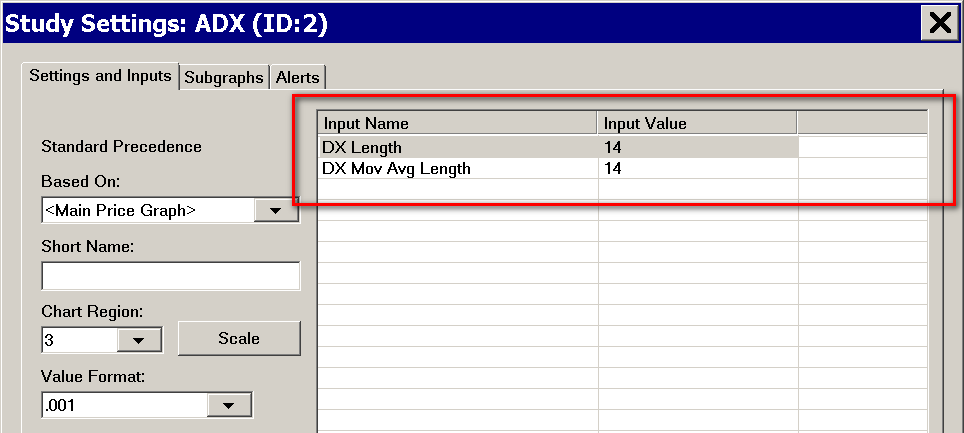

# ACSIL Interface Members - sc.Input Array

## Related Documentation

* [ACSIL Interface Members - Introduction](ACSIL_Members.md)
* [ACSIL Interface Members - Variables and Arrays](ACSIL_Members_Variables_And_Arrays.md)
* **ACSIL Interface Members - sc.Input Array**
* [ACSIL Interface Members - sc.Subgraph Array](ACSIL_Members_scSubgraph.md)
* [ACSIL Interface Members - Functions](ACSIL_Members_Functions.md)
* [ACSIL Interface Members - Graphics Functions](ACSIL_Members_GraphicsFunctions.md).

---

## On This Page

* [Introduction](#introduction)
* [Using References to Inputs](#usingreferencesinputs)
* [Controlling the Display Order of Inputs in the Study Settings Window](#controllingdisplayorderofinputs)
* [Notes About Changing Study Inputs from Other Studies](#notesaboutchangingstudyinputsfromotherstudies)
* [ACSIL sc.Input[] Members](#ACSILInputMembers)
  + [sc.Input[].Name](#scInputName)
  + [sc.Input[].SetInt()](#scInputSetInt)
  + [sc.Input[].GetInt()](#scInputGetInt)
  + [sc.Input[].SetIntLimits()](#scInputSetIntLimits)
  + [sc.Input[].SetFloat()](#scInputSetFloat)
  + [sc.Input[].GetFloat()](#scInputGetFloat)
  + [sc.Input[].SetFloatLimits()](#scInputSetFloatLimits)
  + [sc.Input[].SetYesNo()](#scInputSetYesNo)
  + [sc.Input[].GetYesNo()](#scInputGetYesNo)
  + [sc.Input[].GetBoolean()](#scInputGetBoolean)
  + [sc.Input[].SetInputDataIndex()](#scInputSetInputDataIndex)
  + [sc.Input[].GetInputDataIndex()](#scInputGetInputDataIndex)
  + [sc.Input[].SetMovAvgType()](#scInputSetMovAvgType)
  + [sc.Input[].GetMovAvgType()](#scInputGetMovAvgType)
  + [sc.Input[].SetDate()](#scInputSetDate)
  + [sc.Input[].GetDate()](#scInputGetDate)
  + [sc.Input[].SetTime()](#scInputSetTime)
  + [sc.Input[].SetTimeAsSCDateTime()](#scInputSetTimeAsSCDateTime)
  + [sc.Input[].GetTime()](#scInputGetTime)
  + [sc.Input[].SetDateTime()](#scInputSetDateTime)
  + [sc.Input[].GetDateTime()](#scInputGetDateTime)
  + [sc.Input[].SetCustomInputStrings()](#scInputSetCustomInputStrings)
  + [sc.Input[].SetCustomInputIndex()](#scInputSetCustomInputIndex)
  + [sc.Input[].GetSelectedCustomString()](#scInputGetSelectedCustomString)
  + [sc.Input[].GetColor()](#scInputGetColor)
  + [sc.Input[].SetColor()](#scInputSetColor)
  + [sc.Input[].GetIndex()](#scInputGetIndex)
  + [sc.Input[].SetDouble()](#scInputSetDouble)
  + [sc.Input[].GetDouble()](#scInputGetDouble)
  + [sc.Input[].SetDoubleLimits()](#scInputSetDoubleLimits)
  + [sc.Input[].SetTimePeriodType()](#scInputSetTimePeriodType)
  + [sc.Input[].GetTimePeriodType()](#scInputGetTimePeriodType)
  + [sc.Input[].SetAlertSoundNumber()](#scInputSetAlertSoundNumber)
  + [sc.Input[].GetAlertSoundNumber()](#scInputGetAlertSoundNumber)
  + [sc.Input[].SetStudyID()](#scInputSetStudyID)
  + [sc.Input[].GetStudyID()](#scInputGetStudyID)
  + [sc.Input[].SetChartNumber()](#scInputSetChartNumber)
  + [sc.Input[].GetChartNumber()](#scInputGetChartNumber)
  + [sc.Input[].SetChartStudySubgraphValues()](#scInputSetChartStudySubgraphValues)
  + [sc.Input[].GetChartStudySubgraphValues()](#scInputGetChartStudySubgraphValues)
  + [sc.Input[].SetStudySubgraphValues()](#scInputSetStudySubgraphValues)
  + [sc.Input[].GetSubgraphIndex()](#scInputGetSubgraphIndex)
  + [sc.Input[].SetChartStudyValues()](#scInputSetChartStudyValues)
  + [sc.Input[].SetDescription()](#scInputSetDescription)
  + [sc.Input[].SetString()](#scInputSetString)
  + [sc.Input[].GetString()](#scInputGetString)
  + [sc.Input[].SetPathAndFileName()](#scInputSetPathAndFileName)
  + [sc.Input[].GetPathAndFileName()](#scInputGetPathAndFileName)

---

## Introduction

[Link](#introduction) - [Top](#top)

**sc.Input[]** is an array of the Inputs that a study can use.

A study Input contained within the **sc.Input[]** array is a s\_SCInput\_# type of data structure.

Inputs allow user-specified inputs or parameters to a study function. Inputs are listed on the [Settings and Inputs](ChartStudies.md#settingsandinputstab) tab of the **Study Settings** window for each study. These allow various types input parameters to the study.

Inputs can can consist of numbers (both integers and floating-point numbers), text strings and other various types of settings.

There is a maximum of **SC\_INPUTS\_AVAILABLE** (128) Inputs available for a custom study to use.

The sc.Input[] array starts at 0. The first element is at index 0, the second element is at index 1, and so on. For example: **sc.Input[0]** refers to the first Input and **sc.Input[9]** refers to the tenth Input.

When you are adding or removing study Inputs in the source code for an existing applied study instance to a chart, it is necessary to remove the study from the chart and add it again. Or close and reopen the Chartbook it is contained within.

The **sc.Input[]** array has both Set\* and Get\* member functions. Use the Set\* functions in the [sc.SetDefaults](ACSIL_Members_Variables_And_Arrays.md#scsetdefaults) code block to add an Input to a Study and set its initial value. Use the **Get\***  member functions outside of the [sc.SetDefaults](ACSIL_Members_Variables_And_Arrays.md#scsetdefaults) code block to get the current Input setting.

Unless otherwise noted in the descriptions below, the **sc.Input[].Set\*** and **sc.Input[].Get\*** functions with the same name after Set/Get, correspond with each other. Use the **Set\*** function to add the Input to the study and set its initial value. Use the **Get\*** function to get the current Input setting. For example, [sc.Input[].SetYesNo()](#scInputSetYesNo) and [sc.Input[].GetYesNo()](#scInputGetYesNo) correspond with each other.

## Using References to Inputs

[Link](#usingreferencesinputs) - [Top](#top)

The Input reference type, **SCInputRef**, can be used to set a reference to any of the available inputs to simplify writing code. It is most recommended you use **SCInputRef**, to make your code more readable. Refer to the example below.

#### Code Example

```cpp
      
SCSFExport scsf_SimpMovAvg(SCStudyInterfaceRef sc)
{
    SCSubgraphRef Average = sc.Subgraph[0];

    SCInputRef Length = sc.Input[0];

    // Set configuration variables
    if (sc.SetDefaults)
    {
        // Set the configuration and defaults

        sc.GraphName = "Simple Moving Average";

        sc.StudyDescription = "Example function for calculating a simple moving average.";

        // Set the region to draw the graph in. Region zero is the main
        // price graph region.
        sc.GraphRegion = 0;

        // Set the name of the first subgraph
        Average.Name = "Average";

        // Set the color, style and line width for the subgraph
        Average.PrimaryColor = RGB(0,255,0);
        Average.DrawStyle = DRAWSTYLE_LINE;
        Average.LineWidth = 3;

        // Set the Length input and default it to 30
        Length.Name = "Length";
        Length.SetInt(30);

        Length.SetIntLimits(1, 1000);

        sc.AutoLoop = 1;//Automatic Looping

        sc.AlertOnlyOncePerBar = TRUE;       

        // Must return before doing any data processing if sc.SetDefaults is set
        return;
    }

    // Do data processing

    // Set the index of the first array element to begin drawing at
    sc.DataStartIndex = Length.GetInt(); - 1;

    // Calculate a simple moving average from the base data
    sc.SimpleMovAvg(sc.Close,Average,Length.GetInt());

    if (sc.CrossOver(Average,sc.Close))
    {
        // Since we are using auto-looping we do not specify the Index parameter.
        sc.SetAlert(1, "Moving average has crossed last price."); 
    }
}
        
```

## Controlling the Display Order of Inputs in the Study Settings Window

[Link](#controllingdisplayorderofinputs) - [Top](#top)

The order in which ACSIL study inputs are displayed on the **Inputs**  list on the **Setting and Inputs** tab of the  **Study Settings** window, depends upon the index number into the **sc.Input[]** array a particular Input is using. **sc.Input[0]** is listed first. **sc.Input[1]** is listed second and so on.

It is supported to alter the display order through the **sc.Input[].DisplayOrder** member. This is a 1-based integer used to control the display order in the list of study Inputs. For example, **sc.Input[10].DisplayOrder = 1** , will be the first study listed in the list of Inputs.

[](../images/studyinputlist.png)

It is not valid to repeat the value used for DisplayOrder within the same study. The valid range is from 1 through SC\_INPUTS\_AVAILABLE (128).

## Notes About Changing Study Inputs from Other Studies

[Link](#notesaboutchangingstudyinputsfromotherstudies) - [Top](#top)

It is not possible to change study Inputs for another study during the last call to a study function (sc.LastCallToFunction) when removing the study from Chart Studies window. The internal reason this is not possible is because in the Chart Studies window interface there is a temporary copy of the of the studies and their current state, although not including the subgraph arrays. When studies are removed through this interface they are making changes to the studies on the chart. After the studies are removed, then the remaining studies in the Chart Studies window are then applied to the chart reverting any changes to Inputs. This will not change.

## ACSIL sc.Input[] Members

[Link](#acsilinputmembers) - [Top](#top)

The following sections document all of the members of the **sc.Input[]** array of Input structures.

### sc.Input[].Name

[Link](#scinputname) - [Top](#top)

Type: Read/Write SCString variable.

Initial value: "" (empty string)

**sc.Input[].Name** is the name of the Input. An input will only display in the list of Inputs for the study on the Study Settings window if a name is set for it.

#### Example

```cpp
sc.Input[0].Name = "Length";
```

### sc.Input[].SetInt()

[Link](#scinputsetint) - [Top](#top)

Type: sc.Input[] Set function.

SCInputRef **sc.Input[].SetInt**(int **Value**);

The **sc.Input[].SetInt()** function adds an Input to the Study Settings window for the study and sets the initial value. The initial value is an Integer value. This Input displays a text box in which an Integer value can be entered.

#### Example

```cpp
sc.Input[9].SetInt(20);
```

### sc.Input[].GetInt()

[Link](#scinputgetint) - [Top](#top)

Type: sc.Input[] Get function.

The **sc.Input[].GetInt()** function gets the value from a study Input set with the **sc.Input[].SetInt()** function. User changes to the input also apply when getting the value.

#### Example

```cpp
int InInteger = sc.Input[9].GetInt();
```

### sc.Input[].SetIntLimits()

[Link](#scinputsetintlimits) - [Top](#top)

Type: sc.Input[] Set function.

**sc.Input[].SetIntLimits**(int **Min**, int **Max**);

The **sc.Input[].SetIntLimits()** function sets the minimum and maximum limits for an Integer Input. The user will not be able to set a value for this Input outside of the range that is specified through this function.

#### Example

```cpp
sc.Input[9].SetIntLimits(1, 100);
```

### sc.Input[].SetFloat()

[Link](#scinputsetfloat) - [Top](#top)

Type: sc.Input[] Set function.

SCInputRef **sc.Input[].SetFloat**(float **Value**);

The **sc.Input[].SetFloat()** function adds an Input to the Study Settings window for the study and sets the initial value. The initial value is a single precision floating point value. This Input displays a text box in which a float value can be entered.

#### Example

```cpp
sc.Input[4].SetFloat(5.5f);
```

### sc.Input[].GetFloat()

[Link](#scinputgetfloat) - [Top](#top)

Type: sc.Input[] Get function.

float **sc.Input[].GetFloat**();

The **sc.Input[].GetFloat()** function gets the value from a study Input set with the **sc.Input[].SetFloat()** function. User changes to the input also apply when getting the value.

#### Example

```cpp
float InFloat = sc.Input[4].GetFloat();
```

### sc.Input[].SetFloatLimits()

[Link](#scinputsetfloatlimits) - [Top](#top)

Type: sc.Input[] Set function.

**sc.Input[].SetFloatLimits**(float **Min**, float **Max**);

The **sc.Input[].SetFloatLimits()** function sets the minimum and maximum limits for a float Input. The user will not be able to set a value for this Input outside of the range that is specified through this function.

#### Example

```cpp
sc.Input[4].SetFloat(5.5f);

sc.Input[4].SetFloatLimits(-10.0f, 10.0f);
```

### sc.Input[].SetYesNo()

[Link](#scinputsetyesno) - [Top](#top)

Type: sc.Input[] Set function.

SCInputRef **sc.Input[].SetYesNo**(unsigned int **Value**);

The **sc.Input[].SetYesNo()** function adds an Input to the Study Settings window for the study and sets the initial value. The initial value can either be 1 for **Yes** or 0 for **No**. This Input displays a list box with the choices **Yes** and **No**.

#### Example

```cpp
sc.Input[5].SetYesNo(0);
```

### sc.Input[].GetYesNo()

[Link](#scinputgetyesno) - [Top](#top)

Type: sc.Input[] Get function.

unsigned int **sc.Input[].GetYesNo**();

The **sc.Input[].GetYesNo()** function gets the value from a study Input set with the **sc.Input[].SetYesNo()** function. User changes to the input also apply when getting the value. 0 is returned for No/False, and 1 is returned for Yes/True.

#### Example

```cpp
int InYesNo = sc.Input[5].GetYesNo();
```

### sc.Input[].GetBoolean()

[Link](#scinputgetboolean) - [Top](#top)

Type: sc.Input[] Get function.

int **sc.Input[].GetBoolean**();

The **sc.Input[].GetBoolean()** function gets the value from a study Input set with the **sc.Input[].SetYesNo()** function. User changes to the input also apply when getting the value. 0 is returned for No/False, and 1 is returned for Yes/True.

#### Example

```cpp
int InYesNoValue = sc.Input[0].GetBoolean();
```

### sc.Input[].SetInputDataIndex()

[Link](#scinputsetinputdataindex) - [Top](#top)

Type: sc.Input[] Set function.

SCInputRef **sc.Input[].SetInputDataIndex**(unsigned int **Index**);

**sc.Input[].SetInputDataIndex()** creates an Input Data type of Input in the Study Settings window for the study and sets the selected Input Data item. You can set the **Index** parameter to any of the constants: **SC\_OPEN**, **SC\_HIGH**, ... which are listed in the **[sc.BaseData[][]](index49ba.html?page=doc/ACSIL_Members_Variables_And_Arrays.html#scBaseDataIn)** description. The Input is shown in the Technical Study Settings window as a list box with the options: Open, High, Low, Close, ....

#### Example

```cpp
sc.Input[0].SetInputDataIndex(SC_HIGH);
```

### sc.Input[].GetInputDataIndex()

[Link](#scinputgetinputdataindex) - [Top](#top)

Type: sc.Input[] Get function.

unsigned int **sc.Input[].GetInputDataIndex**();

**sc.Input[].GetInputDataIndex()** gets the index of the selected Input Data item for the study input. This value can be used as an index into the **[sc.BaseData[][]](index49ba.html?page=doc/ACSIL_Members_Variables_And_Arrays.html#scBaseDataIn)** arrays.

#### Example

```cpp
// Get the input data index for the first input
int InputDataIndex = sc.Input[0].GetInputDataIndex();

//The following line copies an element at the current index from
//the sc.BaseData array selected with sc.Input[0], to the element
//at the current index of the first Subgraph.
sc.Subgraph[0][sc.Index] = sc.BaseData[InputDataIndex][sc.Index];
```

### sc.Input[].SetMovAvgType()

[Link](#scinputsetmovavgtype) - [Top](#top)

Type: sc.Input[] Set function.

SCInputRef **sc.Input[].SetMovAvgType**(unsigned int **MovingAverageType**);

**sc.Input[].SetMovAvgType()** sets the moving average type for the input. The input is shown in the Technical Study Settings window as a list containing the various different moving average types supported for the input. The parameter **MovingAverageType** can be one of the following values:

* **MOVAVGTYPE\_EXPONENTIAL**
* **MOVAVGTYPE\_LINEARREGRESSION**
* **MOVAVGTYPE\_SIMPLE**
* **MOVAVGTYPE\_WEIGHTED**
* **MOVAVGTYPE\_WILDERS**
* **MOVAVGTYPE\_SIMPLE\_SKIP\_ZEROS**
* **MOVAVGTYPE\_SMOOTHED**

#### Example

```cpp
sc.Input[3].SetMovAvgType(MOVAVGTYPE_SIMPLE);
```

### sc.Input[].GetMovAvgType()

[Link](#scinputgetmovavgtype) - [Top](#top)

Type: sc.Input[] Get function.

unsigned int **sc.Input[].GetMovAvgType**();

**sc.Input[].GetMovAvgType()** gets the moving average type from the input. A moving average type can be one of the following values:

* **MOVAVGTYPE\_EXPONENTIAL**
* **MOVAVGTYPE\_LINEARREGRESSION**
* **MOVAVGTYPE\_SIMPLE**
* **MOVAVGTYPE\_WEIGHTED**
* **MOVAVGTYPE\_WILDERS**
* **MOVAVGTYPE\_SIMPLE\_SKIP\_ZEROS**
* **MOVAVGTYPE\_SMOOTHED**

#### Example

```cpp
sc.ATR(sc.BaseDataIn, ATR, Length.GetInt(), MAType.GetMovAvgType());
```

### sc.Input[].SetDate()

[Link](#scinputsetdate) - [Top](#top)

Type: sc.Input[] Set function.

SCInputRef **sc.Input[].SetDate**(int **Date**);

The **sc.Input[].SetDate()** function adds an Input to the Study Settings window for the study and sets the initial value. The initial value is a [Date Value](SCDateTime.md#datevalue). This Input displays a standard Windows date picker interface. Unless there is a specific date we want to specify as an initial value, we should use zero for the Date parameter.

#### Example

```cpp
sc.Input[0].SetDate(0);
```

### sc.Input[].GetDate()

[Link](#scinputgetdate) - [Top](#top)

Type: sc.Input[] Get function.

int **sc.Input[].GetDate**();

The **sc.Input[].GetDate()** function gets the date value from a study Input set with the **sc.Input[].SetDate()** function. User changes to the input also apply when getting the value. The value returned is a [Date Value](SCDateTime.md#datevalue).

#### Example

```cpp
int InDate = sc.Input[0].GetDate();
```

### sc.Input[].SetTime()

[Link](#scinputsettime) - [Top](#top)

Type: sc.Input[] Set function.

SCInputRef **sc.Input[].SetTime**(int **Value**);

The **sc.Input[].SetTime()** function adds an Input to the Study Settings window for the study and sets the initial value. The initial value is a [Time Value](SCDateTime.md#timevalue). This Input displays a Time interface. Unless there is a specific time you want to specify as an initial value, use zero for the Time parameter.

#### Example

```cpp
// The HMS_TIME function is used to make a time value from hours, minutes, and seconds
sc.Input[0].SetTime(HMS_TIME(8,30,0)); // Set the time for the input to 8:30
```

### sc.Input[].SetTimeAsSCDateTime()

[Link](#scinputsettimeasscdatetime) - [Top](#top)

Type: sc.Input[] Set function.

SCInputRef **sc.Input[].SetTimeAsSCDateTime**(int **Value**);

The **sc.Input[].SetTimeAsSCDateTime()** function adds an Input to the Study Settings window for the study and sets the initial value. The initial value is a Time as a [SCDateTime](SCDateTime.md) variable.

This Input displays a standard Time interface. Unless there is a specific time you want to specify as an initial value, use zero for the Time parameter.

This function supports setting a Time value with milliseconds or greater precision.

### sc.Input[].GetTime()

[Link](#scinputgettime) - [Top](#top)

Type: sc.Input[] Get function.

int **sc.Input[].GetTime**();

The **sc.Input[].GetTime()** function gets the time value from a study Input set with the **sc.Input[].SetTime()** function. User changes to the input also apply when getting the value. The value returned is a [Time Value](SCDateTime.md#timevalue).

#### Example

```cpp
int InTime = sc.Input[0].GetTime();
```

### sc.Input[].SetDateTime()

[Link](#scinputsetdatetime) - [Top](#top)

Type: sc.Input[] Set function.

SCInputRef **sc.Input[].SetDateTime**(SCDateTime **DateTime**);

The **sc.Input[].SetDateTime()** function adds an Input to the Study Settings window for the study and sets the initial value. The initial value is a [SCDateTime](SCDateTime.md) value. This Input displays a standard Windows date and time interface. Unless there is a specific date-time we want to specify as an initial value, we should use zero for the DateTime parameter.

#### Example

```cpp
sc.Input[0].SetDateTime(0);
```

### sc.Input[].GetDateTime()

[Link](#scinputgetdatetime) - [Top](#top)

Type: sc.Input[] Get function.

SCDateTime **sc.Input[].GetDateTime**();

The **sc.Input[].GetDateTime()** function gets the [SCDateTime](SCDateTime.md) value from a study Input set with the sc.Input[].SetDateTime() function. User changes to the input also apply when getting the value. The value returned is a SCDateTime value.

#### Example

```cpp
SCDateTime InDateTime = sc.Input[0].GetDateTime();
```

### sc.Input[].SetCustomInputStrings()

[Link](#scinputsetcustominputstrings) - [Top](#top)

Type: sc.Input[] Set function.

void **sc.Input[].SetCustomInputStrings**(const char\* p\_CustomStrings)

The **sc.Input[].SetCustomInputStrings()** function works in conjunction with the **sc.Input[].SetCustomInputIndex()** input. These functions together allow you to specify a custom list of text strings for a user study input and set the default selected text string. The **sc.Input[].SetCustomInputIndex()** function allows you set the default selected text string in the input list. Each text string in the input list maps to a zero-based Integer index. The first one is 0, the second one is 1 and so on. To get the Integer index of the selected text string in the input list, use the function  **sc.Input[].GetIndex()**.

For a complete code example, refer to the **scsf\_CustomStringsInputExample** function in the **/ACSSource/studies.cpp** file in the folder where Sierra Chart is installed to.

#### Example

```cpp
// Define a reference to an available input to make it easier to refer to
SCInputRef CustomInput = sc.Input[0];

if (sc.SetDefaults)
{
CustomInput.Name = "List of options";

// Define the list of strings for our custom input
CustomInput.SetCustomInputStrings("Option 1;Option 2;Option 3;Option 4");

// Set the first text string as the initial selected item in the custom list of text strings
CustomInput.SetCustomInputIndex(0);
}

// Get the index of the selected text string. This is zero-based.
int Selection = CustomInput.GetIndex();
```

### sc.Input[].SetCustomInputIndex()

[Link](#scinputsetcustominputindex) - [Top](#top)

Type: sc.Input[] Set function.

void **sc.Input[].SetCustomInputIndex**(int StringIndex)

For complete details about this function and an example, refer to the [sc.Input[].SetCustomInputStrings ()](#scInputSetCustomInputStrings) description.

### sc.Input[].GetIndex()

[Link](#scinputgetindex) - [Top](#top)

Type: sc.Input[] Get function.

unsigned int **sc.Input[].GetIndex**();

The **sc.Input[].GetIndex()** function gets the Integer index of the selection for the sc.Input[]. For more details about this function and an example, refer to the [sc.Input[].SetCustomInputStrings()](#scInputSetCustomInputStrings) description.

#### Example

```cpp
int SelectedIndex = sc.Input[0].GetIndex();
```

### sc.Input[].GetSelectedCustomString()

[Link](#scinputgetselectedcustomstring) - [Top](#top)

Type: sc.Input[] Get function.

SCString **sc.Input[].GetSelectedCustomString()**

This function can be used when an input has been set to hold a list of text strings with the [sc.Input[].SetCustomInputStrings()](#scInputSetCustomInputStrings) function. This function returns the selected text string, and not the Integer index. The return value is a SCString.

#### Example

```cpp
SCString SelectedStringText = sc.Input[0].GetSelectedCustomString();
```

### sc.Input[].SetColor()

[Link](#scinputsetcolor) - [Top](#top)

Type: sc.Input[] Set function.

SCInputRef **sc.Input[].SetColor**(unsigned int **Color**);

The **sc.Input[].SetColor()** function adds an Input to the Study Settings window for the study and sets the initial value. The initial value is a RBG color value. This input displays a color button.

#### Example

```cpp
sc.Input[0].SetColor(128, 128, 128);
```

### sc.Input[].GetColor()

[Link](#scinputgetcolor) - [Top](#top)

Type: sc.Input[] Get function.

unsigned int **sc.Input[].GetColor**();

The **sc.Input[].GetColor()** function gets the value from a study Input set with the **sc.Input[].SetColor()** function. User changes to the input also apply when getting the value. The value returned is a RGB color value.

#### Example

```cpp
// Get the color value 
unsigned int ColorValue = sc.Input[0].GetColor();
```

### sc.Input[].SetDouble()

[Link](#scinputsetdouble) - [Top](#top)

Type: sc.Input[] Set function.

SCInputRef **sc.Input[].SetDouble**(double **Value**);

The **sc.Input[].SetDouble()** function adds an Input to the Study Settings window for the study and sets the initial value. The initial value is a double precision floating point value. This Input displays a text box in which a float value can be entered.

#### Example

```cpp
sc.Input[0].SetDouble(10.5);
```

### sc.Input[].GetDouble()

[Link](#scinputgetdouble) - [Top](#top)

Type: sc.Input[] Get function.

double **sc.Input[].GetDouble**();

The **sc.Input[].GetDouble()** function gets the value from a study Input set with the **sc.Input[].SetDouble()** function. User changes to the input also apply when getting the value.

#### Example

```cpp
double InValue = sc.Input[0].GetDouble();
```

### sc.Input[].SetDoubleLimits()

[Link](#scinputsetdoublelimits) - [Top](#top)

Type: sc.Input[] Set function.

SCInputRef **sc.Input[].SetDoubleLimits**(double **Min**, double **Max**);

The **sc.Input[].SetDoubleLimits()** function sets the minimum and maximum limits for a double Input. The user will not be able to set a value for this Input outside of the range that is specified through this function.

#### Example

```cpp
sc.Input[0].SetDoubleLimits(1.0, 100.0);
```

### sc.Input[].SetTimePeriodType()

[Link](#scinputsettimeperiodtype) - [Top](#top)

Type: sc.Input[] Set function.

SCInputRef **sc.Input[].SetTimePeriodType**(unsigned int **Value**);

The **sc.Input[].SetTimePeriodType()** function adds an Input to the Study Settings window for the study and sets the initial value. The initial value is an Integer value of one of the constants listed below. This Input displays a list box in which one of the choices can be selected.

* TIME\_PERIOD\_LENGTH\_UNIT\_MINUTES
* TIME\_PERIOD\_LENGTH\_UNIT\_DAYS
* TIME\_PERIOD\_LENGTH\_UNIT\_WEEKS
* TIME\_PERIOD\_LENGTH\_UNIT\_MONTHS
* TIME\_PERIOD\_LENGTH\_UNIT\_YEARS

#### Example

```cpp
SCInputRef TimePeriodType = sc.Input[0]; 
TimePeriodType.Name = "Time Period Type"; 
TimePeriodType.SetTimePeriodType(TIME_PERIOD_LENGTH_UNIT_MINUTES); 
```

### sc.Input[].GetTimePeriodType()

[Link](#scinputgettimeperiodtype) - [Top](#top)

Type: sc.Input[] Get function.

unsigned int **sc.Input[].GetTimePeriodType**();

The **sc.Input[].GetTimePeriodType()** function gets the value from a study Input set with the **sc.Input[].SetTimePeriodType()** function. User changes to the input also apply when getting the value. The return value is one the constants listed below.

* TIME\_PERIOD\_LENGTH\_UNIT\_MINUTES
* TIME\_PERIOD\_LENGTH\_UNIT\_DAYS
* TIME\_PERIOD\_LENGTH\_UNIT\_WEEKS
* TIME\_PERIOD\_LENGTH\_UNIT\_MONTHS
* TIME\_PERIOD\_LENGTH\_UNIT\_YEARS

#### Example

```cpp
SCInputRef TimePeriodType = sc.Input[0];

if (TimePeriodType.GetTimePeriodType() == TIME_PERIOD_LENGTH_UNIT_DAYS )
{
    NumMins = MINUTES_PER_DAY;
}
```

### sc.Input[].SetAlertSoundNumber()

[Link](#scinputsetalertsoundnumber) - [Top](#top)

Type: sc.Input[] Set function.

SCInputRef **sc.Input[].SetAlertSoundNumber**(int **Value**);

The **sc.Input[].SetAlertSoundNumber()** function adds an Input to the Study Settings window for the study and sets the initial value.

This Input displays a list box in which one of the choices can be selected.

The initial value can be one of the following:

* **0**: Alert Disabled. This means that the alert is completely disabled and your code should not generate an alert message or sound.
* **1**: No Alert Sound. This means the alert will not generate a sound but can generate a message.
* **>= 2**: The Alert Number + 1 which corresponds to all of the Alert Numbers in **Global Settings >> General Settings >> Alerts**. As of this writing, there are currently 150 of them. This value needs to have 1 subtracted from it to get the actual Alert Number to use.

### Code Example

```cpp

SCInputRef HighAlert = sc.Input[0];

if(sc.SetDefaults)
{
   HighAlert.Name =  "High Alert Sound";
   HighAlert.SetAlertSoundNumber(2);
}
            
```

### sc.Input[].GetAlertSoundNumber()

[Link](#scinputgetalertsoundnumber) - [Top](#top)

Type: sc.Input[] Get function.

unsigned int **sc.Input[].GetAlertSoundNumber**();

The **sc.Input[].GetAlertSoundNumber()** function gets the value from a study Input set with the **sc.Input[].SetAlertSoundNumber()** function. User changes to the input also apply when getting the value.

The return value can be one of the following:

* **0**: Alert Disabled. This means that the alert is completely disabled and your code should not generate an alert message or sound.
* **1**: No Alert Sound. This means the alert will not generate a sound but can generate a message.
* **>= 2**: The Alert Number + 1 which corresponds to all of the Alert Numbers in **Global Settings >> General Settings >> Alerts**. As of this writing, there are currently 150 of them. This value needs to have 1 subtracted from it to get the actual Alert Number to use.

### Code Example

```cpp

SCString Message;
Message.Format("New Daily High: %f. Previous high: %f", sc.DailyHigh, PreviousHigh);
sc.PlaySound(HighAlert.GetAlertSoundNumber() - 1, Message);
            
```

### sc.Input[].SetStudyID()

[Link](#scinputsetstudyid) - [Top](#top)

Type: sc.Input[] Set function.

SCInputRef **sc.Input[].SetStudyID**(unsigned int **Value**);

**sc.Input[].SetStudyID()** sets the unique Study ID for the purpose of referencing another study. Each study on the chart has its own unique Study Identifier. For further information, refer to [Unique Study Instance Identifiers](ACSILProgrammingConcepts.md#uniquestudyinstanceidentifiers).

When an Input is set to this type, it will list all of the studies that are on the chart. The users selection will set the Input to the proper value.

Use [sc.Input[].GetStudyID()](#scInputGetStudyID) to get the current setting for this Input.

This Input type works with the [sc.GetStudyArrayUsingID()](ACSIL_Members_Functions.md#scgetstudyarrayusingid) function and other functions that require the unique Study ID. This normally should be set to 1 in the [sc.SetDefaults](ACSIL_Members_Variables_And_Arrays.md#scsetdefaults) code block.

#### Example

```cpp
sc.Input[0].SetStudyID(1);
```

### sc.Input[].GetStudyID()

[Link](#scinputgetstudyid) - [Top](#top)

Type: sc.Input[] Get function.

unsigned int **sc.Input[].GetStudyID**();

**sc.Input[].GetStudyID()** gets the unique instance ID for the selected study from the input. This input type works with the [sc.GetStudyArrayUsingID()](ACSIL_Members_Functions.md#scgetstudyarrayusingid) function and other functions that require a Study ID.

#### Example

```cpp
SCFloatArray Study1Array; 
sc.GetStudyArrayUsingID(InputStudy1.GetStudyID(), Study1Subgraph.GetSubgraphIndex(), Study1Array);
```

### sc.Input[].SetChartNumber()

[Link](#scinputsetchartnumber) - [Top](#top)

Type: sc.Input[] Set function.

SCInputRef **sc.Input[].SetChartNumber**(int **ChartNumber**);

The **sc.Input[].SetChartNumber()** function sets the input to a Chart Number input type which lists all of the charts within the same chartbook as the chart that the instance of your study is applied to. Each chart has a unique number which is displayed on the title bar of the chart. That number can be given to the **ChartNumber** parameter to this function. Or you can pass 1 which would be the first chart. It is essential to call this function, in order to set the input to a Chart Number type.

#### Example

```cpp
sc.Input[0].SetChartNumber(1); 
```

### sc.Input[].GetChartNumber()

[Link](#scinputgetchartnumber) - [Top](#top)

Type: sc.Input[] Get function.

int **sc.Input[].GetChartNumber**();

The **sc.Input[].GetChartNumber()** function returns the selected Chart Number from the study input. This function works with the **sc.Input[].SetChartNumber()** function. Each chart has a unique number which is displayed on the title bar of the chart. The chart number is used with various ACSIL functions that require a **ChartNumber** parameter.

#### Example

```cpp
int ChartNumber = sc.Input[0].GetChartNumber();

int Index = GetExactMatchForSCDateTime(ChartNumber, DateTimeValue);
```

### sc.Input[].SetChartStudySubgraphValues()

[Link](#scinputsetchartstudysubgraphvalues) - [Top](#top)

Type: sc.Input[] Set function.

SCInputRef **sc.Input[].SetChartStudySubgraphValues**(int **ChartNumber**, int **StudyID**, int **SubgraphIndex**);

The **sc.Input[].SetChartStudySubgraphValues()** function adds an Input to the Study Settings window for the study and sets the initial values. The example given below shows the recommended initial values. This Input displays 3 list boxes which allows a user to choose a chart in the chartbook that your study is applied to, a specific study on that chart, and a specific Subgraph within that selected study. This sc.Input[] Set function works with the corresponding [sc.Input[].GetChartStudySubgraphValues()](#scInputGetChartStudySubgraphValues) function to get the values that have been set.

#### Example

```cpp
SCInputRef StudySubgraphReference = sc.Input[0];

StudySubgraphReference.Name = "Study And Subgraph To Display";
StudySubgraphReference.SetChartStudySubgraphValues(1,1, 0);
```

### sc.Input[].GetChartStudySubgraphValues()

[Link](#scinputgetchartstudysubgraphvalues) - [Top](#top)

Type: sc.Input[] Get function.

s\_ChartStudySubgraphValues **sc.Input[].GetChartStudySubgraphValues**();

void **sc.Input[].GetChartStudySubgraphValues**(int& **ChartNumber**, int& **StudyID**, int& **SubgraphIndex**);

The **sc.Input[].GetChartStudySubgraphValues()** function gets the values from a study Input set with the **sc.Input[].SetChartStudySubgraphValues()** function. User changes to the input also apply when getting the values.

#### Example

```cpp

SCInputRef StudySubgraphReference = sc.Input[0];

if (sc.SetDefaults)
{
    StudySubgraphReference.Name = "Study And Subgraph To Display";

    StudySubgraphReference.SetChartStudySubgraphValues(1,1, 0);
    return;
}

SCFloatArray StudyReference;
sc.GetStudyArrayFromChartUsingID(StudySubgraphReference.GetChartStudySubgraphValues(), StudyReference);

//Alternative way to specify parameters
sc.GetStudyArrayFromChartUsingID(StudySubgraphReference.GetChartNumber(), StudySubgraphReference.GetStudyID(), StudySubgraphReference.GetSubgraphIndex(), StudyReference);
            
```

### sc.Input[].SetStudySubgraphValues()

[Link](#scinputsetstudysubgraphvalues) - [Top](#top)

Type: sc.Input[] Set function.

SCInputRef **sc.Input[].SetStudySubgraphValues**(int StudyID, int SubgraphIndex);

The **sc.Input[].SetStudySubgraphValues()** function adds an Input to the Study Settings window for the study and sets the initial values. The example given below shows the recommended initial values.

This Input displays 2 list boxes which allows a user to choose a study on the same chart that your study is applied to, and a [Subgraph](ACSIL_Members_scSubgraph.md) within that selected study.

This function works in conjunction with **sc.Input[].GetStudyID()** to get the selected study's unique ID and the **sc.Input[].GetSubgraphIndex()** function to get the selected Subgraph index.

The **StudyID** parameter is the study's [Graph Instance ID](ACSIL_Members_Variables_And_Arrays.md#scstudygraphinstanceid). The underlying main price graph in the chart will have a graph instance ID of 0. The **SubgraphIndex** parameter is zero based. The maximum will be MAX\_STUDY\_SUBGRAPHS - 1.

#### Example

```cpp
SCInputRef StudySugbraph1 = sc.Input[0];

StudySugbraph1.Name = "Input Study 1";
StudySugbraph1.SetStudySubgraphValues(0, 0);
```

### sc.Input[].GetSubgraphIndex()

[Link](#scinputgetsubgraphindex) - [Top](#top)

Type: sc.Input[] Get function.

unsigned int **sc.Input[].GetSubgraphIndex**();

The **sc.Input[].GetSubgraphIndex** function returns the zero based index of the selected study Subgraph from the sc.Input[]. It can be used with Inputs set with the **sc.Input[].SetStudySubgraphValues()** and **sc.Input[]. SetChartStudySubgraphValues()** functions.

#### Example

```cpp
SCInputRef StudyReference = sc.Input[0];

if (sc.SetDefaults)
{
    StudyReference.Name = "Study Reference";

    StudyReference.SetStudySubgraphValues(1,0);

    return;
}

// Get the study subgraph

SCFloatArray SubgraphArray;
sc.GetStudyArrayUsingID(StudyReference.GetStudyID(), StudyReference.GetSubgraphIndex(), SubgraphArray);

if (SubgraphArray.GetArraySize() == 0)
    return; // No subgraph data
```

### sc.Input[].SetChartStudyValues()

[Link](#scinputsetchartstudyvalues) - [Top](#top)

Type: sc.Input[] Set function.

SCInputRef **sc.Input[].SetChartStudyValues**(int **ChartNumber**, int **StudyID**);

The **sc.Input[].SetChartStudyValues()** function adds an Input to the Study Settings window for the study and sets the initial values. The initial values are a **ChartNumber** and **StudyID**. This Input displays two list boxes allowing the selection of a chart and study.

This function works in conjunction with **sc.Input[].GetChartNumber()** to get the selected chart number and the **sc.Input[].GetStudyID()** function to get the unique ID of the selected study.

#### Example

```cpp
sc.Input[0].SetChartStudyValues(1, 1);

int ChartNumber = sc.Input[0].GetChartNumber();

int StudyID = sc.Input[0].GetStudyID();
```

### sc.Input[].SetDescription()

[Link](#scinputsetdescription) - [Top](#top)

Type: sc.Input[] Set function.

SCInputRef **sc.Input[].SetDescription**(const char\* **Description**);

The **sc.Input[].SetDescription()** function sets the user documentation for your Input. This is displayed on an automatically generated HTML page. For more information refer to the [ACSIL Study Documentation Interface Members](ACSILDocumentationMembers.md) page.

#### Example

```cpp
sc.Input[0].SetDescription("This input sets the length of the study calculation");
```

### sc.Input[].SetString()

[Link](#scinputsetstring) - [Top](#top)

Type: sc.Input[] Set function.

SCInputRef **sc.Input[].SetString**(const char\* **Value**);

The **sc.Input[].SetString()** function adds an Input to the Study Settings window for the study and
sets the initial value. The initial value is a string value. This Input displays a text box in which a string value can be entered.

#### Example

```cpp
sc.Input[0].SetString("String Value");
```

### sc.Input[].GetString()

[Link](#scinputgetstring) - [Top](#top)

Type: sc.Input[] Get function.

const char\* **sc.Input[].GetString**();

The **sc.Input[].GetString()** function gets the value from a study Input set with the **sc.Input[].SetString()** function. User changes to the input also apply when getting the value.

#### Example

```cpp
const char* InValue = sc.Input[0].GetString();
```

### sc.Input[].SetPathAndFileName()

[Link](#scinputsetpathandfilename) - [Top](#top)

Type: sc.Input[] Set function.

const char\* **sc.Input[].SetPathAndFileName**();

The **sc.Input[].SetPathAndFileName()** function sets the Input type to support a file path and filename and specifies the initial path and filename. This can initially be empty/blank just by specifying empty quotes like "".

#### Example

```cpp
sc.Input[0].SetPathAndFileName("");
```

### sc.Input[].GetPathAndFileName()

[Link](#scinputgetpathandfilename) - [Top](#top)

Type: sc.Input[] Get function.

const char\* **sc.Input[].GetPathAndFileName**();

The **sc.Input[].GetPathAndFileName()** function gets the path and filename text string from the study Input set with the **sc.Input[].SetPathAndFileName()** function. User changes to the Input also apply when getting the value.

#### Example

```cpp
SCString PathAndFileName = sc.Input[0].GetPathAndFileName();
```

---

\*Last modified Sunday, 23rd February, 2025.
