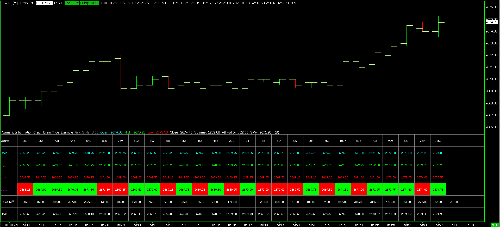

# ACSIL Interface Members - sc.Subgraph Array

## Related Documentation

* [ACSIL Interface Members - Introduction](ACSIL_Members.md)
* [ACSIL Interface Members - Variables and Arrays](ACSIL_Members_Variables_And_Arrays.md)
* [ACSIL Interface Members - sc.Input Array](ACSIL_Members_scInputs.md)
* **ACSIL Interface Members - sc.Subgraph Array**
* [ACSIL Interface Members - Functions](ACSIL_Members_Functions.md)
* [ACSIL Interface Members - Graphics Functions](ACSIL_Members_GraphicsFunctions.md).

---

## On This Page

* [sc.Subgraph[]](#scSubgraph)
* [sc.Subgraph[] Structure Members](#scSubgraphStructureMembers)
  + [sc.Subgraph[].Data[] / sc.Subgraph[][]](#scSubgraphData)
  + [sc.Subgraph[].GetArraySize()](#scSubgraphGetArraySize)
  + [sc.Subgraph[].Arrays[][]](#scSubgraphArrays)
  + [sc.Subgraph[].Name](#scSubgraphName)
  + [sc.Subgraph[].PrimaryColor](#scSubgraphPrimaryColor)
  + [sc.Subgraph[].SecondaryColor](#scSubgraphSecondaryColor)
  + [sc.Subgraph[].SecondaryColorUsed](#scSubgraphSecondaryColorUsed)
  + [sc.Subgraph[].DataColor[]](#scSubgraphDataColor)
  + [sc.Subgraph[].DrawStyle](#scSubgraphDrawStyle)
  + [sc.Subgraph[].LineStyle](#scSubgraphLineStyle)
  + [sc.Subgraph[].LineWidth](#scSubgraphLineWidth)
  + [sc.Subgraph[].LineLabel](#scSubgraphLineLabel)
  + [sc.Subgraph[].DisplayNameValueInWindowsFlags](#scDisplayNameValueInWindowsFlags)
  + [sc.Subgraph[].DisplayNameValueInDataLine](#scSubgraph_DisplayNameValueInDataLine)
  + [sc.Subgraph[].AutoColoring](#scSubgraphAutoColoring)
  + [sc.Subgraph[].DrawZeros](#scSubgraphDrawZeros)
  + [sc.Subgraph[].GraphicalDisplacement](#scSubgraphDisplacement)
  + [sc.Subgraph[].ExtendedArrayElementsToGraph](#scExtendedArrayElementsToGraph)
  + [sc.Subgraph[].TextDrawStyleText](#scTextDrawStyleText)
  + [sc.Subgraph[].ShortName](#scSubgraphShortName)
  + [sc.Subgraph[].IncludeInStudySummary](#scSubgraphIncludeInStudySummary)
  + [sc.Subgraph[].UseStudySummaryCellBackgroundColor](#scSubgraph_UseStudySummaryCellBackgroundColor)
  + [sc.Subgraph[].StudySummaryCellBackgroundColor](#scSubgraph_StudySummaryCellBackgroundColor)
  + [sc.Subgraph[].StudySummaryCellText](#scSubgraph_StudySummaryCellText)
  + [sc.Subgraph[].UseLabelsColor](#scSubgraph_UseLabelsColor)
  + [sc.Subgraph[].LabelsColor](#scSubgraph_LabelsColor)
* [Numeric Information Table Graph Draw Type](#numericinformationtablegraphdrawtype)
  + [s\_NumericInformationGraphDrawTypeConfig](#snumericinformationgraphdrawtypeconfig)
  + [sc.SetNumericInformationGraphDrawTypeConfig()](#scsetnumericinformationgraphdrawtypeconfig)
  + [sc.SetNumericInformationDisplayOrderFromString()](#scsetnumericinformationdisplayorderfromstring)
  + [Numeric Information Graph Example](#numericinformationgraphexample)

---

## sc.Subgraph[]

[Link](#scsubgraph) - [Top](#top)

**Type**: Array of study Subgraph structures.

**sc.Subgraph[]** is an array of the subgraphs available to the study. There is currently a maximum of **SC\_SUBGRAPHS\_AVAILABLE** (60) subgraphs available for your study to use.

Subgraphs have two purposes. The first is to display data which is part of the study onto the chart. The individual drawings in a study graph are considered Subgraphs. The second purpose is to hold data for background calculations or to hold data that needs to be maintained between function calls.

If you are using the [sc.Subgraph[].Data[]](#scSubgraphData) member array of a Subgraph for the second purpose, then do not name a Subgraph unless you want the data in the sc.Subgraph[].Data array to appear on the chart. By default, Subgraphs do not have names unless you set them. If you do want to make the background data visible for debugging purposes, then a Subgraph can have a name. However, in this case set its draw style to **DRAWSTYLE\_IGNORE**. This is very useful for debugging. The data can be viewed in the **Window >> Chart Values Window**.

There are also the Extra Arrays to hold data for background calculations and hold data that needs to be maintained between function calls. Refer to the [Extra Arrays](#scsubgrapharrays) member of this Subgraph structure.

### References

A useful method to make it easier to work with a **sc.Subgraph[]** and the **sc.Subgraph[].Data** array is to use a C++ reference. A reference is defined with **SCSubgraphRef**. **SCSubgraphRef** is a reference to the sc.Subgraph[] type. Below is an example of defining and using a reference.

#### Example

```cpp
// Make a reference to the second Subgraph and call it PlotB
SCSubgraphRef PlotB = sc.Subgraph[1];

// Now the PlotB reference can be used in place of sc.Subgraph[1]

// Set the value of the element in the Subgraph Data array the
// current index to 10.

// This is the same as sc.Subgraph[1][sc.Index] = 10.0f;
PlotB[sc.Index] = 10.0f; 

// Calculate the simple moving average and store the result in
// the Data array of PlotB (sc.Subgraph[1]).
sc.SimpleMovAvg(sc.BaseDataIn[SC_LAST], PlotB, 20);
```

## sc.Subgraph[] Structure Members

### sc.Subgraph[].Data[] / sc.Subgraph[][]

[Link](#scsubgraphdata) - [Top](#top)

Read/Write. Array of float variables (SCFloatArray).

**sc.Subgraph[].Data[]** is the array of values for the study Subgraph. This is where you will store the results of the study calculations, and this is the data that will be graphed on the chart if the sc.Subgraph has the **Name** member set and has a visible **DrawStyle**.

The size of this array is equal to **[sc.ArraySize](ACSIL_Members_Variables_And_Arrays.md#scarraysize)**. If you have set **[sc.IsCustomChart](ACSIL_Members_Variables_And_Arrays.md#sciscustomchart)**, the size of this array is equal to **[sc.OutArraySize](ACSIL_Members_Variables_And_Arrays.md#scoutarraysize)**.

When a chart is reloaded, when the study is first added to a chart, or when a Chartbook is opened and the study exists on one of the charts, then all of the **sc.Subgraph[].Data[]** array elements are initialized to 0.

If you are familiar with the Sierra Chart Spreadsheet Studies, it may help to think of this Subgraph Data array as a column of data in a Spreadsheet (formula columns K through Z). The Spreadsheet Studies uses these same Subgraph Data arrays to hold the results from the formula columns.

A shorthand method to access a Subgraph Data array element exists. Example: **sc.Subgraph[0][sc.Index]** is equivalent to **sc.Subgraph[0].Data[sc.Index]**. When passing a Subgraph Data array to an array based study function such as sc.Highest(), you do not need to use the second set of brackets. For example, use **sc.Subgraph[0]** or **sc.Subgraph[0].Data**.

For more information about the sc.Subgraph structure and the purpose of Subgraphs, refer to [sc.Subgraph[]](#scSubgraph).

For information about indexing and array sizes refer to [Array Indexing and Sizes](ACS_ArraysAndLooping.md#arrayindexing).

Whenever first accessing an element of the **sc.Subgraph[].Data** array at sc.Subgraph[] index 1 or higher, at that time causes an allocation of the memory required for that Data array.

The use of the  **[]**  operator on the **Data**  member (**sc.Subgraph[].Data[]**), returns a *reference* to that particular element and you can both *get and set* the element.

#### Example

```cpp

// Set the value of the element at the current index in the third Subgraph to 12.5
sc.Subgraph[2][sc.Index] = 12.5f; 

// Get the value of the element of the current index in the third Subgraph
float SubgraphValue = sc.Subgraph[2][sc.Index];
            
```

#### Example

```cpp
// Calculate the exponential moving average with a Length of 20 on the closing
// prices from the chart and store the result in the second Subgraph (sc.Subgraph[1]).
sc.ExponentialMovAvg(sc.BaseDataIn[SC_LAST], sc.Subgraph[1], 20);

// Calculate the simple moving average with a Length of 20 on the exponential
// moving average that was calculated above. To do this, use the second
// Subgraph (sc.Subgraph[1]) as the input for the simple moving average.
// Store the result in the first Subgraph (sc.Subgraph[0]).
sc.SimpleMovAvg(sc.Subgraph[1], sc.Subgraph[0], 20);
```

### sc.Subgraph[].GetArraySize()

[Link](#scsubgraphgetarraysize) - [Top](#top)

**Type:** Function.

The **sc.Subgraph[].GetArraySize()** function gets the number of **sc.Subgraph[].Data[]** arrays within the sc.Subgraph[]. Normally, this will return the maximum number of Subgraphs. As of 2013-8 this is 60.

### sc.Subgraph[].Arrays[][]

[Link](#scsubgrapharrays) - [Top](#top)

**Type:** Read/Write array of float arrays (SCFloatArray).

**Arrays[Index1][Index2]**: This member is an array of arrays to be used for storing background or intermediate calculations and to store data that needs to be held between function calls.

As of 2016-02 there are 12 extra arrays for each **sc.Subgraph[]**.

The arrays referred to by **sc.Subgraph[].Arrays[]** are of type SCFloatArray. The reference type to them is **SCFloatArrayRef**.

These extra array elements can be accessed by using **sc.Subgraph[].Arrays[Index1][Index2]**. Where **Index1** can be from 0 to (12 - 1) and represent these internal Subgraph arrays. Where **Index2** is the same index value as used with the **sc.Subgraph[].Data[]** arrays (This accesses the primary graphable Data array for the Subgraph).

Each of the sc.Subgraph[].Arrays[][] arrays has the same size as sc.Subgraph[].Data[]. A working example can be found in the **scsf\_ExtraArraysExample** function in the **/ACS\_Source/studies.cpp**  file.

As with all arrays used in ACSIL, these are safe and using an index which is out of bounds does not cause any harm. It is simply adjusted to be within the bounds. For example, if Index2 is -1, it will be adjusted to 0.

Note: Some study functions that take arrays for input and output require a reference to a **sc.Subgraph** and not a reference to a **SCFloatArray** contained within a sc.Subgraph. An example is sc.MACD().

These functions will use the extra arrays contained within the passed sc.Subgraph (**sc.Subgraph[].Arrays[]**). Usually they will use 2 or 3 extra arrays, but it could be up to 6 to 8 extra arrays. After passing a Subgraph to one of these functions, you do not want to use one of these extra arrays in the sc.Subgraph for another purpose by writing to it.

#### References

To do a reference to an Extra Array to make accessing it easier, define a reference like this:

#### Example

```cpp
SCFloatArrayRef myArray = sc.Subgraph[0].Arrays[0];

// Set the array element at the current index to 10. This is just an example.
myArray[sc.Index] = 10;
```

#### Passing Extra Arrays to Functions

To pass an Extra Array to a function you simply define the parameter type as **SCFloatArrayRef**. Refer to the **scsf\_PassingExtraArray** function in the /ACS\_Source/studies.cpp file in the folder Sierra Chart is installed to.

### sc.Subgraph[].Name

[Link](#scsubgraphname) - [Top](#top)

Read/Write string variable.

Initial value: "" (empty string)

**sc.Subgraph[].Name** is the name of the Subgraph. If there is no name, the Subgraph will not be drawn, and it will not be displayed on the list of Subgraphs in the **Subgraphs** tab on the Study Settings window. It is useful to use a sc.Subgraph to store some background or intermediate calculation that should not be displayed. This is a good example of when you would want to leave the **Name** blank, so that it will not be graphed on the chart.

#### Example:

```cpp

 // Set the name of the first Subgraph
sc.Subgraph[0].Name = "First Subgraph";
```

### sc.Subgraph[].PrimaryColor

[Link](#scsubgraphprimarycolor) - [Top](#top)

Read/Write color variable.

**sc.Subgraph[].PrimaryColor** is the primary color for the Subgraph. This is the only color for the Subgraph if the secondary color is not used. For more information on colors, refer to [RGB Color Values](ACSILDrawingTools.md#rgb).

#### Example

```cpp

 // Set the primary color for the first Subgraph to red
sc.Subgraph[0].PrimaryColor = RGB(255,0,0);
```

### sc.Subgraph[].SecondaryColor

[Link](#scsubgraphsecondarycolor) - [Top](#top)

Read/Write color variable.

**sc.Subgraph[].SecondaryColor** is the secondary color of the Subgraph. For more information on colors, refer to [RGB Color Values](ACSILDrawingTools.md#rgb).

#### Example

```cpp

 // Set the secondary color for the first Subgraph to yellow
sc.Subgraph[0].SecondaryColor = RGB(255,255,0);
```

### sc.Subgraph[].SecondaryColorUsed

[Link](#scsubgraphsecondarycolorused) - [Top](#top)

Read/Write variable.

Initial value: 0 (FALSE)

**sc.Subgraph[].SecondaryColorUsed** can be a TRUE (1) or FALSE (0) value indicating that the secondary color of the Subgraph is used. When this is set to 1 (TRUE) the secondary color is made available for the Subgraph in the Subgraphs tab on the Technical Study Settings window. Setting this *does not* automatically color your Subgraph based on it's slope, however if the Auto-Coloring option is on for the Subgraph, then this secondary color is used.

#### Example

```cpp

 // Enable the secondary color for the first Subgraph
sc.Subgraph[0].SecondaryColorUsed = 1;
```

### sc.Subgraph[].DataColor[]

[Link](#scsubgraphdatacolor) - [Top](#top)

Read/Write array of Integer color values.

**sc.Subgraph[].DataColor[]** is an array of RGB (unsigned Integer) color values associated with each element of a sc.Subgraph[].Data[] array.

If you use this array, the sc.Subgraph[].Data elements will be drawn using the colors in this array rather than the primary color of the sc.Subgraph[].

The DataColor array has the same number of elements as the sc.Subgraph[].Data array. The color in each element of this array will line up directly with the value in each element of the sc.Subgraph[].Data array.

The colors in this array are unset unless you set them. For more information on colors, refer to [RGB Color Values](ACSILDrawingTools.md#rgb).

For information about indexing and array sizes, refer to [Array Indexing and Sizes](ACS_ArraysAndLooping.md#arrayindexing).

For a code example, refer to **scsf\_SimpMovAvgColored** in studies.cpp inside the ACS\_Source folder inside of the Sierra Chart installation folder.

#### Colors for Price Bar Graph Draw Types

In the case where you are using a sc.GraphDrawType other than GDT\_CUSTOM, then the following details how the sc.Subgraph[].DataColor[] arrays affect the elements of each price bar Graph Draw Type.

* **Candlesticks**  
  + CandleUpOutlineColor = sc.Subgraph[SC\_OPEN].DataColor[]
  + CandleUpFillColor = sc.Subgraph[SC\_HIGH].DataColor[]
  + CandleDownOutlineColor = sc.Subgraph[SC\_LOW].DataColor[]
  + CandleDownFillColor = sc.Subgraph[SC\_LAST].DataColor[]

#### Using sc.Subgraph[].DataColor[] Array for GDT\_NUMERIC\_INFORMATION sc.GraphDrawType

The sc.Subgraph[].DataColor[] array can be used to set the foreground and background colors of each element of a Subgraph displayed in a **GDT\_NUMERIC\_INFORMATION** table. **GDT\_NUMERIC\_INFORMATION** is set through [sc.GraphDrawType](ACSIL_Members_Variables_And_Arrays.md#scgraphdrawtype).

To be able to set the foreground and background color requires that these colors be combined into a single 4 byte color value by using the [sc.CombinedForegroundBackgroundColorRef](ACSIL_Members_Functions.md#sccombinedforegroundbackgroundcolorref) function.

#### Example

```cpp
// Set the color of the Data element at the current Index (sc.Index)
// for the third Subgraph (Subgraph[2]) to Blue.
sc.Subgraph[2].DataColor[sc.Index] = RGB(0,0,255);

// Set the color of the Data element at the current Index (sc.Index)
// for the third Subgraph (Subgraph[2]) to the Primary Color.
sc.Subgraph[2].DataColor[sc.Index] = sc.Subgraph[2].PrimaryColor;

// Set the color of the Data element at the current Index (sc.Index)
// for the third Subgraph (Subgraph[2]) to the Secondary Color.
sc.Subgraph[2].DataColor[sc.Index] = sc.Subgraph[2].SecondaryColor; 
```

### sc.Subgraph[].DrawStyle

[Link](#scsubgraphdrawstyle) - [Top](#top)

**Read/Write Integer** variable.

Initial value: **DRAWSTYLE\_LINE** or **DRAWSTYLE\_IGNORE**

**sc.Subgraph[].DrawStyle** is the Draw Style that is used to draw the Subgraph. These are relevant when **sc.GraphDrawType** is set to **GDT\_CUSTOM**. This is the default setting. The Draw Styles you can use are as follows:

* **DRAWSTYLE\_LINE**
* **DRAWSTYLE\_BAR**
* **DRAWSTYLE\_POINT**
* **DRAWSTYLE\_DASH**
* **DRAWSTYLE\_HIDDEN**
* **DRAWSTYLE\_IGNORE**
* **DRAWSTYLE\_STAIR\_STEP**
* **DRAWSTYLE\_SQUARE**
* **DRAWSTYLE\_STAR**
* **DRAWSTYLE\_PLUS**
* **DRAWSTYLE\_ARROW\_UP**
* **DRAWSTYLE\_ARROW\_DOWN**
* **DRAWSTYLE\_ARROW\_LEFT**
* **DRAWSTYLE\_ARROW\_RIGHT**
* **DRAWSTYLE\_FILL\_TOP**
* **DRAWSTYLE\_FILL\_BOTTOM**
* **DRAWSTYLE\_FILL\_RECTANGLE\_TOP**
* **DRAWSTYLE\_FILL\_RECTANGLE\_BOTTOM**
* **DRAWSTYLE\_COLOR\_BAR**
* **DRAWSTYLE\_BOX\_TOP**
* **DRAWSTYLE\_BOX\_BOTTOM**
* **DRAWSTYLE\_COLOR\_BAR\_HOLLOW**
* **DRAWSTYLE\_COLOR\_BAR\_CANDLE\_FILL**
* **DRAWSTYLE\_CUSTOM\_TEXT** (This is for internal Sierra Chart use only. It is not an actual visible Draw Style. It is used only to set the Color and Font height for text drawn on the chart.)
* **DRAWSTYLE\_BAR\_TOP**
* **DRAWSTYLE\_BAR\_BOTTOM**
* **DRAWSTYLE\_LINE\_SKIP\_ZEROS**
* **DRAWSTYLE\_TRANSPARENT\_FILL\_TOP**
* **DRAWSTYLE\_TRANSPARENT\_FILL\_BOTTOM**
* **DRAWSTYLE\_TEXT** (Supports the use of the newline character, \n, in the text string)
* **DRAWSTYLE\_POINT\_ON\_LOW**
* **DRAWSTYLE\_POINT\_ON\_HIGH**
* **DRAWSTYLE\_TRIANGLE\_UP**
* **DRAWSTYLE\_TRIANGLE\_DOWN**
* **DRAWSTYLE\_TRANSPARENT\_FILL\_RECTANGLE\_TOP**
* **DRAWSTYLE\_TRANSPARENT\_FILL\_RECTANGLE\_BOTTOM**
* **DRAWSTYLE\_BACKGROUND** (example function: **scsf\_BackgroundDrawStyleExample** in **studies8.cpp**)
* **DRAWSTYLE\_DIAMOND**
* **DRAWSTYLE\_LEFT\_PRICE\_BAR\_DASH**
* **DRAWSTYLE\_RIGHT\_PRICE\_BAR\_DASH**
* **DRAWSTYLE\_TRIANGLE\_LEFT**
* **DRAWSTYLE\_TRIANGLE\_RIGHT**
* **DRAWSTYLE\_TRIANGLE\_RIGHT\_OFFSET**
* **DRAWSTYLE\_TRIANGLE\_RIGHT\_OFFSET\_FOR\_CANDLESTICK**
* **DRAWSTYLE\_CANDLESTICK\_BODY\_OPEN**
* **DRAWSTYLE\_CANDLESTICK\_BODY\_CLOSE**
* **DRAWSTYLE\_FILL\_TO\_ZERO**
* **DRAWSTYLE\_TRANSPARENT\_FILL\_TO\_ZERO**
* **DRAWSTYLE\_SQUARE\_OFFSET\_LEFT**
* **DRAWSTYLE\_SQUARE\_OFFSET\_LEFT\_FOR\_CANDLESTICK**
* **DRAWSTYLE\_VALUE\_ON\_HIGH**
* **DRAWSTYLE\_VALUE\_ON\_LOW**
* **DRAWSTYLE\_VALUE\_OF\_SUBGRAPH**
* **DRAWSTYLE\_SUBGRAPH\_NAME\_AND\_VALUE\_LABELS\_ONLY**
* **DRAWSTYLE\_LINE\_AT\_LAST\_BAR\_TO\_EDGE**
* **DRAWSTYLE\_FILL\_RECTANGLE\_TO\_ZERO**
* **DRAWSTYLE\_TRANSPARENT\_FILL\_RECTANGLE\_TO\_ZERO**
* **DRAWSTYLE\_X**
* **DRAWSTYLE\_CUSTOM\_VALUE\_AT\_Y**: This Draw Style is meant to be used with ACSIL. The sc.Subgraph[].Data[] array contains the custom value for a bar index. The Chart Region y-coordinate is controlled through the sc.Subgraph[].Arrays[0][] array. The y-coordinate is based on the study scale values.
    
    
  As of version 2526, text alignment for DRAWSTYLE\_CUSTOM\_VALUE\_AT\_Y and DRAWSTYLE\_TRANSPARENT\_CUSTOM\_VALUE\_AT\_Y, can be optionally controlled through the sc.Subgraph[].Arrays[2][] array. Can be one of: TA\_LEFT, TA\_RIGHT, TA\_CENTER and one of TA\_TOP, TA\_BOTTOM separated by the bitwise OR operator |.
    
     
  A vertical offset based on text height can be controlled through the sc.Subgraph[].Arrays[1][] array. A positive value offsets the text up by this set value times the text height. A negative value offsets the text down by this set value times the text type.
    
    
  When the Subgraph Secondary Color is used, then the background color is going to be the secondary color.
* **DRAWSTYLE\_CUSTOM\_VALUE\_AT\_Y\_LEFT\_ALIGNED**: For more details, refer to **DRAWSTYLE\_CUSTOM\_VALUE\_AT\_Y**.
* **DRAWSTYLE\_CUSTOM\_VALUE\_AT\_Y\_RIGHT\_ALIGNED**: For more details, refer to **DRAWSTYLE\_CUSTOM\_VALUE\_AT\_Y**.
* **DRAWSTYLE\_CUSTOM\_VALUE\_AT\_Y\_WITH\_BORDER**: For more details, refer to **DRAWSTYLE\_CUSTOM\_VALUE\_AT\_Y**.
* **DRAWSTYLE\_TRANSPARENT\_CUSTOM\_VALUE\_AT\_Y**: For more details, refer to **DRAWSTYLE\_CUSTOM\_VALUE\_AT\_Y**.
* **DRAWSTYLE\_TRANSPARENT\_CUSTOM\_VALUE\_AT\_Y\_LEFT\_ALIGNED**: For more details, refer to **DRAWSTYLE\_CUSTOM\_VALUE\_AT\_Y**.
* **DRAWSTYLE\_TRANSPARENT\_CUSTOM\_VALUE\_AT\_Y\_RIGHT\_ALIGNED**: For more details, refer to **DRAWSTYLE\_CUSTOM\_VALUE\_AT\_Y**.
* **DRAWSTYLE\_TRANSPARENT\_BAR\_TOP**
* **DRAWSTYLE\_TRANSPARENT\_BAR\_BOTTOM**
* **DRAWSTYLE\_LEFT\_OFFSET\_BOX\_TOP**
* **DRAWSTYLE\_LEFT\_OFFSET\_BOX\_BOTTOM**
* **DRAWSTYLE\_RIGHT\_OFFSET\_BOX\_TOP**
* **DRAWSTYLE\_RIGHT\_OFFSET\_BOX\_BOTTOM**
* **DRAWSTYLE\_HORIZONTAL\_PROFILE**
* **DRAWSTYLE\_HORIZONTAL\_PROFILE\_HOLLOW**
* **DRAWSTYLE\_SQUARE\_OFFSET\_RIGHT**
* **DRAWSTYLE\_SQUARE\_OFFSET\_RIGHT\_FOR\_CANDLESTICK**
* **DRAWSTYLE\_TRANSPARENT\_CIRCLE**
* **DRAWSTYLE\_CIRCLE\_HOLLOW**
* **DRAWSTYLE\_TRANSPARENT\_CIRCLE\_VARIABLE\_SIZE** (The sc.Subgraph[].Data[] array contains the Chart Region y- coordinate. The circle size in pixels is controlled through the sc.Subgraph[].Arrays[0][] array.)
* **DRAWSTYLE\_CIRCLE\_HOLLOW\_VARIABLE\_SIZE**
* **DRAWSTYLE\_POINT\_VARIABLE\_SIZE**
* **DRAWSTYLE\_LINE\_EXTEND\_TO\_EDGE**
* **DRAWSTYLE\_BACKGROUND\_TRANSPARENT**
* **DRAWSTYLE\_LEFT\_SIDE\_TICK\_SIZE\_RECTANGLE**
* **DRAWSTYLE\_RIGHT\_SIDE\_TICK\_SIZE\_RECTANGLE**
* **DRAWSTYLE\_TRANSPARENT\_TEXT** (Supports the use of the newline character, \n, in the text string)
* **DRAWSTYLE\_TRANSPARENT\_TEXT\_WITH\_ALIGNMENT**: This draw style is meant to be used with ACSIL. It is the same as DRAWSTYLE\_TRANSPARENT\_TEXT.
    
     
  Text alignment can be optionally controlled through the sc.Subgraph[].Arrays[0][] array. Can be one of: TA\_LEFT, TA\_RIGHT, TA\_CENTER and one of TA\_TOP, TA\_BOTTOM separated by the bitwise OR operator |.
* **DRAWSTYLE\_TEXT\_WITH\_BACKGROUND**: (Supports the use of the newline character, \n, in the text string)

For descriptions and more information about each of the above Draw Styles, refer to [Draw Style](ChartStudies.md#drawstyle) on the **Chart Studies** documentation page.

When using the Color Bar type of styles (DRAWSTYLE\_COLOR\_BAR, DRAWSTYLE\_COLOR\_BAR\_HOLLOW, DRAWSTYLE\_COLOR\_BAR\_CANDLE\_FILL), these will color the existing chart bars. Typically you will set the **sc.GraphRegion** to 0 when using these draw styles. To color a particular bar in the chart, you will set a **sc.Subgraph[].Data[]**  array element to any nonzero value to color the corresponding chart bar. The color that will be used will be the **sc.Subgraph [].PrimaryColor**  unless you are using the [sc.Subgraph[].DataColor](#scSubgraphDataColor) array.

For more information, refer to the [Color Bar](ChartStudies.md#colorbar) style. For an example, see the scsf\_ColorBarOpenClose in the studies.cpp file inside the /ACS\_Source folder inside of the Sierra Chart installation folder.

When you use a **sc.GraphDrawType** setting value other than GDT\_CUSTOM, then the sc.Subgraph[].DrawStyle variable is automatically set for each of the relevant sc.Subgraphs needed by the **sc.GraphDrawType**. You cannot change them. Additionally, it is not possible when you are drawing a price bar type of graph (GraphDrawType not equal to GDT\_CUSTOM), to also use standard study lines or other Draw Styles using the other available sc.Subgraphs which are not used by the **sc.GraphDrawType**. In this case you will need to use a separate study for those.

When you use **DRAWSTYLE\_TEXT** this means the specified text is drawn at each bar/column in the chart at the value specified in the corresponding Subgraph Data element. The actual text is specifed with **sc.Subgraph[].TextDrawStyleText**. The font height is specified through **sc.Subgraph[].LineWidth**. If **sc.Subgraph[].DrawZeros** is 0, and the sc.Subgraph Data element for a bar/column in the chart is set to zero, no text will be drawn.

The **sc.Subgraph[].DrawStyle** for a study Subgraph sets the draw style for that entire Subgraph for every chart column the Subgraph is drawn in. Any changes to the Draw Style affect all chart column elements of the Subgraph when the chart is drawn. Therefore, it is not possible to use different Draw Styles for different elements of a single study Subgraph. If you want different Draw Styles, it is necessary to use separate Subgraphs for each Draw Style that you want to use.

#### Example

```cpp

 // Set the draw style of the first Subgraph to the stair-step style
sc.Subgraph[0].DrawStyle = DRAWSTYLE_STAIR_STEP;
```

### sc.Subgraph[].LineStyle

[Link](#scsubgraphlinestyle) - [Top](#top)

Read/Write variable.

Initial value: **LINESTYLE\_SOLID**

**sc.Subgraph[].LineStyle** is the style with which lines are drawn. This only applies to subgraphs where **[sc.Subgraph[].DrawStyle](#scSubgraphDrawStyle)** is **DRAWSTYLE\_LINE**, **DRAWSTYLE\_BAR**, **DRAWSTYLE\_DASH**, or **DRAWSTYLE\_STAIR\_STEP**. The line styles you can use are as follows:

* **LINESTYLE\_SOLID**
* **LINESTYLE\_DASH**
* **LINESTYLE\_DOT**
* **LINESTYLE\_DASHDOT**
* **LINESTYLE\_DASHDOTDOT**

Line styles only work when **[sc.Subgraph[].LineWidth](#scSubgraphLineWidth)** is set to 0 or 1. If the line width is greater than 1, the line will appear solid.

#### Example

```cpp

 // Set the line style of the first Subgraph to the "dot" style
sc.Subgraph[0].LineStyle = LINESTYLE_DOT;
```

### sc.Subgraph[].LineWidth

[Link](#scsubgraphlinewidth) - [Top](#top)

Read/Write variable.

Initial value: 1

**sc.Subgraph[].LineWidth** is the width in pixels for the Subgraph Draw Style. Not all the available Draw Styles will support a Line Width. When the Draw Style is set to DRAWSTYLE\_TEXT, this controls the font height. In this case, setting this to 10 will mean a 10 point height.

#### Example

```cpp

 // Set the line width of the second Subgraph to 2 pixels
sc.Subgraph[1].LineWidth = 2;
```

### sc.Subgraph[].LineLabel

[Link](#scsubgraphlinelabel) - [Top](#top)

Read/Write variable.

Initial value: **0**

**sc.Subgraph[].LineLabel** can be set to a set of flags to enable displaying and positioning of the Name and/or Value of the Subgraph. You can set this to a combination of the following flags:

* **LL\_DISPLAY\_NAME**
* **LL\_NAME\_ALIGN\_CENTER**
* **LL\_NAME\_ALIGN\_FAR\_RIGHT**
* **LL\_NAME\_ALIGN\_ABOVE**
* **LL\_NAME\_ALIGN\_BELOW**
* **LL\_NAME\_ALIGN\_LEFT**
* **LL\_NAME\_ALIGN\_RIGHT**
* **LL\_NAME\_ALIGN\_VALUES\_SCALE**
* **LL\_NAME\_ALIGN\_LEFT\_EDGE**
* **LL\_DISPLAY\_VALUE**
* **LL\_VALUE\_ALIGN\_CENTER**
* **LL\_VALUE\_ALIGN\_FAR\_RIGHT**
* **LL\_VALUE\_ALIGN\_ABOVE**
* **LL\_VALUE\_ALIGN\_BELOW**
* **LL\_VALUE\_ALIGN\_RIGHT**
* **LL\_VALUE\_ALIGN\_VALUES\_SCALE**
* **LL\_VALUE\_ALIGN\_LEFT\_EDGE**
* **LL\_VALUE\_ALIGN\_LEFT**
* **LL\_NAME\_REVERSE\_COLORS**
* **LL\_VALUE\_REVERSE\_COLORS\_INV**
* **LL\_NAME\_ALIGN\_DOM\_LABELS\_COLUMN**
* **LL\_VALUE\_ALIGN\_DOM\_LABELS\_COLUMN**
* **LL\_DISPLAY\_CUSTOM\_VALUE\_AT\_Y**
* **LL\_NAME\_ALIGN\_LEFT\_SIDE\_VALUES\_SCALE**
* **LL\_VALUE\_ALIGN\_LEFT\_SIDE\_VALUES\_SCALE**

#### Example

```cpp
// Set the second Subgraph to display it's name on the far right side of the chart and center it vertically.
sc.Subgraph[1].LineLabel = LL_DISPLAY_NAME | LL_NAME_ALIGN_CENTER | LL_NAME_ALIGN_FAR_RIGHT;
```

### sc.Subgraph[].DisplayNameValueInWindowsFlags

[Link](#scdisplaynamevalueinwindowsflags) - [Top](#top)

Read/Write Integer variable.

Initial value: **SNV\_DISPLAY\_IN\_WINDOWS**

**sc.Subgraph[].DisplayNameValueInWindowsFlags** can be set to a flag variable to enable displaying of the Subgraph's Name and Value in the [Chart Values](WindowMenu.md#chartvalueswindow) and [Tool Values](WindowMenu.md#toolvalueswindow) Windows.

Flag Variable:

* **SNV\_DISPLAY\_IN\_WINDOWS**

#### Example

```cpp

sc.Subgraph[1].DisplayNameValueInWindowsFlags = SNV_DISPLAY_IN_WINDOWS;
            
```

### sc.Subgraph[].DisplayNameValueInDataLine

[Link](#scsubgraphdisplaynamevalueindataline) - [Top](#top)

**Type**: Read/Write Integer variable.

The **sc.Subgraph[].DisplayNameValueInDataLine** variable can be set to 1 (or any nonzero value) or 0 and controls whether to display the Subgraph Name and Value in the [Region Data Line](WorkingWithCharts.md#regiondataline) of the Chart Region the study is displayed in.

When it is set to 1, the Subgraph Name and Values are displayed. Otherwise, they are not.

### sc.Subgraph[].AutoColoring

[Link](#scsubgraphautocoloring) - [Top](#top)

Read/Write variable.

Initial value: **0**

AutoColors a Subgraph. Can be one of the following constants:

* **AUTOCOLOR\_NONE**
* **AUTOCOLOR\_SLOPE**
* **AUTOCOLOR\_POSNEG**
* **AUTOCOLOR\_BASEGRAPH**

#### Example

```cpp
sc.Subgraph[1].AutoColoring = AUTOCOLOR_SLOPE;
```

### sc.Subgraph[].DrawZeros

[Link](#scsubgraphdrawzeros) - [Top](#top)

**Type**: Read/Write variable.

Initial value: **0** (disabled)

**sc.Subgraph[].DrawZeros**  can be a TRUE (1) or FALSE (0) value to enable or disable the drawing of Subgraph Data array elements that have a value of zero.

Set this value to 1 to enable the drawing of zero values. Set this value to 0 to disable the drawing of zero values.

When this is disabled, the Subgraph Draw Style of **DRAWSTYLE\_LINE** will draw a continuous line between the chart columns that have non-zero values.

The Subgraph Draw Style of **DRAWSTYLE\_LINE\_SKIP\_ZEROS** can be used to skip over zero values and not draw a line between the last nonzero value and the next nonzero value as an alternative to using **sc.Subgraph[].DrawZeros = 0**.

#### Example

```cpp
sc.Subgraph[0].DrawZeros = 1;
```

### sc.Subgraph[].GraphicalDisplacement

[Link](#scsubgraphdisplacement) - [Top](#top)

**Type**: Read/Write Integer variable.

Initial value: **0**

This is either the positive or negative displacement, in chart columns, to shift the sc.Subgraph [] forward or backward by. A positive number will shift the Subgraph forward and a negative number will shift the Subgraph backward. For more information, refer to [Displacement](ChartStudies.md#displacement) in the Chart Studies documentation.

#### Example

```cpp
sc.Subgraph[0].GraphicalDisplacement = 1;
```

### sc.Subgraph[].ExtendedArrayElementsToGraph

[Link](#scextendedarrayelementstograph) - [Top](#top)

**Type**: Read/Write variable.

Initial value: **0**

ExtendedArrayElementsToGraph is the number of **sc.Subgraph[].Data[]** array elements at and after **sc.ArraySize** that will be graphed into the extended area on the chart.

Example: **sc.Subgraph[0].Data[sc.ArraySize] = 10;**. This line of code will set the value of 10 for Subgraph 0 at the element after the last bar in the chart.

The extended area on the chart are the columns after the very last bar in the chart. You can see this area by scrolling past the right edge of the chart. This is also known as the [Right Side Fill Space/Forward Projection area](WorkingWithCharts.md#fillspace).

To increase the number of columns after the last bar in the chart, use the **Chart >> Chart Settings** **>> [Number of Forward Columns](ChartSettings.md#numberofforwardcolumns)** setting. The default is 150.

For a code example, refer to the **scsf\_ExtendedArrayExample** function in the **/ACS\_Source/Studies6.cpp** file in the Sierra Chart installation folder.

#### Example

```cpp
sc.Subgraph[0].ExtendedArrayElementsToGraph = 10;
```

### sc.Subgraph[].TextDrawStyleText

[Link](#sctextdrawstyletext) - [Top](#top)

**Type**: Read/Write SCString variable.

TextDrawStyleText is used to specify the actual text to use with the DRAWSTYLE\_TEXT Draw Style.

This Subgraph member can be changed at any time even outside of the **sc.SetDefaults** code block. When it is changed, it applies to all elements of the particular Subgraph it is set on. It is not possible to use different text for each chart bar/column with the DRAWSTYLE\_TEXT Draw Style.

#### Example

```cpp
sc.Subgraph[0].DrawStyle =DRAWSTYLE_TEXT;

sc.Subgraph[0].TextDrawStyleText = "Buy";
sc.Subgraph[0].LineWidth = 10;// Use a font height of 10. 
```

### sc.Subgraph[].ShortName

[Link](#scsubgraphshortname) - [Top](#top)

**Type**: Read/Write SCString variable.

ShortName is used to specify the Subgraph Short Name.

When the ShortName is set, it also changes [sc.Subgraph[].Name](#scSubgraphName) to be the same as the specified ShortName, upon reentry into the study function.

#### Example

```cpp

 // Set the short name of the first Subgraph
sc.Subgraph[0].ShortName = "FSG";
```

### sc.Subgraph[].IncludeInStudySummary

[Link](#scsubgraphincludeinstudysummary) - [Top](#top)

**Type**: Read/Write Integer variable.

**IncludeInStudySummary** can be set to 1 to include the Subgraph in the [Study Summary Window](StudySummaryWindow.md) or 0 to not include it.

This variable only has an effect, if the study itself is included in the Study Summary window.

### sc.Subgraph[].UseStudySummaryCellBackgroundColor

[Link](#scsubgraphusestudysummarycellbackgroundcolor) - [Top](#top)

**Type**: Read/Write Integer variable.

**sc.Subgraph[].UseStudySummaryCellBackgroundColor**  can be set to 1 to cause the color set with [sc.Subgraph[].StudySummaryCellBackgroundColor](#scSubgraph_StudySummaryCellBackgroundColor) to be used for the cell background color when the study Subgraph is included in the [Study Summary](StudySummaryWindow.md) window.

This variable only has an effect, if the study instance itself is included in the Study Summary window.

### sc.Subgraph[].StudySummaryCellBackgroundColor

[Link](#scsubgraphstudysummarycellbackgroundcolor) - [Top](#top)

**Type**: Read/Write Integer color variable.

**sc.Subgraph[].StudySummaryCellBackgroundColor** only applies when [sc.Subgraph[].UseStudySummaryCellBackgroundColor](#scSubgraph_UseStudySummaryCellBackgroundColor) is set to 1.

**sc.Subgraph[].StudySummaryCellBackgroundColor**  is the [RGB Color Value](ACSILDrawingTools.md#rgb) of the cell background color for the study Subgraph when it is displayed in the [Study Summary Window](StudySummaryWindow.md).

### sc.Subgraph[].StudySummaryCellText

[Link](#scsubgraphstudysummarycelltext) - [Top](#top)

**Type**: Read/Write SCString variable.

The **sc.Subgraph[].StudySummaryCellText** text string sets the text for the study Subgraph to display in the [Study Summary Window](StudySummaryWindow.md) instead of the Subgraph value.

This variable is not supported in the 32-bit version of Sierra Chart.

### sc.Subgraph[].UseLabelsColor

[Link](#scsubgraphuselabelscolor) - [Top](#top)

**Type**: Read/Write integer variable.

The **sc.Subgraph[].UseLabelsColor** can be set to 1 or 0 and controls whether a separate color is used for [Subgraph Name and Value Labels](ChartStudies.md#namevaluelabels) instead of the Subgraph primary and secondary color settings.

If it is set to 1, the color is set through the [sc.Subgraph[].LabelsColor](#scSubgraph_LabelsColor) variable.

### sc.Subgraph[].LabelsColor

[Link](#scsubgraphlabelscolor) - [Top](#top)

**Type**: Read/Write Integer variable.

The **sc.Subgraph[].LabelsColor** only applies when [sc.Subgraph[].UseLabelsColor](#scSubgraph_UseLabelsColor) is set to 1 and controls the color of [Subgraph Name and Value Labels](ChartStudies.md#namevaluelabels).

### sc.Subgraph[].IncludeInSpreadsheet

[Link](#scsubgraphincludeinspreadsheet) - [Top](#top)

**Type**: Read/Write Integer variable.

The **sc.Subgraph[].IncludeInSpreadsheet** variable, when set to a nonzero value, will cause the Subgraph to be outputted to a Sheet column when using one of the [Spreadsheet studies](OverviewOfSpreadsheetStudies.md).

### sc.Subgraph[].UseTransparentLabelBackground

[Link](#scsubgraphusetransparentlabelbackground) - [Top](#top)

**Type**: Read/Write Integer variable.

The **sc.Subgraph[].UseTransparentLabelBackground** variable can be set to 1 (or any nonzero value) or 0 and controls whether the Subgraph labels are transparent. When they are transparent, only the text is displayed without a background color.

### sc.Subgraph[].GradientAngleUnit

[Link](#scsubgraphgradientangleunit) - [Top](#top)

**Type**: Read/Write Float variable.

The **sc.Subgraph[].GradientAngleUnit**

### sc.Subgraph[].GradientAngleMax

[Link](#scsubgraphgradientanglemax) - [Top](#top)

**Type**: Read/Write Float variable.

The **sc.Subgraph[].GradientAngleMax**

## Numeric Information Table Graph Draw Type

[Link](#numericinformationtablegraphdrawtype) - [Top](#top)

Sierra Chart supports an [sc.GraphDrawType](ACSIL_Members_Variables_And_Arrays.md#scgraphdrawtype) for ACSIL which displays a table of values in a Chart Region. Refer to the screenshot below which shows the table generated from the scsf\_NumericInformationGraphDrawTypeExample function. This table can consist of multiple rows which represents sc.Subgraphs within a study. And each column relates to a specific chart column and chart bar And corresponds to a particular element within a specific study Subgraph.

[](../images/numericinformationtablegraphexample.png)

Below is the documentation for the related data structure and functions.

### s\_NumericInformationGraphDrawTypeConfig

[Link](#snumericinformationgraphdrawtypeconfig) - [Top](#top)

**Type**: Structure

Members:

* static const int **NUMBER\_OF\_THRESHOLDS** = 3

  Constant value used to set the number of thresholds (see PercentCompareThresholds). This value cannot be changed.
* COLORREF **TextBackgroundColor**

  The background color of the text.
    
  Default value = **COLOR\_BLACK**
* bool **TransparentTextBackground**

  Turns on or off the background coloring of the text. A value of **true** removes the background coloring and a value of **false** displays the background coloring.
    
  Default value = **true**.
* bool **LabelsOnRight**

  When set to **true** the row labels are displayed on the right, otherwise they are displayed on the left.
    
  Default value = **false**.
* bool **AllowLabelOverlap**

  When set to **true** the row values are drawn in the same location as the labels, potentially overwriting the row labels. Otherwise the row values are not displayed in the same location as the labels.
    
  Default Value = **false**.
* bool **DrawGridlines**

  When set to **true** the gridlines separating the rows and columns are drawn. Otherwise the gridlines are not drawn.
    
  Default value = **true**.
* int **GridlineStyleSubgraphIndex**

  Defines the index of the subgraph that will be used to define the Gridline Style.
    
  Default value = **-1**.
* int **FontSize**

  Allows for a custom font size to be defined. A value of **0** means that it will use the defined Chart Text Font.
    
  Default value = **0**.
* bool **ShowPullback**

  A value of **true** will display the pullback column and any data that is available for the pullback column. Otherwise, the pullback column is not displayed. If a subgraph does not have any data defined for the pullback column when it is displayed, then the cell will be blank.
    
  Default value = **false**.
* bool **HideLabels**

  A value of **true** will hide the labels so they are not displayed. Otherwise, the labels will be displayed.
    
  Default value = **false**.
* int **ValueFormat[SC\_SUBGRAPHS\_AVAILABLE]**

  Allows a subgraph to be displayed in a specific [Value Format](ChartStudies.md#valueformat).
    
  Default value = **VALUEFORMAT\_INHERITED**.
* int **SubgraphOrder[SC\_SUBGRAPHS\_AVAILABLE]**

  Defines the display order of the subgraphs. It is easier to use the **sc.SetNumericInformationDisplayOrderFromString()** function (defined below) rather than set this order directly in this variable.
    
  Default value = Subgraph index order.
* bool **ColorBackgroundBasedOnValuePercent**

  A value of **true** will color the background of the cell according to the percentage value of the cell as determined from the **HighestValue[]** and **LowestValue[]** and uses the **PercentCompareThresholds[]** to determine the **Range#UpColor** or **Range#DownColor** to use. For more information refer to [Numbers Bars Calculated Values Background Coloring Logic](NumbersBars.md#calculatedvaluesbackgroundcoloringlogic).
    
  Default value = **false**.
* int **DetermineMaxMinForBackgroundColoringFrom**

  When **ColorBackgroundBasedOnValuePercent** is set to **true**, then this variable sets whether the Maximum and Minimum values are determined from **All Data** or **Daily Data**.
    
  This variable can not be changed with ACSIL, as there is no ability to control the Maximum and Minimum daily values through ACSIL.
    
  Default value = **0**.
* float **HighestValue[SC\_SUBGRAPHS\_AVAILABLE]**

  The highest value found for the subgraph. This is used to determine the color of the background when **ColorBackgroundBasedOnValuePercent** is **true**.
    
  Default value = **-FLT\_MAX**.
* float **LowestValue[SC\_SUBGRAPHS\_AVAILABLE]**

  The lowest value found for the subgraph. This is used to determine the color of the background when **ColorBackgroundBasedOnValuePercent** is **true**.
    
  Default value = **FLT\_MAX**.
* float **PercentCompareThresholds[NUMBER\_OF\_THRESHOLDS]**

  An array of percentages that is used to determine the color of the background when **ColorBackgroundBasedOnValuePercent** is **true**. These values need to be assigned as the decimal form of the percentage. For example, if the desired percentages are 25%, 50%, and 75%, these should be assigned as .25, .50, and .75.
    
  Default value = **[0.0, 0.0, 0.0]**.
* COLORREF **Range3UpColor**

  The background color that is used when **ColorBackgroundBasedOnValuePercent** is **true** and the percentage value of a cell falls into the Range 3 Up category.
    
  Default value = **COLOR\_BLACK**.
* COLORREF **Range2UpColor**

  The background color that is used when **ColorBackgroundBasedOnValuePercent** is **true** and the percentage value of a cell falls into the Range 2 Up category.
    
  Default value = **COLOR\_BLACK**.
* COLORREF **Range1UpColor**

  The background color that is used when **ColorBackgroundBasedOnValuePercent** is **true** and the percentage value of a cell falls into the Range 1 Up category.
    
  Default value = **COLOR\_BLACK**.
* COLORREF **Range0UpColor**

  The background color that is used when **ColorBackgroundBasedOnValuePercent** is **true** and the percentage value of a cell falls into the Range 0 Up category.
    
  Default value = **COLOR\_BLACK**.
* COLORREF **Range0DownColor**

  The background color that is used when **ColorBackgroundBasedOnValuePercent** is **true** and the percentage value of a cell falls into the Range 0 Down category.
    
  Default value = **COLOR\_BLACK**.
* COLORREF **Range1DownColor**

  The background color that is used when **ColorBackgroundBasedOnValuePercent** is **true** and the percentage value of a cell falls into the Range 1 Down category.
    
  Default value = **COLOR\_BLACK**.
* COLORREF **Range2DownColor**

  The background color that is used when **ColorBackgroundBasedOnValuePercent** is **true** and the percentage value of a cell falls into the Range 2 Down category.
    
  Default value = **COLOR\_BLACK**.
* COLORREF **Range3DownColor**

  The background color that is used when **ColorBackgroundBasedOnValuePercent** is **true** and the percentage value of a cell falls into the Range 3 Down category.
    
  Default value = **COLOR\_BLACK**.
* bool **DifferentPullbackAndLabelsColor**

  A value of **true** will use the color defined in **PullbackAndLabelsColor** (see below) to color the text in the Pullback and Labels columns. Otherwise, the pullback and labels text are colored the same as the subgraph for the row.
    
  Default value = **false**.
* COLORREF **PullbackAndLabelsColor**

  Defines the color of the text for the Pullback and Labels columns when the **DifferentPullbackAndLabelsColor** is set to **true**.
    
  Default value = **COLOR\_WHITE**.
* bool **ColorPullbackBackgroundBasedOnPositiveNegative**

  A value of **true** will color the background of the Pullback Column based on whether the value is Positive or Negative. When the value in the Pullback Column is Positive, the Range3UpColor is used for the background, and when the value in the Pullback Column is Negative, the Range3DownColor is used for the background.
    
  Default value = **false**

### sc.SetNumericInformationGraphDrawTypeConfig()

[Link](#scsetnumericinformationgraphdrawtypeconfig) - [Top](#top)

**Type**: Function

void **SetNumericInformationGraphDrawTypeConfig**(const s\_NumericInformationGraphDrawTypeConfig& **NumericInformationGraphDrawTypeConfig**)

The **sc.SetNumericInformationGraphDrawTypeConfig()** function sets the parameters for the Numeric Information Graph type, which are part of the [s\_NumericInformationGraphDrawTypeConfig](#snumericinformationgraphdrawtypeconfig) structure.

The **sc.SetNumericInformationGraphDrawTypeConfig** function is used when **sc.GraphDrawType** is set to **GDT\_NUMERIC\_INFORMATION** for the study.

#### Parameters

* **NumericInformationGraphDrawTypeConfig**: The [s\_NumericInformationGraphDrawTypeConfig](#snumericinformationgraphdrawtypeconfig) structure that is used to set the parameters for the Numeric Information Graph type.

### sc.SetNumericInformationDisplayOrderFromString()

[Link](#scsetnumericinformationdisplayorderfromstring) - [Top](#top)

**Type**:Function

void **SetNumericInformationDisplayOrderFromString**(const SCString& **CommaSeparatedDisplayOrder**)

The **sc.SetNumericInformationDisplayOrderFromString()** function takes a comma delimited text string, **CommaSeparatedDisplayOrder**, with the one-based sc.Subgraph[] indexes in the order that you want to display them in the Numeric Information Graph table. For example, "5,4,1,2" would display Subgraphs in the order given.

This function should be used to set the display order of the Subgraphs, rather than setting the display order using the **SubgraphOrder** member of the s\_NumericInformationGraphDrawTypeConfig structure.

The **sc.SetNumericInformationDisplayOrderFromString** function is used when **sc.GraphDrawType** is set to **GDT\_NUMERIC\_INFORMATION**.

Any other sc.Subgraphs which will be displayed in the table that are left out of the **CommaSeparatedDisplayOrder** text string will be appended to the end of the table in their normal order.

#### Parameters

* **CommaSeparatedDisplayOrder**: A string of index numbers (integers between 0 and 59) that are separated by commas that define the order of the subgraphs to be displayed in the Numeric Information Graph. For example - "4, 45, 3, 18" would display the data for subgraphs 4, 45, 3, and 18 in that order from top to bottom.

### Numeric Information Graph Example

[Link](#numericinformationgraphexample) - [Top](#top)

The function **scsf\_NumericInformationGraphDrawTypeExample** is an example of how to use the Numeric Information Graph Draw Type and can be found in the **studies8.cpp** file located in the /ACS\_Source folder directly under the Sierra Chart installation folder.

---

\*Last modified Sunday, 23rd February, 2025.
