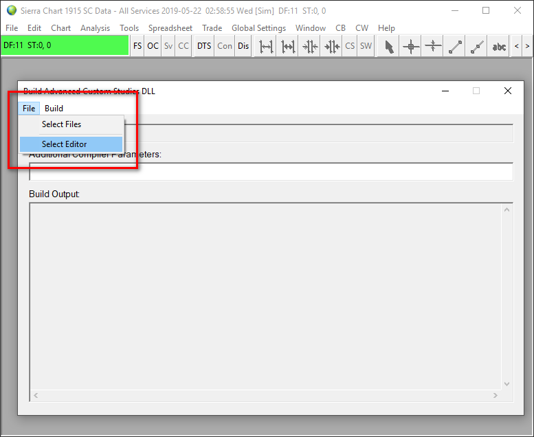
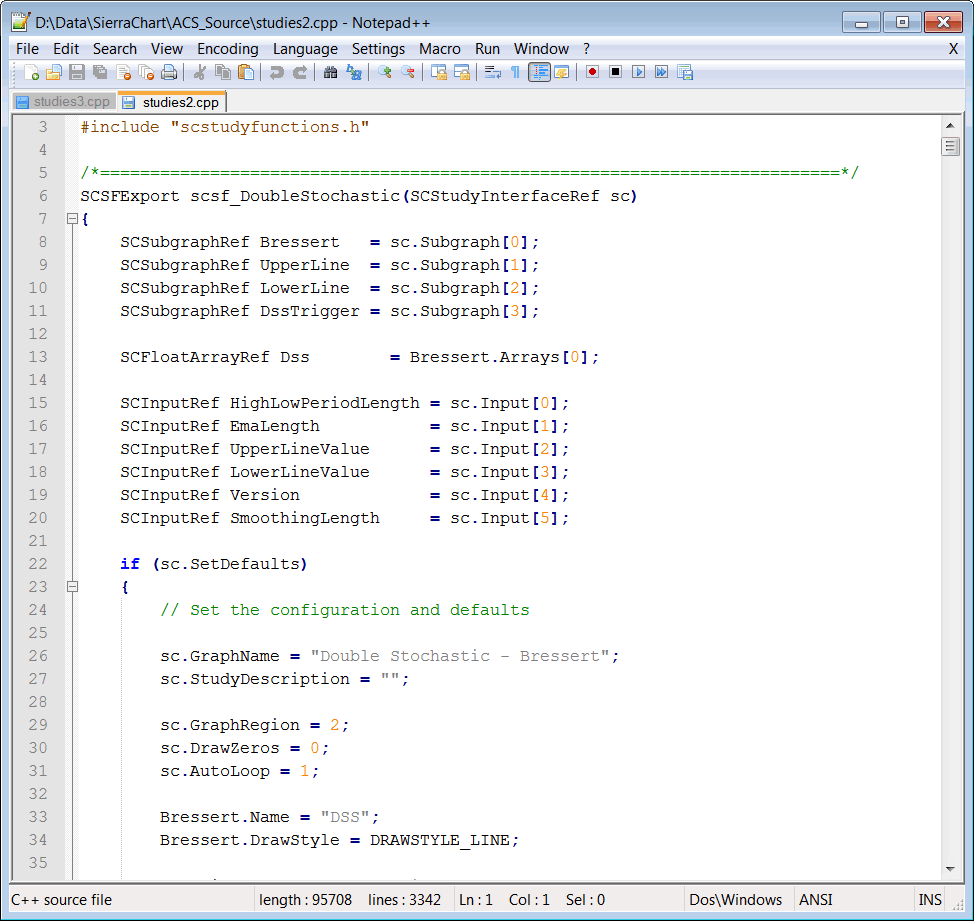
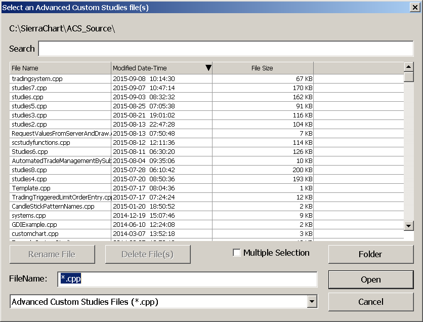
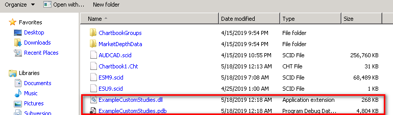
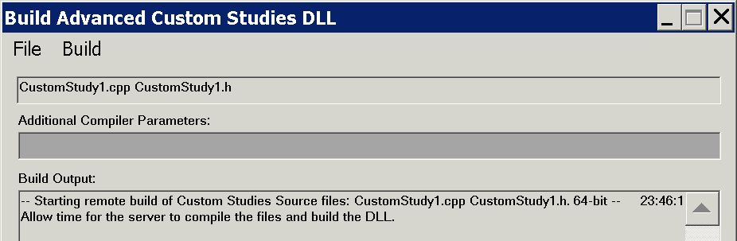
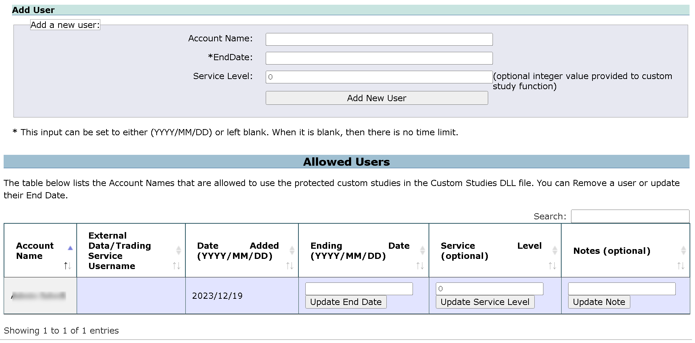
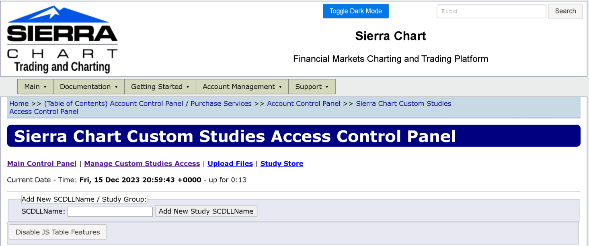

# Advanced Custom Study Interface and Language (ACSIL)

* [Introduction](#introduction)
* [Basic Study Concepts](#basicstudyconcepts)
* [C++ References](#cplusplusreferences)
* [Code and Examples](#codeandexamples)
* [Setting the Default Code Editor](#settingdefaultcodeeditor)
* [Step-By-Step Instructions to Create an Advanced Custom Study Function](#stepbystepinstructions)
* [Custom Study DLL File Name Format](#customstudydllfilename)
* [Exceptions Caused by Improper Programming](#exceptionscausedbyimproperprogramming)
* [Reinstalling C++ Compiler](#reinstallingcppcompiler)
* [Using Additional Header Files](#usingheaderfiles)
* [Using Your Own Header Files](#usingyourownheaderfiles)
* [Modifying Advanced Custom Study Code](#modifyingadvancedcustomstudycode)
* [Redistributing Your Custom Studies To Users](#redistributingtousers)
* [Redistributing and Allowing Use Only by a Defined List of Users](#redistributing)
* [Automated File Distribution System](#automatedfiledistributionsystem)
* [Remote Compiler Parameters](#remotecompilerparameters)
* [Related Documentation](#relateddocumentation)

---

## Introduction

[Link](#introduction) - [Top](#top)

For instructions on how to use an Advanced Custom Study already developed by someone, refer to the [How to Use an Advanced Custom Study](UsingAdvancedCustomStudies.md) documentation page.

Sierra Chart has a very advanced and easy to use custom study interface and language (ACSIL) which is based on C++ and allows you to create your own custom studies and trading systems, as well as do various other things with Sierra Chart with almost unlimited possibilities.

Advanced Custom Study functions have access to all of the main price graph and study data displayed in a chart or other charts, tick by tick data, time and sales data (which includes Bid and Ask data), Depth of Market Data and various functions and variables in the Sierra Chart custom study interface.

If you wish to share your advanced custom study with others, all you need to do is provide them with the Advanced Custom Studies DLL (dynamic link library) file. All they need to do is simply place it into their Sierra Chart Data folder.

If you wish to make the source code available, you only need to provide them with the source code file (these have the extension .cpp).

Despite articles that may claim C# is as fast as C++ or possibly even faster, the reality is that C++ native code which ACSIL uses, as it is called, is simply faster as has been proven time and time again with actual real-life tests. C# and .NET code is slower and more bulky and is Microsoft proprietary. Whereas Sierra Chart embraces open and flexible standards.

Do you need to know C++ to create custom studies? The answer is definitely not. You can simply work from the examples.

The reason is because there is minimal use of C++ when creating a study or trading system. And the limited use of this language is *very similar to or the same* as the languages of other charting and trading programs.

Of course, you have full access to the entire C++ language if you wish to use it, but typically there is no reason to use it. Normally you are working with the Sierra Chart custom study function framework, the interface functions and variables, C++ operators, simple variables, and "**if**" and "**for**" statements.

This is a very powerful feature of the program and is continuously being expanded. There are many functions available in the Advanced Custom Study Interface that provide a lot of functionality. This is in addition to the standard C++ functions.

Sierra Chart custom studies and systems are made using the standard C++ language, the [arrays, variables, and functions](ACSIL_Members.md) that are part of the custom study interface, and the standard C++ library.

All of these collectively make up the Sierra Chart Advanced Custom Study Interface and "Language".

With a simple menu command, you will easily create the Advanced Custom Studies DLL file which contains one or more study functions.

You will be working with the basics of the C++ programming language only.

This feature of the program is a more advanced feature. However, if you only have limited experience with the Basic language or some other easy to work with language, then that will be enough to create a simple study function.

If you have experience with the languages of other charting and trading programs, then you probably will find using the C++ language and the Sierra Chart Custom Study Interface easier to work with since it is based on standards and works as expected. It also provides much greater functionality and it is extremely fast. There is nothing faster. Step-by-step debugging of your custom function is also possible.

## Basic Study Concepts

[Link](#basicstudyconcepts) - [Top](#top)

* A study can perform calculations and display visible results using both text and graphics.
* A study can also be a trading system study which submits orders and/or displays buy and sell markers on the chart.
* A study is contained within a single [Chart Region](#).
* A study can have up to 60 visible Subgraphs sharing the same scale set for the study. Each Subgraph has an additional 12 extra arrays for additional hidden calculations. These arrays can be used for any purpose whether they are associated with the Subgraph or not.
* A study can make reference to the chart data, other studies, other charts, market data, and chart settings.

## C++ References

[Link](#cplusplusreferences) - [Top](#top)

**Note**: We have included below links to pages with good C++ language tutorials on the relevant areas of the language you will be working with. This information is from the C++ website (cplusplus.com).

The C++ language provides a lot of functionality, but in almost all cases you will only be using the basics of it when working with ACSIL. Therefore, only a minimum of the C++ language is used when creating an advanced custom study. Primarily operators, simple variables, and basic control statements like **if**.

What you would be working with is similar to languages in other charting and trading programs.

It is not recommended you work with C++ native arrays. It is always recommended to use the Sierra Chart **sc.Subgraph[].Data** and **sc.Subgraph[].Arrays[]** arrays to store your output data and background calculations. The reason for this is simplicity and safety because these arrays are safe and the bounds can never be overwritten.

Many of the examples in the following tutorials use the **cout** object to display output on a console window which Sierra Chart does not have. If you were to use the **cout** object in your code, the text will not appear.

In place of the **cout** object, you would always use your own relevant code. If you did want to display output, you need to use the [sc.AddMessageToLog()](ACSIL_Members_Functions.md#scaddmessagetolog) function which will display output in the Sierra Chart Message Log.

* C++ Language Tutorial: [Variables and Data Types](cpp/cpp_VariablesDataTypes.md)
* C++ Language Tutorial: [Constants](cpp/cpp_Constants.md)
* C++ Language Tutorial: [Operators](cpp/cpp_Operators.md)
* C++ Language Tutorial: [Control Structures](cpp/cpp_ControlStructures.md)
* C++ Language Tutorial: [Functions (I)](cpp/cpp_Functions.md) This is a more advanced subject. The reason you would want to create a function separate from your own primary ACSIL study function, is to break down more complex study functions into smaller units and to keep common code in a single place for easy maintenance. This makes your code better organized and allows for code that is used in many locations within your study function, to be contained within its own separate function and called at the appropriate locations within the primary study function.
* Common mathematical operations and transformations: [math.h](http://www.cplusplus.com/reference/cmath/). Opens on the cplusplus.com website.
* Fuctions to read and write files: [stdio.h](http://www.cplusplus.com/reference/cstdio/). Opens on the cplusplus.com website.
* [GCC compiler reference](http://gcc.gnu.org/onlinedocs/). The C++ compiler used with the **Remote Build** command is the MinGW GCC C++ compiler.

## Code and Examples

[Link](#codeandexamples) - [Top](#top)

All of these listed files are located inside the **/ACS\_Source** folder inside of the Sierra Chart installation folder.

* **ExampleCustomStudies.cpp**: Basic example study functions which can be used as a starting point for your own functions.
* **Studies#.cpp** : Multiple files containing most of the built-in Sierra Chart studies. All of the individual study functions contained in these files can be used as a starting point for your own study functions. They also serve as good examples.
* **CustomChart.cpp**: Contains a study function that creates a custom chart. This is a more advanced example.
* **SCConstants.h**: Constants you can use in a custom study function.
* **SCSymbolData.h**: Symbol pricing data structure.

## Setting the Default Code Editor

[Link](#settingdefaultcodeeditor) - [Top](#top)

Sierra Chart includes the [Notepad++](https://notepad-plus-plus.org/) source code editor. This is set as the default source code editor. To change the default source code editor:

1. Open the **Build Advanced Custom Studies DLL** window by selecting **Analysis >> Build Custom Studies DLL** on the Sierra Chart menu.
2. Select **File >> Select Editor** on the **Build Advanced Custom Studies DLL** window.
3. Acknowledge the notice about selecting a different editor by pressing **Yes**.
4. On the displayed Open File window, press the **Folder** button.
5. Navigate to the folder where your main Sierra Chart installation is located (typically C:\SierraChart).
6. Select the **NPP** folder that is under the main Sierra Chart folder. If you want to use a different editor, than Notepad++, then to navigate to that folder where it is located on your system.
7. Press the OK button to select that folder.
8. You will see a program called Notepad++ show in the list of files. Select that file. If you want to use a different editor, than Notepad++, then select that particular editor.
9. Press the **Open** button.
10. Next time you edit an advanced custom studies CPP file through **File >> Select Files**, the selected editor will be used.

[](../images/fileselecteditor.png)

## Step-By-Step Instructions to Create an Advanced Custom Study Function

[Link](#stepbystepinstructions) - [Top](#top)

The following are step-by-step instructions to create a custom study function and use it in Sierra Chart.

[](../images/acseditor.png)

1. To create your own custom studies or trading systems in Sierra Chart, you will be working with the code editor and build system provided by Sierra Chart, to edit your source code file and to generate an executable file containing your study functions.
2. To start the code editor, select **Analysis >> New/Open Custom Studies File** on the Sierra Chart menu. A window will open to either select an existing source code file or enter a new file name.
3. To create a *new* Advanced Custom Studies file, type the name of the file in the **File Name** box. Or, select an existing file. The filename must not contain any spaces. There is no need to type the CPP file extension. It will be automatically added.
4. Press the **Open** button. This will launch the source code editor (see image above), where you can edit your Advanced Custom Studies source code file.
5. The location where Advanced Custom Studies source files need to be located is the **/ACS\_Source** folder in the folder where you installed Sierra Chart to. The source code files will be automatically located in that folder.
6. You will see two lines at the top of every custom studies source code file: **#include "sierrachart.h"** and **SCDLLName("My Custom Studies")**. These are both required and just need to be in the file only *once* and at the top.
     
      
   Some source code files that are provided with Sierra Chart, like **studies#.cpp**, will not have the **SCDLLName("")** line because it only needs to be included in one source file when compiling multiple files. However, when compiling source code files individually it must be included.
7. Each study is contained within its own section of code known as a *function*. Functions begin with a line similar to: **SCSFExport scsf\_FunctionName(SCStudyInterfaceRef sc)** followed by an opening brace **{** and a closing brace at the end **}**. All functions are contained in the source code file (.cpp file extension). A source file can contain one or more functions. You can add and remove functions as necessary.
8. To create a custom study, you will need to write a custom study function. To help you get started, each time you create a new Advanced Custom Studies source code file, it will contain a template function, with which you can use as your study function. The name of this function is **scsf\_TemplateFunction**.
9. The first step to writing a custom study function is to modify the predefined template function: **scsf\_TemplateFunction**. This function represents the basic structure required for every study function.
10. A good start to understanding what should go into a custom study function is to have a look at the **ExampleCustomStudies.cpp** source code file in the **/ACS\_Source** folder in the folder that Sierra Chart is installed to. It contains many easy example study functions.
      
      
    This file includes some template functions and some complete example study functions like **scsf\_SimpMovAvg** and **scsf\_MovingAverageExample**. Also in that same folder are the majority of Sierra Chart built-in studies.
11. You can copy and paste the functions from any of the files in the **/ACS\_Source** folder into your Advanced Custom Studies source file and make modifications. If you do, you probably will want to delete **scsf\_TemplateFunction** in your source file and just work with the function or functions you have pasted into your source code file.
12. In general, what you will need to do in your Advanced Custom Study function is use the [sc.BaseData[] arrays](index49ba.html?page=doc/ACSIL_Members_Variables_And_Arrays.html#scBaseDataIn) which hold the data for the main price graph in the chart, perform calculations on that data, and then set your results into one or more of the [sc.Subgraph[].Data arrays](index40e9.html?page=doc/ACSIL_Members_scSubgraph.html#scSubgraphData) to display the results on the chart.
      
      
    For a comprehensive understanding of ACSIL arrays and looping, refer to [Working with ACSIL Arrays and Understanding Looping](ACS_ArraysAndLooping.md).
13. Or, in the case of an automated trading system, you will use the [ACSIL Trading](ACSILTrading.md) functions to perform trade actions. Keep in mind that these trade actions by default are simulated and do not ever have to be live trades. They can simply be informational or you can manually respond to them.
14. Refer to the [Definitions of Advanced Custom Study/System Interface Members](ACSIL_Members.md) page for complete documentation on the Advanced Custom Study Interface members that you can use in your function, and you see used in the study functions in the source code files that are provided in the **/ACS\_Source** folder.
15. These interface members begin with **sc.** in the source code. This designates that the variable, function, or array is part of the Sierra Chart Advanced Custom Study Interface.
16. For information about creating a **trading system study**, refer to [System Studies](ACSILProgrammingConcepts.md#systemsandalerts).
17. It is recommended to begin with the predefined template function, **scsf\_TemplateFunction**, and rename it to something unique. For example: **scsf\_MyNewStudyFunction**. The very top line of all study functions need to be defined like the following:
      

    ```cpp

    SCSFExport scsf_UniqueFunctionName(SCStudyInterfaceRef sc)
                
    ```

      
    Where ***UniqueFunctionName*** is the name that you give your function which must be unique from all other study functions in your advanced custom study source code file. **Important Note:** your function must always begin with the prefix *scsf\_*.
      
      
    Inside the function you will need to set the **[sc.GraphName](ACSIL_Members_Variables_And_Arrays.md#scgraphname)** to the name of your study. This must be done inside the code block that checks if **[sc.SetDefaults](ACSIL_Members_Variables_And_Arrays.md#scsetdefaults)** is set. For example:
      

    ```cpp

    #include "sierrachart.h"
    SCDLLName("Custom Study DLL") 

    SCSFExport scsf_UniqueFunctionName(SCStudyInterfaceRef sc)
    {
        if (sc.SetDefaults)
        {
            // Set the defaults
            sc.GraphName = "My New Study Function";

            sc.Subgraph[0].Name = "Subgraph name";
            sc.Subgraph[0].DrawStyle = DRAWSTYLE_LINE;

            sc.AutoLoop = 1;

            // Enter any additional configuration code here
            return;
        }

        // Perform your data processing here.

        // Multiply the Last price at the current bar being processed, by 10.
        sc.Subgraph[0][sc.Index] = sc.Close[sc.Index] * 10;

        return;
    }
                
    ```
18. Once you are done with the work on your source code file, save the file by selecting **File >> Save** on the Editor menu.
19. The next step is to compile the source code. If the source code contains no errors, the compilation process will create the Advanced Custom Studies DLL. Otherwise, you will be notified of any errors in your source code on the **Build Advanced Studies DLL >> Build Output** window. Follow these steps to compile the source code:  
    1. Go to the Sierra Chart program main window.
    2. Select **Analysis >> Build Custom Studies DLL** on the Sierra Chart menu.

       [](../images/buildacsdll.png)
    3. The selected file is displayed in the **Build Custom Studies DLL** window. To open a different file, press the **Select File** button and select the file you want.

       [](../images/selectacsfile.png)
    4. You can select one or more files. Usually you will be working with one file but multiple files are supported. If you want to select multiple files, enable the **Multiple Selection**  option and select multiple files by left clicking on them.
    5. After selecting the file or files, press **Open** on the Select Advanced Custom Study Files window.
    6. If you have selected more than one file to build, only one of the CPP files that you select can contain the **SCDLLName** line at the top.
    7. The filenames to be built will now be displayed in the text box at the top of the **Build Advanced Custom Studies DLL** window.
    8. If there are any additional compiler parameters you want to specify, then enter them in the **Additional Compiler Parameters** text box on the **Build Advanced Custom Studies DLL** window. These will be appended to the compiler parameters given to the compiler.
    9. **Building Remotely** (Recommended): To compile the source code file and generate the DLL, select **Build >> Remote Build**. The compiling and generating of the DLL is done on the Sierra Chart server. This is a very simplified way of generating the DLL file and is the recommended way unless you need to do something more advanced.
         
          
       *Any **#includes**  that you have added to your CPP file are ignored when doing a remote build.* However, all of the standard C++ headers and **Windows.h** header are already included.
         
          
       The source code file is transmitted securely over an encrypted connection to the Sierra Chart server and deleted when the compiling is done or if it fails. For those of you who have some kind of hypothetical concern, we could care less about your source code. We just make sure it is deleted from the system used for compiling.
    10. **Building Locally**: To compile the source code locally, select **Build >> Build With Visual C++ - Release**. This requires that the Visual C++ compiler be installed first by selecting **Build >> Install Visual C++ Compiler**.
          
           
        Installing the compiler does take time. That must be completed first before using the **Build >> Build with Visual C++ - Release** command.
    11. **Building Locally, To Debug**: To compile the source code locally, and debug the ACSIL function, select **Build >> Build With Visual C++ - Debug**. This requires that the Visual C++ compiler be installed first by selecting **Build >> Install Visual C++ Compiler**.
          
           
        Installing the compiler does take time. That must be completed first before using the **Build >> Build with Visual C++ - Debug** command. When you build a project in debug mode, two important files are created. A study dll file and a PDB file or **Program Debug Database**. For example, if you build a source file called ExampleCustomStudies.cpp file, you will see a **ExampleCustomStudies.dll** and a **ExampleCustomStudies.pdb**.
          
           
        If you want to see that project built to the right place and that you are ready to debug, you can check that these two files were created in your **Data** folder in the Sierra Chart installation folder.

        [](../images/debugbuildoutput.png)

          
           
        Refer to the [Step-By-Step ACSIL Debugging](StepByStepACSILDebugging.md) page for complete documentation on how to debug the ACSIL functions.
20. The compilation is performed. Upon successful completion, the Advanced Custom Studies DLL will be built and named after the name of the source code file name you entered. For example, if your source file is named **SierraChartCustomStudies.cpp**, it will be named **SierraChartCustomStudies.dll**.
      
       
    This is important to be aware of because you need to make sure that your source code file name does not conflict with existing DLL files that you do not want to overwrite.
21. **Note**: In case you want to provide your Advanced Custom Study or studies to another user or customer, this DLL file will be located in the Sierra Chart **Data Files Folder**. Simply give this DLL file to the other user. It is all they need. They just simply need to put it into the **Data Files Folder** in their copy of Sierra Chart. *It cannot be located in any other folder.* The Data Files Folder can be determined through **Global Settings >> General Settings >> Paths**. Look in the **Data Files Folder** box.
22. If there are any errors in the source code, they will be displayed in the **Build Custom Studies DLL Output** window. Here is an example:
      

    CustomStudies.cpp(52): Error! E006: col(17) syntax error; probable cause: missing ';'

      
    You can quickly go to where the error is in the source file by double-clicking on the error line in the **Build Custom Studies DLL Output** window. Correct the error in the source file. Save the file. Switch to the Sierra Chart main window and select **Analysis >> Build Advanced Custom Studies DLL**  from the Sierra Chart menu. Press the **Build Custom Studies DLL**  button to try building the DLL again.
23. Once the DLL build process completes without any errors, the Advanced Custom Studies DLL is ready to be used.
24. In Sierra Chart, open a chart you wish to apply the study to. Select **Analysis >> Studies** on the menu. Press the **Add Custom Study**  button. Locate the name of your advanced custom studies DLL file in the list of studies. It will have the name specified in the **SCDLLName()**  code line. Press the plus sign (+) by it, and select the study you just made (Example: **My New Study Function**). Press the **Add** button to add the selected study to the list of studies on the chart, and press the **OK** button on the **Chart Studies** window to apply it to the chart. Your new study is now on the chart and fully calculated.
25. See the [How to Use an Advanced Custom Study](UsingAdvancedCustomStudies.md) page for more information on adding Advanced Custom Studies.
26. The study function will be called when the study is applied to the chart, when the chart is loaded or reloaded, and when the chart is updated when there is new data. For additional details, refer to [When the Study Function is Called](ACS_ArraysAndLooping.md#whenthestudyfunctioniscalled).
27. **Code Changes**: If you wish to make code changes, you can make those changes in the source code file using the source code editor and simply build the Custom Studies DLL file again. There is no need to remove the study from the chart or add it again unless you made changes in the **sc.SetDefaults** code block. However, it is still not necessary to re-add the study to the chart in that case. After you make changes to the source code and build the DLL again, you will want to go to **Chart >> Recalculate** to perform a full recalculation to see all of the results from your changes.

## Custom Study DLL File Name Format

[Link](#customstudydllfilename) - [Top](#top)

DLL file names have a specific format. This format is not mandatory but it is important to understand the format because it can cause some unexpected behaviors if it is not understood.

The following is the format: ***[DLLName]\_[optional numeric version number]\_64.dll***

Example: **CustomMovingAverage\_2201\_64.dll**

It is supported to have multiple filenames that share the same DLLName but have different version numbers. Sierra Chart will load the appropriate one based upon the *internal version number* of the DLL file. This internal version number is related to the version of Sierra Chart they were compiled for.

This allows different versions of the same DLL to exist, which can be used with different versions of Sierra Chart.

Therefore, if DLL file names only differ by version number, they are considered the same DLL and only will be loaded based upon the version of Sierra Chart.

## Exceptions Caused by Improper Programming

[Link](#exceptionscausedbyimproperprogramming) - [Top](#top)

This section briefly discusses *exceptions* which can be caused by improper programming in a custom studies source code file which causes exceptions while the executable code in the compiled DLL is run.

The two most common exceptions that you would encounter are Access Violation and Integer Divide by Zero. Access Violation exceptions are caused by accessing invalid memory locations. Integer Divide by Zero exceptions are caused by dividing an integer by 0.

An Access Violation can even be caused by a memory corruption in one area of code at an earlier point in time causing a problem with other code at a later point in time that has no problem to begin with. This is what makes tracking these problems down very difficult. That is why one method is simply to carefully read through the code and see if there any obvious problems such as array bounds violations which can cause this.

When a custom study causes an exception it will be logged in **Window >> Message Log**. Once an exception occurs, the Sierra Chart process is no longer in a stable state and has to be restarted. Otherwise, Sierra Chart will be unstable and exceptions can continue to occur even though the underlying problem has been solved in the custom studies DLL.

## Reinstalling C++ Compiler

[Link](#reinstallingcppcompiler) - [Top](#top)

If there is some problem with the installation of the C++ compiler downloaded by Sierra Chart through **Analysis >> Build Custom Studies DLL >> Build >> Install Visual C++ Compiler**, then the compiler can be installed again just simply by selecting that command again and going through the installation procedure again.

## Using Additional Header Files

[Link](#usingheaderfiles) - [Top](#top)

This section applies to including additional header files which are part of the operating system, the standard C/C++ libraries, or some other library you may be using. It does not apply to the header files that you create yourself.

When including in your source code file these additional header files, they need to be placed *above* the **#include "sierrachart.h"**  line. Refer to the example below.

If this is not done, then you may receive various compiler errors that probably will not make sense to you.

The Windows.h and standard C++ library header files are already included. So there is not a need to include those unless you receive an error indicating a particular identifier or function is not found. In that case include the required header file which contains that identifier or function.

```cpp

#include <header.h>
#include "sierrachart.h"
    
```

## Using Your Own Header Files

[Link](#usingyourownheaderfiles) - [Top](#top)

If you have created your own header files that you want to include when using the **Analysis >> Build Custom Studies DLL >> Build >> Remote Build** building method, then you need to select that header or header files in addition to your source code files through **File >> Select Files** on the **Analysis >> Build Custom Studies DLL** window.

Refer to the image below.

[](../images/buildcustomstudieswithlocalheaderfile.png)

## Modifying Advanced Custom Study Code

[Link](#modifyingadvancedcustomstudycode) - [Top](#top)

Effective with Sierra Chart version 1842 and higher, whenever you build or rebuild a custom studies DLL file through **Analysis >> Build Custom Studies DLL >> Build**, the DLL file will be released as needed. There is nothing special to do.

If you are using external custom study DLL build tools, then to be able to make changes to the source code of a custom study function for a study that is already or was on an open chart, and build the DLL file for it which has already been loaded into Sierra Chart, and see those changes in the corresponding study on a chart, you will need to select **Analysis >> Build Custom Studies DLL >> Build >> Release All DLLs and Deny Load** or **Release Single DLL and Deny Load**, before you start the build with the external tools.

After the build is complete, then select **Analysis >> Build Custom Studies DLL >> Build >> Allow Load DLLs**. Recalculate the chart with **Chart >> Recalculate** on the menu.

Alternatively these commands can be executed with the [UDP Interface Port Commands](UDPAPI.md).

If you change any of the code in the **sc.SetDefaults** code block at the top of your study function source code, such as Inputs or Subgraphs, and the study is already on a chart, then you will need to *remove* the study from the chart and add it again to see the changes after the DLL is rebuilt.

Or if you have saved a Chartbook with the study, close and reopen the Chartbook in order to see the source code changes in the **sc.SetDefaults** code block after building a new DLL file. This can be done through **File >> Close Chartbook** and **File >> Open Chartbook**. However, any settings in **sc.SetDefaults** which are *saved* with the study in the Chartbook, are not going to go into effect unless you remove the study from the chart and add it again.

If you have saved the study by saving the charts containing the study as a Chartbook or by saving it as part of a Study Collection, then you will need to go into the [Study Settings](ChartStudies.md#technicalstudysettingswindow) for the study and make sure the the Inputs and Subgraphs settings are all correct and as you expect.

Keep in mind if you have set [Custom Default Study Settings](ChartStudies.md#customdefaultstudysettings) for the study, then those will be applied after adding the study to the chart regardless of the defaults set in the **sc.SetDefault** code block. You may want to reset those default Study settings. Refer to [Resetting Default Study Settings for an Individual Study](ChartStudies.md#resettingdefaultstudysettingsforanindividualstudy).

## Redistributing Your Custom Studies To Users

[Link](#redistributingtousers) - [Top](#top)

To redistribute custom studies or systems that you have developed, you simply need to provide the user the DLL file that has been created.

When you are using the Sierra Chart build system (**Analysis >> Build Custom Studies DLL**), the DLL file is placed into the **Data Files Folder**.

You can determine where this folder is located by selecting **Global Settings >> General Settings >> Paths**. The complete path is displayed in the **Data Files Folder** box.

When you provide your DLL file to other users, the DLL must be placed into their Data Files Folder. You should have them check the location of this folder under **Global Settings >> General Settings >> Paths** and make certain the DLL is copied to that folder.

Be aware that the Data Files Folder is not necessarily consistent and can be set to any location.

## Redistributing and Allowing Use Only by a Defined List of Users

[Link](#redistributing) - [Top](#top)

[](../images/customdllstudiesmanagement.png)

Sierra Chart provides a feature to allow you to redistribute custom studies or trading system studies and only allow use by a defined list of users. This is a completely secure feature of Sierra Chart.

To control and allow use of your studies/systems by a certain defined list of users, you will need to establish management of a Custom Studies DLL file within the Sierra Chart web-based control panel for managing custom studies users. The control panel can be accessed by selecting the link for [Manage Custom Studies Users](https://www.sierrachart.com/UserControlPanel.php?page=ManageCustomStudiesDLLUsers) on the [Main Control Panel](https://www.sierrachart.com/UserControlPanel.php) for your account on our website.

This will take you to the web-based control panel where you can create a new Custom Studies DLL Name, or manage existing Custom Studies DLL Names. For each Custom Studies DLL Name, you are able to specify the Sierra Chart Account Names of the allowed users, add an optional Expiration date if you want an Expiration date, and add an optional general-purpose 64-bit variable that can be set on a user basis through this control panel and passed through to your custom study functions. In the custom study the ACSIL variable which is set to this specified 64-bit variable is [sc.DLLNameUserServiceLevel](ACSIL_Members_Variables_And_Arrays.md#scdllnameuserservicelevel).

At the top of the Manage Custom Studies Users page is the box to enter a new **SCDLLName** (this is a grouping name). Enter the name of the group or DLL that you want to create. This does not need to be the name of the DLL itself.

[](../images/managecustomstudiesusersscdllnameentry.png)

To automatically redistribute the custom studies DLL file that you have developed and any associated Chartbooks or Study Collections, refer to [Automated File Distribution System](#automatedfiledistributionsystem).

In the case where there is no Internet connection to Sierra Chart, the user will still have access to the custom studies in a DLL they are allowed to use, for up to 30 days, as long as their Sierra Chart account has not expired.

The following information applies to version 1420 and higher of Sierra Chart: When a Sierra Chart account is removed from the list of authorized users for a custom studies file or the current date is passed the expiration date, the user will still have access to the studies until the user restarts Sierra Chart. *Unless* the user were to remove the study from the chart and add it again, close the Chartbook containing instances of the study and reopen it, open a Chartbook containing instances of the study, or add a new instance of the study. In any of these cases, they will not have access to the particular instances of the study which are involved in these operations.

To actually protect your studies or systems, you need to use the **sc.IsUserAllowedForSCDLLName** variable in your code. In the code example below, you will see code which checks this variable to see if the user is allowed to use the study. There is a section of code which adds a message to the Message Log telling the user that they are not authorized.

```cpp

//This function is an example of using the sc.IsUserAllowedForSCDLLName variable
SCSFExport scsf_IsUserAllowedForSCDLLNameExample(SCStudyInterfaceRef sc)
{

  if (sc.SetDefaults)
  {
    // Set the configuration and defaults

    sc.GraphName = "IsUserAllowedForSCDLLName";
    sc.StudyDescription = "This function is an example of using the sc.IsUserAllowedForSCDLLName variable to protect a study.";
    sc.AutoLoop = 1;

    return;
  }

  // Do data processing

  if(sc.IsUserAllowedForSCDLLName == false)
  {

    if(sc.Index == 0)
    {
      sc.AddMessageToLog("You are not allowed to use this study",1);
    }

    return;
  }
} 
    
```

## Automated File Distribution System

[Link](#automatedfiledistributionsystem) - [Top](#top)

Sierra Chart provides a feature where you are able to provide custom studies DLL, Study Collection and/or Chartbook files to users who have been authorized to use your Custom Studies developed for Sierra Chart.

To manage these files, follow the instructions on the webpage after selecting the SCDLLName/Group Name on the Manage Custom Studies Users page.

When you activate a Sierra Chart user for your custom studies, they will automatically receive the files after starting Sierra Chart. If the user has a DLL file with the same name already that is being provided, it will be overwritten if the one that you are distributing is different.

In the case of Chartbooks and Study Collections, these individual files will only be downloaded by Sierra Chart if the user does not already have them. However, the capability does now exist to automatically replace those types of files with the specific version of them that you want the user to have.

The compiled code in a custom studies DLL file cannot be reverse engineered. Since it was built with C++ and not C#. This is one huge advantage of C++ over C#. Additionally, it is high-performance native code which has proven to be solid and very fast.

## Remote Compiler Parameters

[Link](#remotecompilerparameters) - [Top](#top)

#### 64 Bit

[Link](#remotecompilerparameters32) - [Top](#top)

```cpp

x86_64-w64-mingw32-g++ -D _WIN64 -march=x86-64 -mtune=x86-64 -O2 -shared -static -static-libgcc -static-libstdc++ -s -fexceptions -std=gnu++17 {$FileNames} -o Output.dll -Wno-deprecated -lgdi32 &>Output.txt;
        
```

## Related Documentation

[Link](#relateddocumentation) - [Top](#top)

* [Working with ACSIL Arrays and Understanding Looping](ACS_ArraysAndLooping.md)
* [Definitions of Advanced Custom Study/System Interface Members](ACSIL_Members.md)
* [ACSIL Programming Concepts](ACSILProgrammingConcepts.md)
* [Persistent Variables](ACSIL_Members_Functions.md#scgetpersistentint)
* [Using Drawing Tools from an Advanced Custom Study](ACSILDrawingTools.md)
* [Advanced Custom Study Interaction With Menus, Control Bars, Mouse Pointer Events](ACSInteractionWithMenusControlBarButtonsPointerEvents.md)
* [ACSIL Study Documentation Interface Members](ACSILDocumentationMembers.md)
* [Automated Trading From an Advanced Custom Study](ACSILTrading.md)
* [Referencing Other Time Frames and Symbols When Using the ACSIL](ACSILRefOtherTimeFrames.md)
* [Using ACSIL Study Calculation Functions](ACSILUsingStudyCalculationFunctions.md)
* [Working with the SCDateTime Variables and Values](SCDateTime.md)
* [Example ACSIL Trading Systems](ACSIL_ExampleTradingSystems.md)
* [Developing Custom Studies and Systems for Sierra Chart](DevelopingCustomStudiesAndSystems.md)
* [Step-By-Step Debugging](StepByStepACSILDebugging.md)
* [Developing Custom Studies and Systems for Sierra Chart](DevelopingCustomStudiesAndSystems.md)

---

\*Last modified Wednesday, 28th May, 2025.
