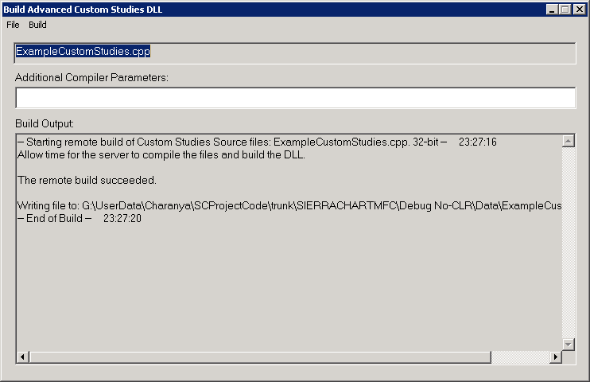
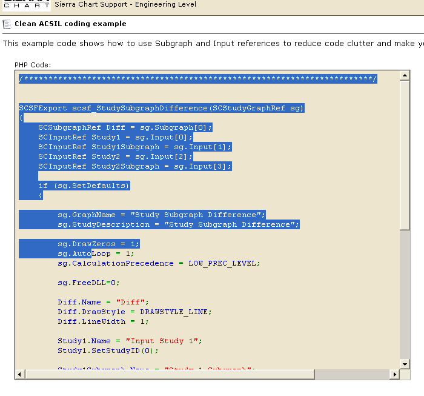

# How to Build an Advanced Custom Study from Source Code

* [Introduction](#introduction)
* [Step-By-Step Instructions](#instructions)
* [Obtaining Code From Support Board](#supportboard)
* [Searching for Source Code for Sierra Chart Built-In Studies](#searchingsourcecodebuiltin)
* [Source Code for Some Built in Studies Not Available](#sourcecodeforsomebuiltinstudiesnotavailable)

---

## Introduction

[Link](#introduction) - [Top](#top)

The instructions on this page explain how to create the necessary executable file, DLL (dynamic link library) file, from study source code or trading system study source code (.cpp file extension), so that you are able to use the study in Sierra Chart. Below are various sources for source code that you can compile into a DLL executable file for use in Sierra Chart.

* You may have been given source code from someone, possibly from a developer who developed a custom study or trading system for you for Sierra Chart.
* You may have developed your own custom ACSIL study or trading system and have the source code for it.
* You may want to use the source code for various studies and trading system studies posted on the Sierra Chart [Support Board](https://www.sierrachart.com/SupportBoard.php). The source code be could be inside of a **cpp** source code file, or the source code could be posted outside of a cpp file. Instructions for working with either of these forms of source code is documented here.
* You may want to create your own customized version of studies from Sierra Chart built-in studies. These are studies found in **Analysis >> Studies >> Studies Available**. The study functions for the built-in studies can be found in the **studies#.cpp**  files in the **/ACS\_Source** folder in the folder Sierra Chart is installed to on your system.
    
     
  There are several of these files. Each one of them contains many of the built-in studies.
    
    
  To locate the source code for a particular Sierra Chart built-in study, refer to [Searching for Source Code for Sierra Chart Built-In Studies](#searchingsourcecodebuiltin).

## Step-By-Step Instructions

[Link](#instructions) - [Top](#top)

1. Generally a developer of an Advanced Custom Study or studies for Sierra Chart will provide you a file that has a **.DLL** extension. If you have that file, then you *do not* need to follow the instructions on this page and instead refer to the [How To Use an Advanced Custom Study](UsingAdvancedCustomStudies.md#usingadvancedcustomstudy) section. However, if you were provided with the actual source code in a .CPP file or outside of a file, then the instructions on this page explain how to build a Custom Studies DLL file to actually use the study or studies.
2. If you have a full CPP file that has a **#include <Sierrachart.h>** and the **SCDLLName** lines at the top of the file (refer [Example Source Code File](#examplesourcecode) to see what this looks like), then you will need to save the source code to the proper folder as explained in this step so that it can be compiled. If you have the text of the source code and these two lines are at the top, but it is not contained in a file, then you will need to save the source code to the proper folder as explained in this step so that it can be compiled. In all other cases [skip to step 3](#step3).
     
     
   Save the complete CPP file that you have to the **ACS\_Source** folder which is located in the Sierra Chart program folder on your computer system. If you only have the text of the source code and not the file, then you will first need to save it to a text file that has a **CPP** extension, using a text editor such as **Notepad**. In this case, also save it to the **/ACS\_source** folder in the Sierra Chart program folder.
     
     
   It is essential that when using the Sierra Chart provided custom study compiler that the very top line of the source code file contains the line **#include "sierrachart.h"**. The text within the quotation marks needs to exactly be **"sierrachart.h"**. Otherwise, you may get compiler errors or be using an incorrect header file.
     
     
   At this point skip to the [build step](#buildstep).
3. If you do not see the **#include** and/or **SCDLLName** lines at the top of the source code file or source code text, then you have have an *independent study function*. Or, if you want to modify and use a study function in one of the **studies#.CPP** files in the **/ACS\_Source** folder in the folder where Sierra Chart is installed to, and build a Custom Studies DLL file from that source code, then you also will be working with an *independent study function*.
     
      
   Note: The **/ACS\_Source/studies#.CPP** files contain source code for most of the Sierra Chart studies. To find the source code for a particular Sierra Chart study, refer to [Searching for Source Code for Sierra Chart Built-In Studies](#searchingsourcecodebuiltin).
4. Select **Analysis >> New/Open Advanced Custom Studies File** on the main menu. Make sure you are using the main instance of Sierra Chart for this. And *not a sub instance*.
     
      
   All custom studies DLL files, are automatically copied from the main instance to a sub instance when the sub instance is started.
5. In the **Filename**  box, enter a name without spaces for the source code file that will contain your *study function* and press the **Open** button.
6. The **Notepad++** editor will open with a new file displayed with your specified name.
7. The empty skeleton study function that is at the top of this file should be selected and deleted. Paste the source code that you have copied from elsewhere at the end of the file. Select **File >> Save** on the menu to save the file.
8. If the source code you have copied has the **#include "sierrachart.h"** and/or **SCDLLName** lines at the top (see **Example Source Code File** below), then you need to *overwrite the full contents of the file in the editor instead of pasting to the end of it*. However, if the source code you have copied does not have **#include "sierrachart.h"** and/or **SCDLLName** at the top, then these lines must not be overwritten in the existing file (see **Example Source Code File** below).

   #### Example Source Code File

   ```cpp

   //Make sure your custom studies source code file has the following two lines at the top of the file and in this order.

   // This must be exactly "sierrachart.h" to ensure you are referencing the correct header file.
   #include "sierrachart.h"

   // Change the text within the quote marks to what you want to name your group of custom studies. 
   SCDLLName("Custom Study DLL") 

   //This is the basic framework of a study function.
   SCSFExport scsf_FunctionName(SCStudyInterfaceRef sc)
   {
       if (sc.SetDefaults)
       {
           //Code in this section
           return;
       }
       // Data processing code	
   }
                       
   ```
9. **Build Step**: Go back to Sierra Chart and select **Analysis >> Build Custom Studies DLL** on the Sierra Chart menu.
     
     

   [](../images/buildstudiesdllwindow.png)
10. Select **File >> Select Files** on the menu of the Build Advanced Custom Studies DLL window. Select the file that you want to build a Custom Studies DLL file from, and press **Open**. This will be the file that you saved or created in the steps above.
11. Select **Build >> Remote Build** on the menu. The resulting DLL will be generated and put into the Sierra Chart Data Files Folder. If there are any errors they will be displayed in the **Output** frame on this window.   
       
    You can also use the **Build >> Build with Visual C++ - Release** command to build the DLL using Visual C++ if the compiler has already been installed with the **File >> Install Visual C++ Compiler**.
12. To use the study or studies in the Custom Studies DLL file that you have just built, select **Analysis >> Studies >> Add Custom Study** from the menu. For complete instructions, refer to the [How To Use an Advanced Custom Study](UsingAdvancedCustomStudies.md#usingadvancedcustomstudy) section.
13. If you wish to modify the source code you are building a Custom Studies DLL from, then refer to the Sierra Chart [Advanced Custom Study Interface and Language](AdvancedCustomStudyInterfaceAndLanguage.md) page for the complete reference on this subject.

## Obtaining Code From Support Board

[Link](#supportboard) - [Top](#top)

On the Sierra Chart Support Board you will be able to find code in 2 forms:

1. The source code is in an attached .CPP file. In this case, follow step number 2 in the [Step-By-Step Instructions](#instructions) section.

2. The source code is directly in the post itself. In this case just select the code, right-click over it and select **Copy** on the displayed menu. Refer to the image below. In this case, follow step number 2 or 3 in the [Step-By-Step Instructions](#instructions) section.



## Searching for Source Code for Sierra Chart Built-In Studies

[Link](#searchingsourcecodebuiltin) - [Top](#top)

Follow these step-by-step instructions below to locate the source code for a particular Sierra Chart built-in study. These are the studies which are found in the **Analysis >> Studies >> Studies Available** list.

1. Within Sierra Chart select **Analysis >> New/Open Custom Studies File**.
2. In the list of files select **Studies.cpp**.
3. Press the  **Open** button. The Notepad++ editor will be open and this file will be edited.
4. In Notepad++, select **Search >> Find in Files...** .
5. The **Filters** needs to be set to \*.cpp. Or \*.\*.
6. Enable  **Follow Current Doc**.
7. Disable  **Match Whole Word Only**.
8. Disable  **Match Case**.
9. In the  **Find What** text box, enter the name of the study function you want to search for. This is the name as you find it in **Analysis >> Studies >> Studies Available**.
10. Press the **Find All** button.
11. The search results will be displayed in the **Search Results** window. Select the particular relevant search result and double-click on it to navigate to that particular file and line within the file. You can then close the search results window.
12. Once you go to the actual source code in a file from the search window, you then need to take a copy of the entire source code function which begins with **scsf\_** that contains the text you searched for.
13. To modify and compile this code into a custom studies DLL file, refer to [Step-By-Step Instructions](#instructions).
14. There is also the **SCStudyFunctions.CPP**  file in the **/ACS\_Source** folder in the folder Sierra Chart is installed to on your system. This file contains the source code for most of the intermediate study calculation functions, like **sc.SimpleMovAvg()**, which are used by the study functions you find in the **studies#.CPP** files.
      
       
    It is not possible to build a custom studies DLL from these intermediate functions completely on their own, but you can take a copy of the source code of these [intermediate study calculation functions](ACSIL_Members_Functions.md#workingwithintermediatestudycalculationfunctions), put them in your own source code file, make any necessary changes that you require, and call those functions from your primary study function which begins with **scsf\_\***. The intermediate study calculation functions need to be placed above the study function where they are called from in the source code file.

## Source Code for Some Built in Studies Not Available

[Link](#sourcecodeforsomebuiltinstudiesnotavailable) - [Top](#top)

The source code for some studies, this includes the [Numbers Bars](NumbersBars.md), **Volume by Price**, **TPO Profile Chart**, **TPO Value Area Lines**, **Volume Value Area Lines**, **Study/Price Overlay**,  **Market Depth Historical Graph** studies, are not provided or available.

The main reason this is the case is because these are studies which are built into the main Sierra Chart core and not implemented using ACSIL. These studies require functionality which is beyond the current capabilities of ACSIL.

We will not provide source code for these studies, because the effort involved in that would be a major effort, inevitably we would get follow-up questions which is more of a burden for us and is not worth our time, and we do not think in virtually all cases, you would find the source code useful because it is not ACSIL compatible and is generally complex.

In the case where you want to create a study similar to **Numbers Bars** or the **Volume by Price** study, refer to [Accessing Volume at Price Data Per Bar](ACSILProgrammingConcepts.md#accessingvolumepricedataperbar) and [Custom Free Form Drawing into Chart Window Using GDI (Graphics Device Interface)](ACSILProgrammingConcepts.md#customfreeformdrawing).

---

\*Last modified Wednesday, 22nd February, 2023.
