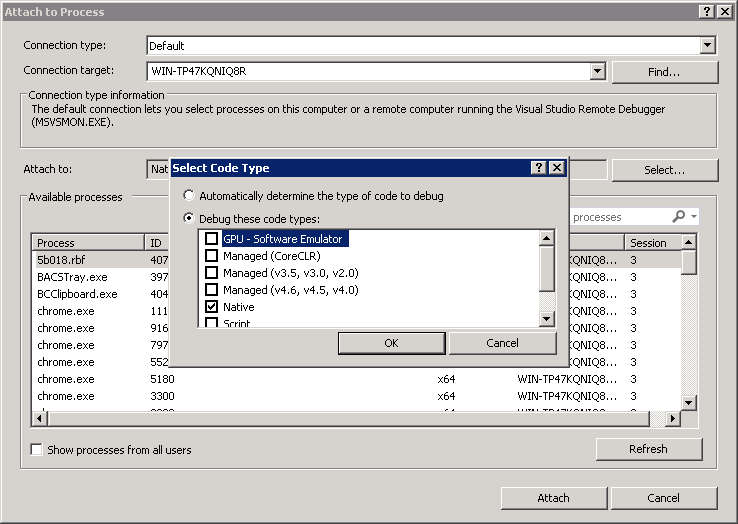

# Step-By-Step ACSIL Debugging

* [Overview](#overview)
* [Enabling Debugging](#enablingdebugging)
* [Basic command for stepping through your code](#steppingthroughcode)
* [Viewing Values](#viewingvalues)
* [Breakpoint With Condition](#breakpointwithcondition)
* [Cannot Access Application Gui While Stepping Through](#cannotaccessguiwhilesteppingthrough)
* [Getting Your Code to Run](#gettingcodetorun)

---

## Overview

[Link](#overview) - [Top](#top)

Step-by-step debugging is possible Using the Microsoft Visual C++ Development Environment.

In order to perform debugging using this environment, your custom studies DLL file must be built with Visual C++. Follow the instructions described in the [ACSIL Step By Step Instructions To Create an Advanced Custom Study Function](AdvancedCustomStudyInterfaceAndLanguage.md#stepbystepinstructions) section to build the DLL using Sierra Chart.

## Enabling Debugging

[Link](#enablingdebugging) - [Top](#top)

1. The custom studies DLL file *must be built* as a **Debug** build with Visual C++ using Sierra Chart in order to debug the source code.
2. Follow the instructions described in the [ACSIL Step By Step Instructions To Create an Advanced Custom Study Function](AdvancedCustomStudyInterfaceAndLanguage.md#compileacsilsourcecode) section to build the DLL. Note that the custom study dll must be built using the command **Build >> Build With Visual C++ - Debug** as explained in the [Building Locally To Debug](AdvancedCustomStudyInterfaceAndLanguage.md#buildinglocallytodebug)

   
3. Open Microsoft Visual Studio, select **File >> Open >> File**. Select the cpp file of the study from the **/ACS\_Source** folder in the Sierra Chart installation folder. In our example, it is **ExampleCustomStudies.cpp**

   
4. Start Sierra Chart.
5. To make debugging easier at least at first, disconnect Sierra Chart from the data feed (**File >> Disconnect**).
6. Open a chart.
7. [Add](ChartStudies.md#addingmodifyingstudies) the custom study that you wish to debug to the chart.
8. With Visual Studio, *attach* to the Sierra Chart process. To do this, from the Visual Studio's main menu, select **Debug >> Attach to Process**.

   
9. In the **Attach to Process** dialog, **Attach to** must be set to **native**.

   
10. From the list of **Available Processes** in the **Attach to Process** window of Visual C++, select the SierraChart.exe (32-bit) or SierraChart\_64.exe (64-bit) process and press the **Attach** button.

    
11. In order to step through the code, we will set a break point. A breakpoint tells visual studio to stop program execution at a specific line of code. In order to set a breakpoint, click in the gutter which is found to the left of the source code area (see image below).

    
12. In Sierra Chart, refresh the chart by selecting **Chart >> Recalculate**. This will cause Sierra Chart to recalculate all studies, which in turn will call the study function and halt at our breakpoint.

    

## Basic command for stepping through your code

[Link](#steppingthroughcode) - [Top](#top)

Once Sierra Chart program execution is halted by a breakpoint there are 3 basic commands to continue execution from this point.

* **Step Over**: can be accessed from the debug menu in visual studio or by pressing F10 on the keyboard. This command executes the current line at which the debugger is currently on and will move to the next line. *If the current line is a function call, the function will be evaluated but the debugger will not drop in to the function code (that is why it is called **Step Over**).*
* **Step Into**: can be accessed from the debug menu in visual studio or by pressing F11 on the keyboard. This command executes the current line at which the debugger is currently on and will move to the next line. *If the current line is a function call, the debugger will drop in to the function code (that is why it is called **Step Into**).*
* **Start Debugging**: can be accessed from the debug menu in visual studio or by pressing F5 on the keyboard. When the debugger has halted at some line, executing this command will cause the debugger to continue execution and will halt at the next breakpoint it encounters.

## Viewing Values

[Link](#viewingvalues) - [Top](#top)

It is common to need to see the values of the variables in your study function. Once the program is halted in visual studio, there are 2 basic ways to do this:

* Hover over - hovering over a variable with the mouse will show the that variables values.

  
* Locals, Autos and Watch views - each one provides a bit of a different functionality and will be more useful than the other depending on your needs.

  

  

  

## Breakpoint With Condition

[Link](#breakpointwithcondition) - [Top](#top)

When debugging code, either during a Backtest, Replay or by Recalculating, it is often the case where you need to debug a specific bar in the chart. Say that bar is bar number 5,000 in the chart. How can you stop on that bar specifically? One way to do this is to set a break point and watch sc.Index. When you reach 5,000, you know you have your bar. But that can take quite a while. A more efficient way to do this is by using a conditional breakpoint.

In Visual Studio, do the following:

* On the line you wish to halt execution, set a breakpoint.
* Right click the breakpoint which brings up a small menu - select **Condition...**.

  
* In the condition menu, type sc.Index == 5000 (or any other condition for that matter).

  

## Cannot Access Application Gui While Stepping Through

[Link](#cannotaccessguiwhilesteppingthrough) - [Top](#top)

In general, Sierra Chart will continue to run normally and you can work with the application GUI while Visual Studio is attached. That said, when you halt execution during with a break point and are stepping through the study function code, the application GUI will no longer be available. This is normal and expected behavior.

## Getting Your Code to Run

[Link](#gettingcodetorun) - [Top](#top)

Your study function does not run all the time. Sierra Chart is responsible for calling your study function upon certain events. At this point your study function code is executed after which control is returned to Sierra Chart.

The conditions under which this occur are documented in the [When the Study Function is Called](ACS_ArraysAndLooping.md#whenthestudyfunctioniscalled) section.

When you first attach to Sierra Chart process and set a break point, depending on what Sierra Chart is doing, you might not see execution stop at your break point. One way to determine that you have done everything correctly is to force Sierra Chart to call your study. The easiest way to do this is by recalculating by selecting **Chart >> Recalculate** on the Sierra Chart menu.

Make sure you put a breakpoint on a line in the code that is always reachable (not hidden in some **if** statement).

---

\*Last modified Thursday, 22nd February, 2024.
